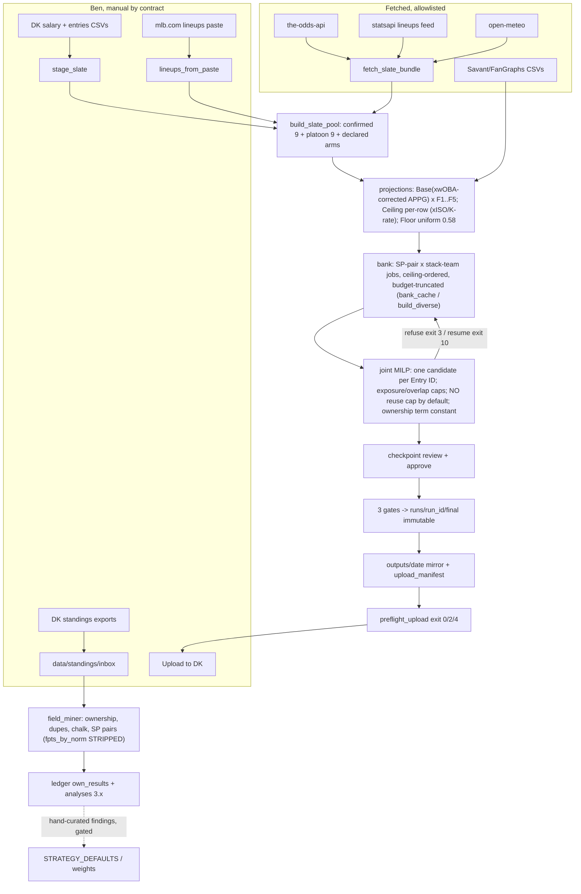
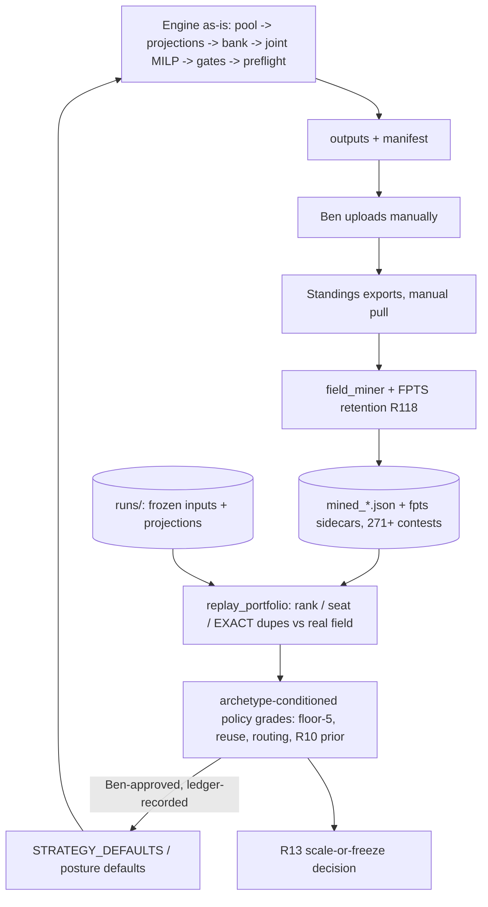

# DFS Portfolio Edge Audit — 2026-08-14

Audited at HEAD `0111d4e` (R70). Working tree: tracked files clean; untracked
dirt only (archive zips, inbox fragments, two run-scoped operator patches, the
ed4 review). Claim held: `engine_2026-08-14_edge_audit_2026-08-14` (DEV).
Write scope: `docs/2026-07-27_backlog_v2.md` (the single live backlog; there
is no root `BACKLOG.md` — CLAUDE.md names this file) and `.audit/`.
Pre-audit snapshot: `.audit/BACKLOG.before-audit.md`, sha256
`f501779b…` identical to the live file at capture.

## Executive verdict

The system is sound where it is deterministic and starved where it is
strategic. Gates, provenance, intake, and legality are strong and tested
(V1: 928/928 across all five per-suite pins; preflight exit 0 on the newest
delivery; golden replay green). The strategy layer optimizes enriched ceiling
plus structural bonuses under exposure caps — a reasonable Picking-Winners-
shaped construction — but it runs **blind on ownership and duplication**
(`Ownership_Tier` is a constant; the ownership term cancels for every
lineup), it **concentrated an apex portfolio silently** (no production reuse
cap), and its **learning loop discards the one artifact that would grade it**:
the miner computes each archived contest's player→FPTS map and strips it at
the archive boundary (`field_miner.py:1961`). The highest-EV move is not a
new optimizer. It is retaining that map and shipping a deterministic
counterfactual replay tool (R118), which converts a 271-contest archive of
REAL fields into the grading substrate the board's three open strategy
questions (R37(2) floor-5, R40 routing, R10's duplication bar) currently
wait on live tranches for. Do not rebuild; instrument, default the reuse
cap, fix the two gate blindnesses, and grade.

## Verification levels used

- V1 Executed: audit suite per-suite (`Ran 621/55/168/9/75 … OK`, sums to the
  928 pin; the one-call macro exceeds the ~178s sandbox ceiling — same
  finding as the Quick Card's fallback note and ed4 §1). Preflight V1:
  `preflight_upload.py` on `runs/20260814T011858Z_d2d53e40/final/DKEntries.csv`
  → exit 0, "11 classic entries, all hard checks clean".
- V2 Covered: every code claim below carries file:line, read this session
  (three parallel read-only inspection passes + direct reads).
- V3/V4 tagged inline where used. Nothing was closed on V3/V4.

## Current state (graph)

LLM sits at: session orchestration, paste transcription, review/approve,
fragment filing, ledger analyses. Deterministic code owns: pool, projections,
solve, gates, preflight, mining. That boundary is correct and should not move.

## Top findings (all reconciled into the backlog)

1. **The learning loop discards its own grading data (→ R118, new, P1).**
   `mine_contest` builds `fpts_by_norm`; the only other reference is the line
   that strips it before archiving (`field_miner.py:1961`). The raw export
   holds full-field per-player `%Drafted` and `FPTS` (verified header,
   2026-08-06 CSV). 271 mined contests, 21 dates. Nothing anywhere replays a
   candidate or delivered lineup against an archived field (verified absent).
   Consequence: every "would floor-5 / diversified / re-routed have done
   better" question is answered by waiting weeks for live tranches when the
   archive could answer a conditioned version tonight, deterministically,
   with exact duplication counts against real lineups. Self-validating
   (replaying own entries must reproduce recorded points/rank exactly).
2. **The production allocator has no candidate-reuse cap (→ R116, new, P1).**
   The 08-13 fragment's cited default (`contest_allocator.py:1012-1023`) is
   the LEGACY path (`:916` "retained for compatibility"); production
   `select_and_assign_entries` adds a reuse row only `if max_reuse is not
   None` (`:2232-2233`), `STRATEGY_DEFAULTS` never sets it, nothing passes
   `reuse_strategy` outside tests. Observed cost: 4 distinct lineups across
   11 apex entries, certified; the +1-control rebuild bought 7 distinct for
   0.98% of fit. The fragment's diagnosis is corrected in the filed item —
   the R36 "verify before filing" discipline catching friendly fire too.
3. **Ownership machinery is constant, not merely uncalibrated (R10 note).**
   `Ownership_Tier` is unconditionally `"Mid"` (`slate_intake_manager.py:1353`;
   `execution_pipeline.py:2603,2776,3053`) so `ownership_sum = 120.0` for
   every lineup: the field-pressure ownership term cancels in ranking,
   `has_duplication_signal` is always true, `high_owned_one_offs` and
   `low_owned_hitter_count` are structurally 0 (`optimizer_v3.py:2763,
   2951-2956,3370-3408`). Live duplication signal today = meta-lineup
   overlap + a 49800 salary band + a 5-stack term. R10 (satellite ownership
   prior, already unblocked and correctly scoped) is the fix; R118 gives it
   a duplication grading target immediately.
4. **Bank freeze mechanism found (→ R115, new, P1).** Growth target
   collapses to `requested_n` (`optimizer_v3.py:3863`), exit-10 is gated on
   `len(candidates) < n_entries*2` (`build_slate.py:1534`), and jobs are
   ceiling-ordered so budget truncation concentrates arms
   (`bank_cache.py:744-756`). Cost: the whole 08-13 1310_6g window (11
   blocked runs), refusals blaming controls while pool checks read 60 viable
   SP pairs, and a mid-slate engine monkey-patch on 1507_3g
   (`tools/_operator_patch_20260813_crossgame.py`) to fake a missing control.
5. **Two gate blindnesses at the money boundary (→ R114 new + R67 existing).**
   Declared pitchers never reach preflight/verify_export: a certified
   bullpen-game file failed 12x and shipped via `--force` (fragment,
   2210_2g). A mandatory gate that fails known-good files trains the exact
   habit it exists to prevent.
6. **Objective scale-invariance is confirmed and adopted (→ R119; ed4
   adjudicated).** Floor is uniform 0.58×Base (`projection_builder.py:103`),
   the objective is linear in one column (`optimizer_v3.py:714-723`), GPP/WTA
   scoring consumes ceiling alone (`:3453-3456`): `target='floor'` IS
   mean-maximization, and enrichment is the only GPP/cash differentiator
   (ed4 measured 25/25 identical without it). Adopted: an
   `objective_differentiation` brief block; the sim-gate variance-basis
   sentence (now in Do-not-build); plus a dangling `enrichment['value_guard']`
   pointer found this session (brief warns "see" a key that is never
   written; golden pins it null).
7. **Provenance gap (→ R120, new, P2).** `outputs/2026-08-13`'s upload_ready
   1310_6g row names run `20260813T164738Z_8ca54fa4`; no such dir exists
   under `runs/` (302 checked), and another manifest embeds a different
   session's mount in `source_path`. A delivered file's certified artifact
   chain must exist on the mount.

## Pruning candidates (verified, filed under existing items)

Run-scoped monkey-patches `tools/_operator_patch_20260813_crossgame.py` +
`_run_patched_build.py` (stale hardcoded mount; slate closed) → named under
R77. Root residue: empty `upload_hou_sd/`, stray 07-21 `slate_bundle.json`,
07-27 root DK CSVs, `_audit.log`, 0-byte `audit_out.log` → R107's class;
`.tmp/` (56MB, incl. a duplicate vendored scipy) + `_to_delete/` (18MB) ≈
74MB reclaimable under Ben's delete grant (R109). Stale bank_cache residue in
`runs/` (7 files). Legacy `assign_lineups_to_contests` reuse block is dead
code feeding wrong diagnoses (R116 notes it; R17/R77 pattern). `audit.py`'s
`EXPECTED_TEST_COUNT` comment says "# 901" while the dict sums 928 (trivial,
noted for the next DEV pass). CLAUDE.md's platoon-stale limit (7d) shipped a
9.1d reference on the newest delivery under `'warn'` — behavior as designed,
recorded as an observation only.

## Strategy / portfolio analysis (condensed)

- **Objective.** Enriched-ceiling + stack/cluster/uniqueness/pressure bonuses
  under caps ≈ the Hunter–Vielma–Zaman "Picking Winners" construction
  (maximize upside proxy + correlation, force diversity via overlap caps)
  — the right family for top-heavy contests. What HVZ adds that this engine
  lacks is a field/duplication term; the board already knows (R10) and the
  ledger's 3.17 finding (chalk-positive cores + 1-2 sub-10% pieces win;
  blanket contrarianism loses) matches the public literature. No objective
  rewrite recommended: fix the inputs (ownership prior, reuse default),
  then grade via replay before touching weights (R40's own rule).
- **Chalk policy** is rational and evidence-backed (3.17/3.18): keep.
- **Variance.** Per-player variance exists only via ceiling enrichment
  (CV∈[0.26,0.40], power-driven). Any future sim needs a real variance basis
  — now a named precondition on the sim gate (ed4 §3, adopted).
- **Contest awareness.** Shape vocabulary, per-shape weights, breadth
  routing, and posture resolution are real and validated at import
  (`contest_shapes.py`). Satellite family = 86% of entries; R10's
  satellite-only scope is the right cell. `paid_places` still null
  everywhere (R30 data half, Ben's export) — seat-clearing remains
  ungradeable until then; replay reports "would-have-cleared" only where a
  paid line exists.
- **Robustness.** Late-news paths (late swap, locked-team walls, postponement
  caps) are contract-tested; the swap-rails and preflight-evidence batches
  carry the residual known gaps.

## Engineering / AI-boundary analysis (condensed)

Deterministic rails own everything that must be right (math, legality,
gates, provenance) — correct. LLM owns judgment and narrative — correct, with
one systemic weakness the board already names as its most recurring family:
**reports that are honest line-by-line and misleading in composite**
(R92/R99/R112/R113/R71/R119). The false-signal batch is correctly at the head
of Tier 1; this audit added three members (R114's forced `--force`, R119's
dangling key, R115's slice-as-slate refusals). Loops: the exit-10 resume loop
violates its own contract (R115) — it has state and a success condition but
its engage-gate is wrong; fixed by reading `job_list_exhausted`. Sandbox
constraint reconfirmed: one-call audit macro cannot fit ~178s; per-suite
fallback is the documented, working path.

## Web research (2026-08-14)

- DK MLB rules: two P slots at 2.25/IP and 2/K; max five hitters per team in
  Classic — consistent with the engine's encoded legality; official page is
  the manual authority (the DK wall forbids scripted fetch, honored here).
  [DraftKings MLB rules](https://www.draftkings.com/help/rules/mlb) (not
  fetched; cited as authority), [scoring summary](https://windailysports.com/scoring-for-draftkings-mlb-baseball-fantasy/),
  [Stokastic MLB cheat sheet](https://www.stokastic.com/articles/dfs-strategy/draftkings-mlb-dfs-cheat-sheet).
- Portfolio construction for top-heavy payoffs: [Hunter, Vielma, Zaman 2016,
  "Picking Winners…"](https://arxiv.org/abs/1604.01455) (submodular
  probability-of-top-finish; sequential MILPs with overlap constraints) and
  the open reference implementation [zlisto/Daily-Fantasy-Baseball-Contests-in-DraftKings](https://github.com/zlisto/Daily-Fantasy-Baseball-Contests-in-DraftKings);
  modern extension [Mlčoch et al. 2024, generative models for DFS](https://onlinelibrary.wiley.com/doi/full/10.1111/itor.13344).
  Current engine = same family minus field model; R10+R118 close the gap
  the cheap way (real archived fields instead of a generative field).
- Duplication/leverage practice: [Stokastic NFL leverage & game theory](https://www.stokastic.com/nfl/nfl-dfs-leverage-plays-game-theory-large-field-gpp-strategy-ac11/),
  [dfsbuild GPP strategy](https://dfsbuild.com/dfs-gpp-strategy/) — field-size-
  conditioned chalk tolerance and duplication-kills-upside, both consistent
  with ledger 3.17 and with R10's conditioning rule. Treated as hypothesis
  sources only.
- No new dependency is proposed anywhere in this audit: everything runs on
  stdlib + vendored numpy/pandas/scipy (BSD-3, local, $0). Landscape tools
  (pydfs-lineup-optimizer, MIT; zlisto repos) are cited for method, not
  adopted — the in-house MILP already covers their function under this
  repo's gates.

## Three zero-cost designs

**D1 — Radical simplification ("paste-and-solve").** Delete TBD/platoon
machinery, RotoWire, odds, enrichments, banks; build only confirmed-lineup
slates from paste + DK CSV; one MILP with stack floors; preflight; ship.
Deletes perhaps 60% of custom code. Keeps: legality, gates, preflight.
Boundary: LLM transcribes paste, code does the rest. Impact: negative on
evidence — enrichment is the only GPP/cash differentiator (R119), and F1/F4
carry the market/matchup signal a confirmed-only build would lose; also
forfeits early builds on TBD slates. Effort S. Principal risk: measured
quality loss. Falsifier that would revive it: R118 replays showing enriched
and unenriched portfolios indistinguishable across ≥8 archived slates.
**Rejected on current evidence.**

**D2 — Archive-first (replay-driven evidence loop).** Keep the engine
exactly as-is; add FPTS retention + `replay_portfolio` (R118); grade R10's
prior on replayed duplication; tune controls only on replayed, archetype-
conditioned evidence; false-signal and gate fixes proceed as filed. Deletes
nothing; adds one read-only tool + one sidecar. Boundary unchanged. Effort M.
Risk: replay-overfitting to observed fields — bounded by the truthful-labels
rule (replays are conditioned counterfactuals, never proofs) and by
walk-forward habit (grade policy on slates after the one that motivated it).
Falsifier: self-validation failing (replayed own entries not reproducing
recorded points/rank) kills the tool's premise. **Recommended.**

**D3 — Scenario-portfolio selection (creative alternative).** Keep bank
generation; replace score-and-cap selection with scenario-based portfolio
choice: K seeded correlated team-run scenarios (the retired §16 correlation
skeleton), score the bank per scenario, greedy-submodular pick maximizing
P(at least one entry clears the contest's historical winning threshold),
duplication-penalized via R10's prior — HVZ's objective made literal.
Deletes: shape-weight scoring at selection time. Effort L. Principal risk:
garbage-in-confident-garbage-out — requires the per-player variance basis
(now a named gate precondition) and calibrated ownership (R10). **Correctly
gated behind R13 + R10 + variance basis; do not build now.** D2 is what
makes D3 decidable later.

**Counterfactuals.** 80% of code gone → D1 remains (gates + MILP + preflight
+ paste). No LLM in the build path → already nearly true: `build_slate.py`
is one command; LLM is review and narrative. LLM aggressive → deterministic
rails stay mandatory at: pool membership, MILP, gates, preflight, money wall.
Wrong objective → D3's P(top) is the alternative; on the current evidence the
cheaper fix is inputs (ownership, reuse), not the objective. Cheapest
edge-revealing experiment → R118's worked A/B (2207_2g reuse pair, dupes
counted against the real field): one session, zero spend.

## Target state (graph)

## Self-diagnostic

Wasted motion: one full-suite run timed out before falling back to per-suite
(the Quick Card's own warning, re-learned); one redundant `test_core` re-run
to capture the count line. Assumptions carried: agent-reported line numbers
spot-checked only where decision-relevant (R116/R118/R115 mechanisms) — the
rest is V2-by-inspection, not V1. Possible confirmation bias: the audit
brief asked for "edge and leverage", which favors filing R118; mitigated by
scoping it as evidence infrastructure rather than a strategy change, and by
stating its falsifier. Three weakest findings: (1) R120 — the missing run
dir may exist in a container this audit cannot see; filed P2 with that
falsifier. (2) R117's part (b) loudness threshold — "100% neutral" is the
only case evidenced; a lower threshold would be speculation. (3) The D1
rejection leans on ed4's 25-seed synthetic measurement plus one delivered
run's enrichment counts — a replayed A/B (R118 acceptance) is the evidence
that would settle or overturn it. What would overturn the central
recommendation: R118's self-validation failing, or union player tables
covering <90% of typical lineups (both named as falsifiers on the item).
Unresolved business questions (Ben's, unchanged, minutes each — the audit
adds none): R41's two decisions, R31(d), R17 wire-or-delete, R107(a),
R111(b) default branch, R30's entry-history export, R1c-tail archetypes
execution, R34-tail, R25-tail.

## Backlog reconciliation counts

Retained: all 30 pre-audit open R-numbers/tails, none renumbered, none
closed (nothing landed as code this session; archive-on-V1/V2 therefore
empty). Merged: 3 unmerged BUILD fragments + 2 ledger-fragment ask-sets →
R114, R115, R116, R117 (+ riders on R84, R112), fragment→ID mapping recorded
on each entry; fragment files left in place marked consumed (audit write
scope; sweep owed). New: 7 tickets (R114-R120), 4×P1 / 3×P2, 0×P0 (the
board's P0 grammar = corrupts uploads; nothing found there — the P0 budget
is deliberately unspent). Reprioritized: Tier 1 head = preflight-evidence
batch + false-signal batch (+R119); Tier 2 = R118 → R48+R83 → R10; Tier 3
head = R115 beside R98(3). Kept: new "Kept as-is" section (7 components,
V-tagged). Deferred: Tier 6 explicitly marked as the deferred list; nothing
moved out of it. Do-not-build: one added precondition sentence (sim-gate
variance basis), no removals. Owner engineering required by any ticket:
none. Paid dependencies: none.

## Contract notes for the next session

This commit deliberately carries no CHANGELOG.md entry (audit write scope:
backlog + .audit/ only). `audit.changelog_debt` will warn on it; the entry it
owes is: "2026-08-14 portfolio-edge audit — R114-R120 filed, fragments
merged, ed4 adjudicated, tiers reordered; see .audit/AUDIT.md". Sweep owed:
the three consumed `docs/backlog_inbox/` fragments (delete grant or mv per
R109).
