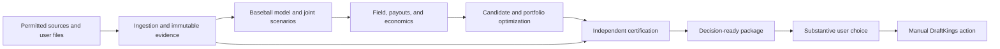

# DraftKings MLB DFS Greenfield System Specification

**Review date:** 2026-08-10  
**Repository reviewed:** `mlb-dfs` at commit `89ca350ea1d03f3eae2b39c4105e65206b07300e`  
**Scope:** DraftKings MLB Classic and single-game Showdown research, modeling, lineup construction, portfolio allocation, late swap, evidence, QA, and delivery  
**Audience:** An implementation agent that has no access to the reasoning that produced this document

**Executive verdict:** The repository is a serious legality-and-audit system, but it is not yet an expected-value system. It can construct legal rosters, preserve useful evidence, and run substantial QA. Its production objective is nevertheless a collection of hand-tuned projection, ownership, stack, contest, and diversity proxies. It does not generate calibrated joint game outcomes, simulate a contest-conditioned opponent field, settle exact payouts and ties, or optimize a bankroll-aware portfolio over scenario-level profit. Calling the result maximum-EV would be false.

The greenfield recommendation is to retain the useful domain knowledge but replace the runtime architecture. The target is a deterministic, persisted event-driven system in which immutable inputs feed calibrated baseball simulations, contest-specific opponent-field simulations, exact payout settlement, scenario-level portfolio optimization, and an independent fail-closed certifier. The language model is a research and exception-handling assistant, not the control plane, calculator, evidence authority, or release signer.

There is also a non-negotiable product constraint. DraftKings' current [Terms of Use](https://sportsbook.draftkings.com/legal/us-terms-of-use), [Fair Play Commitment](https://help.draftkings.com/hc/en-us/articles/4405223983635-Fantasy-Sports-Fair-Play-Commitment-US), and [Community Guidelines](https://help.draftkings.com/hc/en-us/articles/4405229759763-What-are-the-DraftKings-Community-Guidelines-US) prohibit bots or scripts that interact with the site and state that permitted lineup tools must leave substantive independent decisions to the user. Therefore, literal zero-human-intervention entry submission is not an acceptable production requirement. The compliant target is zero-touch computation through a decision-ready package, followed by a logged substantive user choice and manual DraftKings login, entry, upload, and money movement. An authenticated automation capability must remain disabled unless DraftKings grants written authorization or supplies an authorized API and counsel approves its use.

The design follows four rules:

1. **Compute continuously; promote conservatively.** Missing evidence may never stall diagnostic calculation, but it must prevent a package from becoming certified.
2. **No EV label without economics.** A score becomes EV only after calibrated outcomes, a contest-conditioned field, exact payout/tie logic, and uncertainty accounting exist.
3. **No assumption becomes evidence.** `UNKNOWN`, `STALE`, and `CONFLICTED` remain first-class states and cannot be converted to `PASS` by a caller flag.
4. **No model grades itself.** Final legality, evidence, identity, and byte-level delivery checks run in an independent process from different inputs or independently loaded artifacts.

**Research basis.** Current source material used for the redesign includes Anthropic's guidance on [context engineering](https://www.anthropic.com/engineering/effective-context-engineering-for-ai-agents), [long-running agent harnesses](https://www.anthropic.com/engineering/effective-harnesses-for-long-running-agents), [long-running app harness design](https://www.anthropic.com/engineering/harness-design-long-running-apps), and [bounded Ralph loops](https://claude.com/plugins/ralph-loop); MLB's definitions of [expected wOBA](https://www.mlb.com/glossary/statcast/expected-woba), [expected statistics](https://baseballsavant.mlb.com/expected_statistics), and [bat tracking](https://baseballsavant.mlb.com/leaderboard/bat-tracking); DraftKings' [Classic rules](https://help.draftkings.com/hc/en-us/articles/24807418578707-Game-Style-Classic-Overview-US), [Showdown rules](https://help.draftkings.com/hc/en-us/articles/24808583978003-Game-Style-Showdowns-Overview-US), [CSV workflow](https://help.draftkings.com/hc/en-us/articles/4405223998867-How-do-I-upload-or-edit-multiple-lineups-at-once-US), and [lock policy](https://support.draftkings.com/dk/en-us/when-do-lineup-entries-and-edits-close?id=kb_article_view&sysparm_article=KB0010806); official [SciPy MILP](https://docs.scipy.org/doc/scipy/reference/generated/scipy.optimize.milp.html), [OR-Tools CP-SAT](https://developers.google.com/optimization/cp/cp_solver), and [SQLite transaction](https://www.sqlite.org/lang_transaction.html) / [WAL](https://www.sqlite.org/wal.html) documentation; and vendor capability descriptions from [SaberSim contest simulations](https://support.sabersim.com/en/articles/12079199-how-contest-sims-work), [SaberSim late swap](https://support.sabersim.com/en/articles/12079563-using-late-swap), [Stokastic MLB tools](https://www.stokastic.com/mlb/stokastics-mlb-dfs-package-use-what-our-pros-use-to-win-big-m23/), and [RotoGrinders LineupHQ](https://rotogrinders.com/lineuphq). Vendor pages are capability benchmarks, not independent proof that their models are profitable.

## 1. Critical Flaws, Bottlenecks & Architectural Anti-Patterns

### F-01 — Product boundary: literal zero-touch DraftKings operation is non-compliant

**Title / Component:** Product objective, platform automation, and required human agency

**Adversarial Critique & Rationale:** The prompt's literal objective—maximum-EV lineups with zero human intervention—collides with current DraftKings rules. The Terms prohibit automated means, scripts, and tools from interacting with the site, including screen scraping and creating or editing lineups. The Community Guidelines permit an optimizer only when the user incorporates substantive independent decisions; a system distributing prebuilt lineups that require no substantive user input is specifically outside that boundary. Automating authenticated salary downloads, entry editing, upload, or submission with a browser is therefore not a clever autonomy win. It is account, funds, and product risk. A manual click added after an otherwise predetermined workflow is unlikely to be a substantive decision.

**Proposed Architecture & Implementation Spec:** Define two product modes. `SHADOW_AUTONOMOUS` may run research through economic recommendations without account interaction and is used for model evaluation. `DK_COMPLIANT_PRODUCTION` must stop at `DECISION_READY`, present at least two meaningfully different portfolios with material trade-offs, record the user's independent selection or parameter choice, then create a manually uploaded CSV. Login, contest entry, upload, editing, withdrawal, and payment remain manual. Put authenticated DraftKings automation behind a compile-time-disabled capability named `AUTHORIZED_DK_API`, requiring written platform approval, legal review, explicit credentials, and a new threat model before it can be built.

### F-02 — Objective function: lineup score is being mistaken for expected value

**Title / Component:** Contest allocator and portfolio objective

**Adversarial Critique & Rationale:** `mlb_engine/allocate/contest_allocator.py` explicitly says it does not perform true ROI simulation. It combines normalized candidate-shape scores, contest attractiveness weights, stack bonuses, pitcher-tier preferences, reuse rules, and other handcrafted terms. Those values can produce sensible-looking portfolios but do not have units of dollars and cannot price top-heavy payouts, duplicate lineups, ties, entry fees, field strength, or cross-entry covariance. A beautifully optimized proxy can be systematically negative-EV. The current design also makes weight tuning look like quantitative progress even when no prospective profitability target exists.

**Proposed Architecture & Implementation Spec:** Replace the production objective with scenario-level net profit. For lineup `l`, contest `c`, and scenario `s`, calculate `profit[l,c,s] = settled_prize[l,c,s] - entry_fee[c]`. Portfolio selection must choose one lineup per reserved Entry ID and maximize a declared utility such as expected profit minus downside risk, Monte Carlo uncertainty, and concentration costs. Keep the old score only as `proxy_score_v1`, never `EV`, `ROI`, or `expected_profit`. Require an `economics_complete=true` contract before any EV field can be populated.

### F-03 — Projection core: AveragePointsPerGame is not a forecast

**Title / Component:** `projection_builder.py`, `execution_pipeline.py`, and `showdown.py`

**Adversarial Critique & Rationale:** The current engine can use DraftKings `AvgPointsPerGame` as the base of a multiplicative projection, and Showdown paths use it directly. APPG is a backward-looking mixture of role, opponents, parks, lineup spots, injuries, variance, and sample length. It is especially fragile for call-ups, platoon players, openers, bulk relievers, recently injured players, and pitchers changing workload. Salary and APPG also encode DraftKings' own priors, which creates circularity when the system later treats price-based leverage as independent information.

**Proposed Architecture & Implementation Spec:** Build forecasts from opportunity and event distributions. Project hitter plate appearances conditional on lineup slot and team run environment; pitcher batters faced and innings conditional on role, pitch count, efficiency, and removal hazard; then project K, BB, HBP, batted-ball outcomes, steals, runs, RBI, wins, and quality starts. APPG may be a weak fallback feature with an explicit `emergency_proxy` tier, never the primary mean. Every prediction must carry model version, as-of time, feature cutoff, mean, quantiles, and uncertainty.

### F-04 — Projection multipliers create false precision and hidden double counting

**Title / Component:** Multiplicative factor model and manual adjustments

**Adversarial Critique & Rationale:** The documented `Base × F1 × F2 × F3 × F4 × F5` model looks interpretable but multiplies correlated signals: salary, recent fantasy output, batting order, handedness, park, implied total, Statcast quality, and manual context. Products amplify measurement error, make interactions accidental, and provide no calibrated predictive distribution. Expected statistics such as xwOBA are valuable descriptive features, but MLB defines them from comparable batted balls and selected running characteristics; they are not complete forward DFS forecasts. A 7% multiplier is not evidence of a 7% change in expected fantasy points.

**Proposed Architecture & Implementation Spec:** Replace manual multiplicative factors with versioned probabilistic submodels trained and evaluated out of time. Use partial pooling for players with sparse data, time-decay or dynamic latent skill, explicit park/handedness/opponent terms, and workload models. Preserve human-readable factor reports as Shapley-style or counterfactual explanations generated after inference, not as the inference mechanism. Calibration and ablation tests must determine whether each feature stays.

### F-05 — Outcome model: documented simulation capabilities are absent from the runtime

**Title / Component:** Joint slate simulation and documentation truth

**Adversarial Critique & Rationale:** `MLB_Classic.md` describes a `slate_sim.py`, calibration engine, and post-slate evaluator, but those modules are not present in the current tree. The runtime produces point estimates and ceilings rather than internally consistent joint outcomes. Without shared game states, a stack's upside, opposing-hitter versus pitcher conflict, bullpen exposure, weather effects, and teammate correlations are all approximated. Phantom documentation is worse than missing documentation because an agent may believe an economic prerequisite already exists.

**Proposed Architecture & Implementation Spec:** Introduce an event-driven `GameSimulator` that generates coherent plate appearances and scoring events for every game, then combines game blocks into slate scenarios with deterministic seeds. Make the simulator an importable, tested package rather than a prose contract. Documentation must be generated from registered components and artifact schemas where possible; CI must fail if named executable modules or commands do not exist.

### F-06 — Opponent model: ownership priors are not a simulated field

**Title / Component:** `ownership_prior.py` and absent contest-field generator

**Adversarial Critique & Rationale:** The ownership module correctly labels itself an uncalibrated structural prior, yet downstream strategy can still treat its output as contest leverage. Player marginals alone cannot reproduce lineup stacks, pitcher pairs, salary usage, max-entry behavior, optimizers, chalk concentration, or duplicate counts. The archive now contains hundreds of mined contest artifacts, which is meaningful raw material, but roughly a few weeks of repeated contest observations is not automatically a calibrated population model. Contest size and entry limit materially change field construction.

**Proposed Architecture & Implementation Spec:** Train a hierarchical field model conditioned on slate, contest family, fee, field size, maximum entries, payout shape, and observed ecosystem regime. It must match player ownership, team stack rates, stack shapes, pitcher pairs, salary-left distribution, player-pair correlations, lineup duplication, and entrant portfolio behavior. Generate only legal lineups through sequential constrained sampling or conditional optimization. Evaluate with held-out contests and reliability plots; retain the structural prior only as a cold-start distribution.

### F-07 — Contest economics: payout and tie settlement are missing from selection

**Title / Component:** Payout tables, ranking, duplicate handling, and ROI

**Adversarial Critique & Rationale:** Contest metadata and payout rows may be stored, but the production allocator does not rank the user's lineup against a simulated field and settle the exact payout table. This ignores the defining economics of GPPs. Duplicate lineups share prizes across tied positions; a high-owned lineup can project well yet lose value through duplicated top finishes. Flat, satellite, single-entry, three-max, and 150-max contests demand different portfolios even on the same slate.

**Proposed Architecture & Implementation Spec:** Create a vectorized `ContestSettlementEngine`. For each scenario, score all field and user lineups, rank them, group exact ties, and divide the sum of prizes occupying the tied positions equally among tied entries. Subtract fees to produce net profit. Store the exact payout-table hash and contest snapshot with every result. If field size, fee, or payout is missing or inconsistent, set `economics_state=INCOMPLETE` and prohibit EV terminology.

### F-08 — Historical data exists, but there is no clean prospective prediction ledger

**Title / Component:** Calibration archive, leakage control, and feedback loop

**Adversarial Critique & Rationale:** The repository has expanded its mined field archive, but mining results after contests is not the same as preserving what the model knew before lock. Without append-only pre-lock forecasts, ownership estimates, evidence versions, generated candidates, and decisions, later analysis can silently mix revised lineups, final ownership, or postgame information into evaluation. That produces excellent backtests and disappointing live results. Repeated contest exports can also overweight a slate unless grouped correctly.

**Proposed Architecture & Implementation Spec:** Add an append-only prediction ledger keyed by slate identity, contest identity, model snapshot, and cutoff time. Persist pre-lock distributions before outcomes are available. After settlement, join results in a separate namespace and calculate metrics only through a time-aware dataset builder. Enforce train/validation/test splits by date and slate, group duplicate contest observations, and prohibit post-lock features with automated provenance checks.

### F-09 — Candidate prefiltering can manufacture infeasibility

**Title / Component:** `contest_allocator.py` candidate pruning

**Adversarial Critique & Rationale:** The allocator retains sole-compatible candidates, limited representatives by stack/pitcher structure, and high-score candidates before solving the joint assignment. A candidate that appears weak in isolation can be the only combination that satisfies global exposure, uniqueness, or contest-fit constraints. Dropping it turns a feasible portfolio into a solver-reported infeasible one. The solver then receives blame for a lossy heuristic performed before it saw the actual problem.

**Proposed Architecture & Implementation Spec:** Remove destructive score-only prefiltering. Use dominance rules that are proven safe under the active constraint set, or solve with column generation: start from a compact bank, obtain dual pressure or conflict diagnostics, generate improving lineups, and repeat to convergence or a hard time budget. When the problem is infeasible, generate an irreducible-conflict explanation against the unpruned contract and label heuristic exhaustion separately from mathematical infeasibility.

### F-10 — Candidate generation is not tied to economic marginal value

**Title / Component:** Candidate bank generation and diversity rules

**Adversarial Critique & Rationale:** Random perturbations, stack quotas, ownership buckets, overlap caps, and no-good cuts can create a visually diverse bank while missing the lineups that improve portfolio EV. Conversely, generating thousands of variants before contest economics are applied consumes CPU and memory without knowing which columns matter. Fixed diversity targets can also remove rational concentration on small slates.

**Proposed Architecture & Implementation Spec:** Generate candidates as best responses to sampled outcome scenarios, field compositions, contest types, and current portfolio dual prices. Add columns for high-value stack/game-state clusters, ownership-error stress cases, late-swap branches, and downside hedges. Stop when recent columns fail to improve held-out portfolio utility or the regret bound, not when an arbitrary bank size is reached. Record why each candidate entered the bank.

### F-11 — Evidence semantics: callers can convert unknown facts into passing gates

**Title / Component:** `build_slate.py` and `execution_pipeline.py` evidence assumptions

**Adversarial Critique & Rationale:** Current paths can mark odds and weather gates assumed when data maps are absent, and caller assumptions can turn `None` into `True`. This destroys the difference between verified fact, policy default, and missing evidence. It is a direct route to an upload-ready claim with no current source behind it. Boolean gates cannot express staleness, disagreement, partial coverage, or not-applicable states.

**Proposed Architecture & Implementation Spec:** Replace booleans with immutable `EvidenceAssertion` and derived `EffectiveFact` records. Status is one of `PASS`, `FAIL`, `UNKNOWN`, `STALE`, `CONFLICTED`, or `NOT_APPLICABLE`; only the evidence resolver can derive it from policy. Callers may request a diagnostic continuation but may not mutate an evidence state. Promotion requires every policy-declared critical fact to be `PASS` or `NOT_APPLICABLE` with provenance.

### F-12 — Preflight can warn on missing or stale evidence and still declare upload-ready

**Title / Component:** `preflight_upload.py` certification verdict

**Adversarial Critique & Rationale:** Unreadable lineup feeds, feeds older than the current threshold, and even missing feed files can remain warnings. If other checks pass, the verdict can become `upload_ready`. This is a category error: legality of a CSV does not establish that every selected player is currently active, starting, eligible, and unlocked. A warning-heavy report is not an independent certification.

**Proposed Architecture & Implementation Spec:** Split outputs into `structural_qa`, `live_evidence_qa`, `economic_qa`, and `delivery_qa`. Structural checks may pass while live evidence remains unknown. Only their policy-complete conjunction can produce `CERTIFIED_FOR_USER_REVIEW`. Every other artifact must visibly carry `DO_NOT_UPLOAD` plus machine-readable blockers. Use deadline-aware diagnostic completion, not permissive promotion.

### F-13 — Shared lineup feeds accept weak coverage and overwrite provenance

**Title / Component:** Supplied-feed ingestion and `data/slates/<date>/lineups_feed.json`

**Adversarial Critique & Rationale:** The current acceptance check can allow exactly half-team coverage, then writes a mutable date-level file. Multiple draft groups or modes on the same date can collide, and a later partial source can overwrite a better one. The filename cannot express contest, draft group, retrieval time, source, or parser version. A consumer cannot prove which raw bytes produced a decision.

**Proposed Architecture & Implementation Spec:** Store every acquired response as a content-addressed blob and insert a versioned assertion set keyed by game-set fingerprint and source time. Never overwrite raw evidence. Calculate coverage per required game and team, not against an arbitrary fraction. Promote a resolved view only after identity and completeness checks. A `latest` pointer is a derived database query, never the source of truth.

### F-14 — Late-swap evidence is slate-global and unsafe

**Title / Component:** `tools/late_swap.py` lineup, pitcher, weather, and odds gates

**Adversarial Critique & Rationale:** The late-swap path can assume several gates, and the presence of confirmed teams can turn a lineup check truthy for the slate. One posted team does not verify all unlocked players. This is most dangerous near lock, when evidence changes quickly and a false global pass can preserve a scratched player in another game. Labeling the workflow certified based on workflow validity compounds the error.

**Proposed Architecture & Implementation Spec:** Evaluate each rostered player and each relevant game independently at a precise decision timestamp. Model locked, unlocked, postponed, delayed, and uncertain games explicitly. Re-simulate or reweight only the remaining conditional game distribution, freeze all locked slots, and certify that every unlocked selected player has valid evidence. Unresolved facts produce a fast diagnostic swap branch and a promotion blocker, never a stall.

### F-15 — Delivery manifest is a race-prone mutable JSON document

**Title / Component:** `upload_manifest.py` read-modify-write and corruption handling

**Adversarial Critique & Rationale:** Manifest updates perform an unlocked read-modify-write around a whole JSON document. Concurrent sessions can lose deliveries, supersession links, or status changes. An unreadable manifest is converted into an empty manifest, masking corruption as a fresh state. The manifest primarily hashes the delivered file rather than binding the full evidence, model, candidate, portfolio, and contest dependency graph.

**Proposed Architecture & Implementation Spec:** Make a transactional database the authority and the JSON manifest a generated view. Use append-only delivery events, unique constraints, foreign keys, optimistic version checks, and short transactions. Bind every promoted byte to a Merkle-style dependency manifest containing input hashes, contest identity, evidence snapshot, code/model versions, scenarios, solver configuration, QA report, and user-decision record. Corruption is `QUARANTINED`, never empty.

### F-16 — Manifest status vocabularies already contradict each other

**Title / Component:** Showdown preflight and manifest state model

**Adversarial Critique & Rationale:** `upload_manifest.py` limits delivery status to `candidate`, `upload_ready`, `blocked`, `acknowledged`, and `superseded`, while the Showdown preflight can stamp `review_ready`. Another verifier then rejects the same artifact. This is not cosmetic. It means status is being used simultaneously for artifact lifecycle, certification grade, and operator verdict, with no single owning schema.

**Proposed Architecture & Implementation Spec:** Define separate enums: `artifact_state`, `certification_state`, `decision_state`, and `delivery_state`. Generate language bindings and migrations from one schema. Reject unknown values at write time. Model legal transitions in the persisted state machine, and add a contract test that every producer/consumer handles every enum value. Never overload `upload_ready` as a generic success word.

### F-17 — Date-based mutable paths do not provide slate identity

**Title / Component:** Artifact naming, run directories, and contest reconciliation

**Adversarial Critique & Rationale:** Some run-manager paths are immutable and hashed, which is a real strength, but shared date-level inputs and `latest` pointers still permit collisions across Classic, Showdown, contest sets, draft groups, and simultaneous sessions. Date plus mode is not enough to prove that a salary file and reserved-entry template describe the same game set. Contest discovery can change while a run is active.

**Proposed Architecture & Implementation Spec:** Use a canonical identity tuple: `contest_id`, `draft_group_id`, `game_set_fingerprint`, `mode`, `salary_hash`, `entries_hash`, and `roster_contract_version`. Every artifact must carry it. Reconciliation must compare embedded player pools, game IDs, salary identities, and entry slots before any modeling. Use content hashes for storage and stable logical IDs only as indexes.

### F-18 — Classic and Showdown are two products with unequal safety guarantees

**Title / Component:** Roster modes, certification, and late swap

**Adversarial Critique & Rationale:** Classic flows through stronger projection, validation, and certification machinery while Showdown remains review-grade in important paths. Separate implementations duplicate logic and allow fixes to land in only one mode. The user receives a similarly shaped CSV but materially different assurance. Showdown's CPT/UTIL role makes identity more complex, not less deserving of certification.

**Proposed Architecture & Implementation Spec:** Implement a common `RosterContract` interface with mode plugins. Shared services own ingestion, evidence, player identity, scenarios, field simulation, economics, optimization, QA, manifests, and late swap. The Classic plugin defines two pitchers, positional slots, salary cap, team minimum, and game diversity. The Showdown plugin defines one CPT, five UTIL, 1.5× salary/points, both-team requirement, and underlying-player uniqueness. Both must satisfy the same promotion policy.

### F-19 — Showdown theses are handcrafted labels rather than latent game states

**Title / Component:** `showdown_theses.py`, captain logic, and bank relaxations

**Adversarial Critique & Rationale:** Current theses apply deterministic multipliers to salary-regressed APPG and name narratives such as game scripts. Candidate construction can relax overlap or captain constraints to fill a bank. This creates narrative confidence without a probability model and can quietly violate portfolio intent under scarcity. A thesis written after selecting players is explanation theater if it did not correspond to simulated states used in selection.

**Proposed Architecture & Implementation Spec:** Cluster simulated game outcomes into reproducible latent states—pitcher duel, one-sided rout, bullpen collapse, extra innings, concentrated scoring, and so on—and compute each lineup's conditional payoff by cluster. Derive thesis labels from those clusters after selection. Hard constraints remain hard; any configured relaxation creates a new policy version, diagnostic-only state, and explicit blocker. Captain exposure should be portfolio-level and configurable, with `<= 1/3` as the default for a 17-lineup portfolio unless prospective evidence supports another value.

### F-20 — Showdown salary ingestion confuses role rows and starter status

**Title / Component:** `paste_lineups.py` and Showdown pool validation

**Adversarial Critique & Rationale:** DraftKings Showdown salary files commonly contain both CPT and UTIL rows for the same underlying player. The paste path indexes both rows without first collapsing the identity and can report every name as ambiguous. Its starting-position tokens are Classic pitcher tokens, so valid Showdown probable pitchers can be declared absent. These defects were observed on real files, making the operator tool unreliable at the exact point of time pressure.

**Proposed Architecture & Implementation Spec:** Parse a canonical `UnderlyingPlayer` once, then attach explicit `RosterVariant` records for CPT and UTIL. Resolve pasted names against underlying identity before applying the requested slot. Starter validation must use normalized evidence roles, never DK position tokens. Add golden tests with real redacted Showdown files, duplicate CPT/UTIL rows, suffixes, accents, abbreviations, and both probable pitchers.

### F-21 — Pitcher role semantics disagree across modules

**Title / Component:** `live_data_adapters.py`, PO/PLR handling, and lineup eligibility

**Adversarial Critique & Rationale:** `PO` and `PLR` statuses are interpreted inconsistently: one path can regard a pitcher opener as viable, another treats projected long reliever as generic, and Showdown declared-starter logic can admit both. This mixes evidence (“listed opener”), role forecast (“bulk innings”), and selection policy (“may start”). A cheap opener who will face four batters can become a catastrophic false value.

**Proposed Architecture & Implementation Spec:** Define distinct typed fields: `announced_role`, `projected_role`, `role_confidence`, `expected_batters_faced`, `expected_innings`, and `roster_policy`. `PO` is ineligible to start by default. `PLR` requires an independently sourced bulk-role projection and workload threshold; otherwise it remains diagnostic only. Centralize the policy in the roster contract and test every provider code mapping.

### F-22 — Contest truth is incomplete and too easy to infer

**Title / Component:** Contest card, entries template, payout, and lock identity

**Adversarial Critique & Rationale:** A legal lineup file does not prove which reserved contest, fee, field size, payout table, entry limit, or lock schedule it belongs to. Contest attributes can be inferred from filenames or loosely reconciled inputs. Wrong-contest allocation makes all field and EV calculations irrelevant while still yielding valid player IDs and salaries.

**Proposed Architecture & Implementation Spec:** Require a signed `ContestSnapshot` assembled from user-supplied files or a permitted structured provider. It must include contest ID, draft group, name, mode, fee, field size, maximum entries, reserved Entry IDs, payout rows, game IDs, lock times, and source provenance. Never infer missing economics from contest-name text for promotion. A missing field may permit structural lineup generation but not EV selection or certification.

### F-23 — Oversized modules and duplicated infrastructure make fixes non-local

**Title / Component:** Runtime modularity and shared infrastructure

**Adversarial Critique & Rationale:** The current Python surface is more than thirty thousand lines, with individual modules thousands of lines long. Network clients and durable-write behavior are distributed across many files. This makes a timeout, parser, atomic-write, or identity fix difficult to apply universally and encourages mode-specific shortcuts. Long files also make LLM-assisted maintenance more expensive because every change requires loading unrelated context.

**Proposed Architecture & Implementation Spec:** Split packages by stable domain contracts rather than workflow chronology. Centralize HTTP behavior, clocks, identifiers, serialization, content storage, transactions, and policy evaluation. Set review thresholds—roughly 400 lines for ordinary modules and 800 for cohesive numerical kernels—with exceptions justified in architecture records. Require dependency direction from domain to adapters, never the reverse.

### F-24 — Instruction bloat consumes context and creates policy drift

**Title / Component:** `CLAUDE.md`, `MLB_Classic.md`, and `skills/generate-lineups/SKILL.md`

**Adversarial Critique & Rationale:** The main instruction files collectively contain many thousands of words, repeated procedures, historical constraints, mode-specific details, and multi-session guidance. Important rules compete with stale implementation commentary. Current context-engineering guidance favors the smallest high-signal system context and just-in-time progressive disclosure. A long prompt does not make an agent more reliable if the decisive rules are buried and duplicated.

**Proposed Architecture & Implementation Spec:** Reduce root `CLAUDE.md` to purpose, safety boundaries, authoritative commands, artifact states, and where to load deeper references. Move roster contracts, evidence policy, model notes, incident playbooks, and provider instructions into versioned references retrieved only for the current task. Split the monolithic lineup skill into thin operator, diagnose, research, postmortem, and migration skills. Treat machine-readable schemas and executable checks as authority over prose.

### F-25 — The LLM is being asked to perform deterministic control-plane work

**Title / Component:** Cowork orchestration and token economics

**Adversarial Critique & Rationale:** Asking an agent to discover files, interpret state, decide the next routine command, copy fields, retry feeds, and narrate every transition is slower, costlier, and less reproducible than code. The language model's flexibility is useful for ambiguous sources and diagnosis, but it is a liability for hashes, roster rules, deadlines, and state transitions. More agent autonomy inside a prompt does not repair the absence of a durable orchestrator.

**Proposed Architecture & Implementation Spec:** Run the normal path from one deterministic CLI/service call. The orchestrator owns state, timers, retries, cancellation, idempotency, and promotion. Invoke an LLM only for approved unstructured public-page extraction, provider mapping proposals, incident explanations, or model research; require structured output and deterministic verification. Budget normal critical-path LLM calls at zero.

### F-26 — Retry logic is local, but the end-to-end process is not a bounded durable loop

**Title / Component:** Autonomous execution, resumption, and deadlock prevention

**Adversarial Critique & Rationale:** Individual adapters may have timeouts, yet the overall workflow is driven through sessions and mutable files rather than a persisted state machine. A crash, context reset, partial write, repeated exception, or hung external dependency can leave ambiguous progress. “Keep trying until complete” is not a stopping rule and can burn lock-window time and tokens.

**Proposed Architecture & Implementation Spec:** Every unit of work needs an idempotency key, attempt count, next-at time, deadline, and terminal outcome. Use bounded exponential backoff with jitter, circuit breakers, per-provider concurrency limits, and lock-aware cancellation. A watchdog must move overdue work to `FAILED_BOUNDED` or a lower diagnostic tier. Restarting the process must replay state without duplicating side effects.

### F-27 — Runtime is not hermetic on the actual operator platform

**Title / Component:** Python, NumPy/pandas/SciPy, and deployment

**Adversarial Critique & Rationale:** The checked lock file targets a specific Python/Linux environment, while this review ran on Windows with Python 3.13 and no NumPy, pandas, or SciPy. The environment probe reports a cold runtime and SciPy MILP unavailable; the audit test run stops after dependency failure. That is an environment-limited validation result, not proof that the code is broken, but it proves the repository alone cannot reproduce its declared runtime here. Installing numerical packages during a lock window is operationally unacceptable.

**Proposed Architecture & Implementation Spec:** Ship a prebuilt, versioned runtime for each supported OS/architecture or a locally available OCI image. Pin Python, wheels, native solver, model artifacts, and hashes; publish an SBOM and startup self-test. Warm the worker before slate day and refuse production mode if its image digest differs from the certified digest. No package installation or compilation is allowed in the critical path.

### F-28 — Browser automation is aimed at the wrong surfaces

**Title / Component:** Claude in Chrome, scraping, and authenticated actions

**Adversarial Critique & Rationale:** Browser-driving DraftKings to download files, inspect entries, edit rosters, or submit uploads would violate current automation restrictions and create brittle selectors, secret exposure, and ambiguous responsibility for financial actions. Browser extraction from public news pages can also be less reliable and slower than a licensed or documented feed.

**Proposed Architecture & Implementation Spec:** Never automate the authenticated DraftKings site. Prefer licensed feeds, official APIs, permitted public endpoints, and user-supplied DK files. Permit browser research only for allowlisted public sites whose terms permit it and only when structured sources are unavailable. Capture raw HTML/screenshot, URL, retrieval time, parser version, and extraction confidence; the browser output enters evidence resolution like any other untrusted source.

### F-29 — Provider authority and freshness rules are scattered in code

**Title / Component:** Live lineup, injury, weather, roof, umpire, and odds evidence

**Adversarial Critique & Rationale:** Provider mappings, freshness thresholds, fallbacks, and assumptions are embedded across adapters and workflow files. The system cannot answer one simple question: “Why did this source have authority for this fact at this time?” Adding umpires or a new lineup source under this pattern multiplies special cases. A cached success can be mistaken for a current success.

**Proposed Architecture & Implementation Spec:** Define a versioned evidence-policy document with source priority, fact type, allowed age as a function of time to lock, minimum coverage, conflict resolution, and promotion criticality. Adapters only emit assertions; they never decide gates. The resolver produces an explanation graph. Cache raw responses and assertions, but freshness is recomputed at decision time.

### F-30 — Tests and documentation can validate the wrong contract

**Title / Component:** `MANIFEST.md`, regression tests, and permissive behavior

**Adversarial Critique & Rationale:** `MANIFEST.md` still describes an older migration state and test/module counts, and documented components are missing. Some tests encode permissive assumptions that should be rejected in a fail-closed production design. High test counts do not help if they lock in the wrong semantics or skip the deployed environment.

**Proposed Architecture & Implementation Spec:** Replace hand-maintained inventory counts with generated reports. Build contract, property, metamorphic, replay, chaos, and golden-file tests around the new invariants. A policy change must update a machine-readable version and its tests. CI must run in the exact production image and report skipped tests as explicit coverage gaps, not success.

### F-31 — Backtests are vulnerable to time leakage and optimizer overfitting

**Title / Component:** Model selection, scenario reuse, and historical evaluation

**Adversarial Critique & Rationale:** Using final lineups, final ownership, settled roles, or updated data in pre-lock prediction causes leakage. Reusing the same simulated scenarios to discover candidates, select the portfolio, tune risk, and certify performance overfits Monte Carlo noise. Repeatedly adjusting heuristics after viewing the same slates creates researcher degrees of freedom that no holdout metric captures.

**Proposed Architecture & Implementation Spec:** Use as-of data joins and rolling-origin evaluation. Keep separate scenario banks for model development, candidate discovery, portfolio selection, and an independent referee, each with logged seeds. Lock evaluation protocols before reading holdout results. Promote models through shadow runs and prospective slates, not retrospective anecdotes.

### F-32 — Bankroll and contest selection are outside the optimizer

**Title / Component:** Portfolio risk, allocation, and contest choice

**Adversarial Critique & Rationale:** Maximizing lineup upside inside a preselected group of entries ignores the first-order decisions of which contests to enter and how much bankroll to risk. Contest attractiveness is represented by hard-coded scores rather than simulated net utility. Correlated entries can create large hidden downside, and optimizing expected value alone can still be ruinous under model error.

**Proposed Architecture & Implementation Spec:** Add bankroll state, daily/weekly risk caps, contest exposure limits, model-uncertainty haircuts, and a utility configuration. Evaluate available contests only from user-supplied or authorized data. Optimize contest-entry count and lineup assignment jointly where allowed, using expected profit plus CVaR or another explicitly selected risk measure. Money movement and final entry remain manual.

### F-33 — Governance currently protects the proxy system from the work needed to become an EV system

**Title / Component:** Backlog policy and architectural decision making

**Adversarial Critique & Rationale:** Current backlog guidance explicitly defers Monte Carlo, field ROI, play-by-play simulation, a transactional database, and machine-readable evidence policy. That can be sensible short-term scope control, but it directly conflicts with the stated maximum-EV objective. Continuing to optimize legality proxies while forbidding economic modeling guarantees local polish and strategic failure.

**Proposed Architecture & Implementation Spec:** Create a new architecture decision record that supersedes the anti-goals for a separate vNext package. Freeze the current engine as a reference implementation and operational fallback. Fund the EV prerequisites in dependency order and require each milestone to demonstrate measurable information or economic value. Do not retrofit every new concept into the monolith.

### F-34 — Secrets, provenance, and promotion authority are insufficiently isolated

**Title / Component:** Security and release trust

**Adversarial Critique & Rationale:** A process that can fetch arbitrary pages, run model code, write artifacts, and label them upload-ready has excessive authority. A compromised provider response or parser could influence both the selected lineup and the system that certifies it. Mutable reports do not prove which bytes were reviewed. Browser sessions compound credential risk.

**Proposed Architecture & Implementation Spec:** Use least-privilege service roles: acquisition can write raw blobs, modeling can read resolved evidence, optimization can write candidates, and certification can only read immutable dependencies and sign promotion records. Store secrets outside the repository, redact logs, validate schemas and content sizes, and sandbox parsers. Use keyed signatures or a local signing identity for promotion manifests; verification must occur before a file is presented for manual upload.

## 2. Greenfield Architecture, Feature Enhancements & Implementation Specs

### A-01 — Operating model: autonomous computation with a hard decision wall

**Title / Component:** Product modes and platform-safe operating boundary

**Adversarial Critique & Rationale:** “Zero touch” is useful when it means no prompt babysitting, but unsafe when it means the system makes every substantive lineup and account decision. The architecture must maximize unattended computation without pretending current DraftKings rules allow unattended production submission.

**Proposed Architecture & Implementation Spec:** Implement these modes:

- `SHADOW_AUTONOMOUS`: run the entire research-to-portfolio loop, settle after contests, and never create an account-action instruction. Use it for evaluation.
- `DK_COMPLIANT_PRODUCTION`: autonomously produce a `DecisionPackage` containing two or more portfolios with meaningful EV/risk/ownership differences, explanations, blockers, and immutable hashes. Require a logged substantive user choice before final CSV materialization.
- `DIAGNOSTIC`: always finish structural work when possible, label model/evidence gaps, and produce no upload claim.
- `AUTHORIZED_API`: absent and disabled by default. It can exist only after documented platform permission and a separate security review.

The user must never be asked to supervise retries, fix prompt wording, copy values between stages, or perform intermediate QA. Their only production roles are substantive strategy choice and manual DraftKings account actions.

### A-02 — System topology: separate data, intelligence, economics, and trust planes

**Title / Component:** Service boundaries and dependency direction

**Adversarial Critique & Rationale:** A single workflow that downloads data, interprets it, builds projections, selects lineups, and certifies itself cannot isolate failures or establish trust. Separating modules only by filename is insufficient if they share mutable state and authority.

**Proposed Architecture & Implementation Spec:** Build five planes with typed artifacts between them:



Ingestion has no optimization authority. Modeling cannot alter evidence. Optimization cannot mark itself certified. Certification is a separately launched process with read-only access to immutable inputs. The orchestrator coordinates IDs and events but cannot override policy results.

### A-03 — Clean implementation tree and package contracts

**Title / Component:** Repository layout for vNext

**Adversarial Critique & Rationale:** Incremental additions to the current large modules will preserve circular dependencies and mode-specific behavior. An implementation agent needs a target layout and clear ownership.

**Proposed Architecture & Implementation Spec:** Create a new package alongside the current engine:

```text
dfs_vnext/
  domain/       ids.py contest.py roster.py evidence.py artifacts.py states.py
  ingest/       dk_files.py provider_client.py adapters/ normalize.py
  store/        schema.sql blob_store.py repositories.py migrations/
  model/        opportunity.py skills.py event_rates.py game_sim.py calibration.py
  field/        ownership.py construction.py sampler.py duplication.py
  economics/    payouts.py settlement.py utility.py uncertainty.py
  optimize/     roster_contract.py candidates.py portfolio.py solvers.py
  swap/         observations.py conditioning.py optimizer.py
  certify/      legality.py evidence.py economics.py referee.py promotion.py
  orchestrate/  fsm.py workers.py retries.py scheduler.py watchdog.py
  explain/      decision_package.py reports.py
  cli.py
tests_vnext/
schemas/
policy/
```

Domain objects must be dependency-free and immutable. Adapters implement protocols owned by the domain layer. No module may read an arbitrary workspace path; all I/O goes through injected repositories and content stores.

### A-04 — Canonical identity and immutable artifact graph

**Title / Component:** IDs, hashes, provenance, and reproducibility

**Adversarial Critique & Rationale:** Reproducible optimization is impossible if “today's slate” or a mutable filename identifies inputs. Every downstream conclusion must be traceable to exact bytes and code.

**Proposed Architecture & Implementation Spec:** Define:

```python
SlateKey = (
    contest_id,
    draft_group_id,
    game_set_fingerprint,
    mode,
    salary_sha256,
    entries_sha256,
    roster_contract_version,
)
```

Every artifact header contains `artifact_id`, `artifact_type`, `schema_version`, `created_at_utc`, `as_of_utc`, `producer_version`, `configuration_hash`, `parent_artifact_ids`, and `payload_sha256`. Store payloads by hash and never modify them. Derived logical names resolve through database rows. Reproduction means loading the same dependency graph and deterministic seeds, not copying a date folder.

### A-05 — Transactional state store with append-only events

**Title / Component:** SQLite/PostgreSQL authority and JSON views

**Adversarial Critique & Rationale:** JSON is excellent for interchange and poor as a concurrently updated authority. The system needs atomic state transitions, uniqueness, crash recovery, and inspectable history.

**Proposed Architecture & Implementation Spec:** Use SQLite in WAL mode for one local host, short write transactions, a bounded busy timeout, explicit checkpointing, and storage on a local filesystem. SQLite documents that readers and a writer can coexist in WAL mode but there is still only one writer; serialize high-contention commands accordingly. Use PostgreSQL only when multi-host workers are justified. Minimum tables: `slates`, `contests`, `runs`, `artifacts`, `artifact_edges`, `evidence_assertions`, `effective_facts`, `jobs`, `events`, `model_snapshots`, `scenario_banks`, `candidates`, `portfolios`, `certifications`, `decisions`, and `deliveries`. JSON files are regenerated immutable reports.

### A-06 — Persisted finite-state machine with monotonic transitions

**Title / Component:** Orchestration lifecycle

**Adversarial Critique & Rationale:** A reliable autonomous system must know what has completed, what can run in parallel, what can be retried, and what has permanently failed without relying on chat history.

**Proposed Architecture & Implementation Spec:** Use this primary lifecycle:

```text
DISCOVERED
  -> INPUTS_VALIDATED
  -> EVIDENCE_COLLECTING
  -> MODEL_READY
  -> SCENARIOS_READY
  -> CANDIDATES_READY
  -> PORTFOLIO_READY
  -> QA_COMPLETE
  -> DECISION_READY
  -> USER_DECISION_RECORDED
  -> CERTIFIED_PACKAGE
  -> DELIVERED
```

Parallel terminal or holding states are `DIAGNOSTIC_READY`, `EVIDENCE_PENDING`, `QUARANTINED`, `EXPIRED`, `SUPERSEDED`, and `FAILED_BOUNDED`. Transitions append events and use compare-and-swap versions. Unknown evidence can allow modeling states but cannot cross the certification transition. Jobs resume from committed artifacts after restart.

### A-07 — Bounded workers, deadlines, and a deterministic degradation ladder

**Title / Component:** Non-blocking autonomy and lock-window behavior

**Adversarial Critique & Rationale:** High throughput is not achieved by infinite retries or by dropping safety checks. The system needs an explicit answer when time or data runs out.

**Proposed Architecture & Implementation Spec:** Every job specifies `deadline`, `timeout`, `max_attempts`, `backoff`, `idempotency_key`, and `fallback_tier`. Use bounded exponential backoff with jitter and provider circuit breakers. Define degradation:

1. full calibrated model, full scenario and field counts;
2. fewer simulations with reported Monte Carlo standard error;
3. cached model parameters plus current evidence;
4. legal diagnostic proxy with no EV claim;
5. structural report only.

Never degrade player eligibility, roster legality, identity checks, or promotion evidence. The watchdog terminates overdue processes and records a reason. No worker is allowed to wait past the package's useful lock-relative deadline.

### A-08 — Machine-readable evidence policy and explanation graph

**Title / Component:** Fact resolution and promotion gates

**Adversarial Critique & Rationale:** Evidence rules will drift if freshness and authority live in arbitrary code branches. Operators and certifiers need the same declarative contract.

**Proposed Architecture & Implementation Spec:** Add `policy/evidence_policy.v1.yaml` with entries for `batting_lineup`, `player_active`, `pitcher_role`, `weather`, `roof`, `postponement`, `game_start`, `lock`, `contest_contract`, and `payout`. Each entry declares authoritative sources, backup sources, maximum age by minutes-to-lock, required coverage, conflict rules, and whether it blocks modeling, selection, or promotion. Assertions retain raw source hashes. The resolver emits an explanation graph showing which assertions produced each effective fact. Only resolver output can feed certification.

### A-09 — Unified provider framework

**Title / Component:** Network acquisition, normalization, and observability

**Adversarial Critique & Rationale:** Duplicated network behavior creates inconsistent caching, retries, timestamps, and failure semantics. Provider data must be treated as untrusted and temporally scoped.

**Proposed Architecture & Implementation Spec:** Implement one async `ProviderClient` with connection and total timeouts, retry budgets, host rate limits, response-size limits, caching, ETag/Last-Modified support, schema validation, and raw-blob capture. Adapters return typed assertions and never write shared files. Normalize team, player, game, and timezone identities centrally. Log retrieval start/end, source URL or endpoint identifier, status, hash, parser version, and coverage without logging secrets.

### A-10 — DraftKings file intake and reconciliation

**Title / Component:** Salaries, entries, contest templates, and immutable preservation

**Adversarial Critique & Rationale:** User-provided DK files are the safest source of contest and player-pool truth, but filename guesses and partial parsing can mix slates. Input bytes must be preserved before any normalization.

**Proposed Architecture & Implementation Spec:** On receipt, hash and copy bytes to the blob store, detect encoding and dialect without mutating the source, parse into versioned schemas, and reconcile salaries with entries at row and player-pool level. Detect Classic versus Showdown from slot contracts, not names. Reject ambiguous multiple templates into `INPUT_CONFLICT`, while still providing a diagnostic inventory. Preserve the original column order and values for final byte-level comparison.

### A-11 — Typed player, role, and roster identity

**Title / Component:** Underlying players, roster variants, teams, and game roles

**Adversarial Critique & Rationale:** String names, DK position tokens, and provider status codes cannot safely represent the same person across Classic, Showdown, and late swap.

**Proposed Architecture & Implementation Spec:** Create `UnderlyingPlayer(player_id, canonical_name, team_id, game_id)` and mode-specific `RosterVariant(slot_role, salary, scoring_multiplier)`. Store provider aliases separately with confidence and source. Pitchers get an independent role object rather than a position-code inference. Enforce that two roster variants of one underlying player cannot coexist in Showdown. All exports resolve back to the exact DK ID and roster position required by the source template.

### A-12 — Opportunity-first hitter and pitcher models

**Title / Component:** Playing time, lineup position, and workload distributions

**Adversarial Critique & Rationale:** Event-rate sophistication is wasted if plate appearances or pitcher workload are wrong. DFS scoring is highly sensitive to opportunity.

**Proposed Architecture & Implementation Spec:** Model hitter lineup inclusion and plate appearances jointly with lineup slot, home/away status, expected innings, team scoring, and pinch-hit/substitution risk. Model pitcher start probability, opener/bulk role, pitch-count distribution, batters faced, innings, and removal hazard. Use hierarchical priors for sparse players and explicit injury/return states. Output samples, not just means. A role confidence below policy threshold prevents production selection even if the mathematical projection is attractive.

### A-13 — Calibrated baseball event-rate models

**Title / Component:** Batter-pitcher skills, Statcast, park, weather, and bullpen

**Adversarial Critique & Rationale:** Maximum EV depends on calibrated tails and correlations, not a list of advanced-stat multipliers. The model must distinguish signal from descriptive noise and quantify uncertainty.

**Proposed Architecture & Implementation Spec:** Fit probabilistic K, BB/HBP, home-run, batted-ball type, hit, extra-base, and steal submodels with handedness interactions, player latent skill, pitcher mix/velocity/location, catcher/umpire where reliable, park, roof, temperature, wind, altitude, bullpen quality/availability, and defense. Use shrinkage and missingness indicators. Retain features only after rolling-origin improvement in log loss or proper scoring rules. Version data cutoffs and publish feature lineage.

### A-14 — Joint plate-appearance and game simulator

**Title / Component:** Correlated fantasy scoring scenarios

**Adversarial Critique & Rationale:** Independent player samples cannot correctly value stacks, pitcher opposition, bullpen cascades, win bonuses, or concentrated scoring.

**Proposed Architecture & Implementation Spec:** Simulate lineups through innings or an equivalent state model. Each plate appearance samples event type conditioned on batter, pitcher, base/out state, handedness, environment, and fatigue; update runners, outs, score, pitcher removal, bullpen, and batting-order turn. Translate events to DraftKings scoring in a separate roster-contract module. Use deterministic counter-based random streams so parallel execution is reproducible. Combine independent games into slate scenarios while preserving within-game dependence.

### A-15 — Calibration, uncertainty, and model promotion

**Title / Component:** Distribution validation and prospective model registry

**Adversarial Critique & Rationale:** A simulator can be detailed and still be wrong. Mean error alone will not reveal bad tails, correlations, or overconfidence—the quantities tournament optimization uses most.

**Proposed Architecture & Implementation Spec:** Evaluate opportunity, event, and fantasy-point distributions with log score, Brier score, calibration curves, PIT diagnostics, interval coverage, tail exceedance rates, covariance error, and stratified residuals. Compare against simple baselines. Use rolling time splits and prospective shadow runs. Register a model only after predefined gates pass; failed or uncertain models remain shadow-only. Store parameter and training-data hashes.

### A-16 — Disjoint scenario banks and simulation governance

**Title / Component:** Candidate discovery, selection, and referee independence

**Adversarial Critique & Rationale:** Optimizing and evaluating on the same random scenarios converts Monte Carlo noise into apparent edge.

**Proposed Architecture & Implementation Spec:** Produce at least four seeded banks: `development`, `candidate_discovery`, `portfolio_selection`, and `independent_referee`. They may share a model snapshot but not random streams. The selection bank estimates the objective; the referee bank reports held-out EV, risk, and Monte Carlo error after the portfolio is frozen. Scenario artifacts record seed families, counts, weighting, simulator version, and effective sample size. Never retune on referee results for the same slate.

### A-17 — Hierarchical ownership and field-construction model

**Title / Component:** Contest-conditioned opponent behavior

**Adversarial Critique & Rationale:** Ownership is a joint lineup-generation problem. Commercial DFS tools publicly emphasize realistic opponent-field simulations because payout value depends on who else enters what, not only on individual popularity.

**Proposed Architecture & Implementation Spec:** Model player selection logits plus construction structure hierarchically by Classic/Showdown, contest family, stakes, field size, max entries, slate size, and time regime. Include team stacks, stack size and order adjacency, bring-backs, pitcher pairs, salary left, total ownership, captain choice, and entrant portfolio correlations. Sample legal opponent lineups and calibrate against held-out mined fields. Report uncertainty bands, especially for rare contest segments.

### A-18 — Exact payout, tie, and duplicate settlement

**Title / Component:** Contest simulation economics

**Adversarial Critique & Rationale:** An EV engine must turn fantasy outcomes and field construction into dollars with correct tie behavior. Approximate percentile scores are not enough.

**Proposed Architecture & Implementation Spec:** Vectorize lineup scoring by sparse player-incidence matrices and scenario score matrices. For each contest/scenario, add the user's candidate, rank all entries, identify tie blocks, sum prizes for occupied ranks, divide by all tied entries, and subtract the entry fee. Support flat payouts, satellites/tickets, and noncash prizes only through explicit valuation policy. Validate against hand-calculated golden contests and permutation invariance.

### A-19 — Monte Carlo uncertainty and conservative EV labels

**Title / Component:** Estimation error and decision robustness

**Adversarial Critique & Rationale:** Rare top prizes create noisy EV estimates. Selecting the largest noisy sample mean creates winner's-curse bias, especially across a huge candidate bank.

**Proposed Architecture & Implementation Spec:** Use common random numbers across candidates, batched estimates, bootstrap or batch-means standard errors, and a conservative score such as `LCB_EV = mean_profit - z * standard_error`. Shrink unstable segment estimates toward a baseline. Report effective scenario count, EV standard error, probability of profit, cash rate, top-percentile rate, and CVaR. If uncertainty exceeds policy, increase simulations within budget or downgrade the claim to `ECONOMIC_ESTIMATE_UNSTABLE`.

### A-20 — Economically driven candidate generation

**Title / Component:** Best-response columns, k-best solutions, and convergence

**Adversarial Critique & Rationale:** A candidate bank should cover economically useful responses to plausible futures, not merely combinatorial diversity.

**Proposed Architecture & Implementation Spec:** Seed with high-mean legal lineups, then add scenario best responses, leverage-sensitive solutions, game-state-cluster winners, contest-segment solutions, and risk hedges. Use no-good cuts for k-best enumeration and perturb economic coefficients rather than arbitrary player scores. Iterate candidate generation and portfolio selection with held-out marginal utility estimates. Stop on a hard deadline or when no recent column improves conservative held-out utility beyond tolerance.

### A-21 — Solver adapter with benchmarked MILP/CP-SAT choices

**Title / Component:** Optimization backend and termination semantics

**Adversarial Critique & Rationale:** Solver fashion is not architecture. SciPy MILP/HiGHS and OR-Tools CP-SAT have different strengths, and status handling matters more than the logo. A time-limited feasible solution is not optimal; `UNKNOWN` is not infeasible.

**Proposed Architecture & Implementation Spec:** Define a `SolverResult` contract with `status`, incumbent, bound, gap, runtime, node count where available, and diagnostics. Benchmark SciPy/HiGHS, native HiGHS if appropriate, and CP-SAT on representative Classic, Showdown, candidate, and joint-portfolio models. Use integer-safe CP-SAT formulations only where appropriate. Pick backends per problem based on prospective latency and correctness tests. Enforce time limits and distinguish `OPTIMAL`, `FEASIBLE`, `INFEASIBLE`, `MODEL_INVALID`, `TIME_LIMIT_NO_SOLUTION`, and `ERROR`.

### A-22 — Scenario-level portfolio optimization

**Title / Component:** Entry assignment, reuse, exposure, and risk

**Adversarial Critique & Rationale:** Lineups are not independent assets. Their returns share players, stacks, games, and field-duplication risk. Exposure rules are rough substitutes for direct scenario covariance.

**Proposed Architecture & Implementation Spec:** For selected lineups `x[l,c]`, maximize a declared portfolio utility over scenario total profit:

```text
maximize  mean(P_s)
        - lambda * CVaR_alpha(-P_s)
        - eta * MonteCarloUncertainty
        - kappa * concentration_cost
```

subject to one lineup per Entry ID, contest eligibility, bankroll limits, uniqueness, configured exposure limits, and any operator decision. Use sparse conflict graphs, decomposition, or lazy cuts to control size. Treat lineup reuse as an explicit variable whose economics include duplicate and covariance effects, not a sign-prone score penalty.

### A-23 — Contest selection and bankroll utility

**Title / Component:** Which contests and how many entries

**Adversarial Critique & Rationale:** The best lineup for a bad contest is still a bad allocation. Bankroll survival and model uncertainty must constrain theoretical EV.

**Proposed Architecture & Implementation Spec:** Accept a user-supplied or authorized contest catalog. Estimate field strength and economics by contest segment, then jointly recommend contest counts and portfolios subject to daily risk, sport allocation, max loss, entry-limit, and liquidity policies. Support expected log growth, fractional Kelly with conservative edge haircuts, or mean-CVaR as explicit configuration. Default to no recommendation when the contest economics are incomplete.

### A-24 — Unified Classic and Showdown roster contracts

**Title / Component:** Mode plugins and legality

**Adversarial Critique & Rationale:** Shared economics and evidence should not be duplicated, but roster constraints must remain explicit and mode-aware.

**Proposed Architecture & Implementation Spec:** Define `RosterContract` methods for slots, salary/scoring transform, team/game requirements, variant identity, legality constraints, scoring, and export. `ClassicContract` enforces the current DK slot and salary rules from the input template. `ShowdownContract` uses one CPT and five UTIL, 1.5× salary and fantasy points for CPT, at least one player from each team, and no repeated underlying player. Rules must be versioned from current DK documentation and confirmed against each source template.

### A-25 — Showdown-specific field and portfolio design

**Title / Component:** Captain, duplication, underlying-player overlap, and theses

**Adversarial Critique & Rationale:** Showdown has a small combinatorial space and severe duplication. Captain identity and game-state dependence dominate economics, so generic Classic diversity logic is inadequate.

**Proposed Architecture & Implementation Spec:** Generate role-aware opponent fields with captain ownership, salary duplication, and common construction archetypes. Jointly enforce the configured captain cap, defaulting to no more than 5 of 17 lineups for one underlying player, and a default pairwise overlap limit of four underlying players unless a contest-specific model justifies another policy. Each selected lineup receives a named thesis derived from its highest-payoff simulated game-state cluster plus probability and conditional EV. No post-hoc player swaps are allowed to manufacture thesis diversity.

### A-26 — Conditional late swap as a new optimization problem

**Title / Component:** Observed outcomes, locks, ownership, and remaining uncertainty

**Adversarial Critique & Rationale:** Late swap is not a projection refresh with locked columns. The value of an unlocked player depends on observed portfolio performance, actual ownership if legitimately available, opponents, remaining games, and payout thresholds.

**Proposed Architecture & Implementation Spec:** At each allowed refresh, freeze locked underlying players and observed fantasy points, update permitted evidence, condition or resimulate remaining games, and rebuild the relevant opponent-field branches. Optimize remaining slots for conditional portfolio utility. Add lineup churn only as a secondary operational cost. Use DraftKings' player lock-at-game-time rule from the supplied contest/template; never scrape authenticated live standings. If actual ownership/standings are supplied by the user, preserve and hash them as new observations.

### A-27 — Generation fail-open; promotion fail-closed

**Title / Component:** Availability without false assurance

**Adversarial Critique & Rationale:** Treating every missing feed as fatal prevents useful computation, while treating it as a warning makes certification meaningless. These are different stages and should have different policies.

**Proposed Architecture & Implementation Spec:** Candidate and portfolio generation may proceed with explicit priors, cached models, or unknown evidence and must complete within budget. The artifact state records every degradation. Promotion is a separate transaction and fails closed on any hard-gate `FAIL`, `UNKNOWN`, `STALE`, or `CONFLICTED`. The system always emits the best safe diagnostic plus a concise blocker list. Only certified bytes lose the prominent `DO_NOT_UPLOAD` marker.

### A-28 — Independent referee and final-byte certification

**Title / Component:** QA process and trust separation

**Adversarial Critique & Rationale:** Re-running the same functions that generated a lineup is not independent QA. Shared bugs and mutable files will pass twice.

**Proposed Architecture & Implementation Spec:** Launch `dfs-certify` as a clean process. It independently parses the original DK inputs and proposed final bytes, rebuilds the roster contract, validates player IDs, salaries, slot eligibility, team/game rules, uniqueness, Entry ID mapping, lock state, exposure and overlap policy, evidence closure, contest identity, and artifact dependency hashes. It must not import optimizer selection code. It writes an immutable `CertificationReport` and a signed promotion event. Corrupt or missing dependencies yield `QUARANTINED`.

### A-29 — Decision-ready package and substantive user choice

**Title / Component:** Human interface at the platform-compliance boundary

**Adversarial Critique & Rationale:** A vague “review this” click is neither helpful nor clearly substantive. Conversely, forcing the user to inspect hundreds of rows defeats autonomy.

**Proposed Architecture & Implementation Spec:** Present two to four portfolio alternatives that differ materially—for example, higher mean EV, lower downside risk, lower duplication, or different game-state concentration. For each, show conservative EV estimate, uncertainty, loss probability, CVaR, major exposures, model/evidence grade, and a plain-language trade-off. Require the user to select an alternative or set a material risk/strategy parameter; record the selection and artifact hashes. After selection, rerun the independent byte certifier and produce a manual-upload CSV plus DraftKings' documented upload instructions.

### A-30 — Signed, hash-bound promotion manifest

**Title / Component:** Delivery integrity and supersession

**Adversarial Critique & Rationale:** A CSV can be modified after review, and a filename cannot prove which run is current.

**Proposed Architecture & Implementation Spec:** The promotion manifest contains final-file SHA-256, full artifact dependency root, contest/slate identity, code and model versions, evidence policy version, effective-fact snapshot, solver results, referee report, user-decision record, creation/expiry times, and superseded package IDs. Sign it with a local promotion key. A lightweight verifier recomputes the CSV hash immediately before presentation. Any changed byte, expired lock state, or newer critical evidence revokes the package and returns to `DECISION_READY`.

### A-31 — Event-driven evidence refresh and invalidation

**Title / Component:** Lineups, injuries, weather, odds, and lock scheduling

**Adversarial Critique & Rationale:** Fixed polling either wastes traffic early or reacts too slowly near lock. New evidence can invalidate projections, candidates, portfolios, and certifications at different scopes.

**Proposed Architecture & Implementation Spec:** Schedule refresh frequency by time to lock and provider policy, with jitter and strict rate limits. Normalize new assertions and compare effective facts. Emit scoped invalidation events: a lineup-slot change reruns opportunity and affected game simulations; a weather change reruns the game block; a payout change reruns economics; a salary/contest identity change invalidates the full run. Cancel stale jobs by generation number so old results cannot overwrite new state.

### A-32 — Context-engineered Cowork skills

**Title / Component:** `CLAUDE.md`, skills, and progressive disclosure

**Adversarial Critique & Rationale:** The operator should not pay a context and error tax for loading the entire system every run. Anthropic's current guidance emphasizes lightweight root instructions and progressively disclosed skills and references.

**Proposed Architecture & Implementation Spec:** Keep root instructions to roughly 60–100 high-signal lines: goal, compliance boundary, do-not-upload semantics, source of truth, one command, and emergency stop. Create thin skills:

- `dfs-run`: identify supplied inputs and invoke the orchestrator;
- `dfs-status`: read the state store and explain blockers;
- `dfs-diagnose`: collect reproducible failure evidence;
- `dfs-research-provider`: investigate an unknown public source under allowlist policy;
- `dfs-postmortem`: settle predictions and produce calibration reports;
- `dfs-migrate`: execute versioned artifact/schema migrations.

Each skill loads only its schema, reference, and commands. Do not duplicate executable rules in prose.

### A-33 — Bounded agent exception loop

**Title / Component:** LLM planning, verification, and stopping conditions

**Adversarial Critique & Rationale:** Modern agent loops are useful only when the environment supplies durable state and skeptical evaluation. An unbounded “continue until done” prompt can repeat the same failure.

**Proposed Architecture & Implementation Spec:** When an exception genuinely requires an LLM, pass a compact packet: goal, current state, immutable evidence, allowed tools, deadline, previous attempts, and acceptance tests. The agent proposes one structured action. A deterministic verifier decides whether it worked. Limit attempts by error class and total wall time; after repeated identical failure, open a diagnostic incident and continue at the next safe degradation tier. The agent cannot edit evidence statuses, certification results, or platform capability flags.

### A-34 — Performance budgets and warm execution

**Title / Component:** Latency SLOs, caching, and throughput

**Adversarial Critique & Rationale:** “Lightning-fast” without target hardware, scenario counts, error bars, and deadlines is marketing. Speed must be measured against output quality.

**Proposed Architecture & Implementation Spec:** Benchmark on the actual deployment machine and target a warm news-to-revised-decision-package p95 under 45 seconds with a 60-second hard deadline. Initial budgets: intake/reconciliation 1 second; permitted provider fan-out 8 seconds; incremental model update 3 seconds; affected game simulations 15 seconds; candidate refresh 20 seconds; field/economic evaluation 20 seconds; portfolio solve 8 seconds; independent QA 3 seconds. Stages may overlap, so budgets are not summed mechanically. Report achieved scenario count, standard error, solver gap, and degradation tier. Preload models and numerical libraries before the slate.

### A-35 — Cost architecture and build-versus-buy decisions

**Title / Component:** Compute, data licensing, and LLM spend

**Adversarial Critique & Rationale:** Local Python is cheap, but reliable real-time data and engineering attention are not. Recreating every provider is not automatically lower cost, and constant LLM browsing is both expensive and unreliable.

**Proposed Architecture & Implementation Spec:** Instrument cost per slate by provider, CPU/GPU, storage, and LLM. Keep LLM calls off the normal path. Benchmark licensed lineup/injury/weather/odds sources by timeliness, historical availability, identity quality, and terms—not headline price. Shadow-test internal field and projection models against vendor exports when lawfully available. Buy commodity truth when it is cheaper than maintaining scrapers; build the proprietary joint modeling and portfolio economics where differentiation lives.

### A-36 — Observability, replay, and incident evidence

**Title / Component:** Metrics, logs, traces, and operator visibility

**Adversarial Critique & Rationale:** Autonomous systems fail silently unless their timing, evidence, uncertainty, and state transitions are visible. Raw logs are not an operating dashboard.

**Proposed Architecture & Implementation Spec:** Emit structured events with run/slate/job IDs. Track minutes to lock, evidence coverage/freshness/conflicts, provider latency and circuit state, artifact generation age, scenario counts and Monte Carlo error, calibration drift, field-model error, solver status/gap/runtime, candidate marginal utility, QA blockers, package expiry, and cost. Provide one local status page and a machine-readable summary. A replay command must rebuild any run from its event log and immutable artifacts without network access.

### A-37 — Security and platform-action isolation

**Title / Component:** Credentials, network allowlists, sandboxing, and financial safety

**Adversarial Critique & Rationale:** Optimization output can affect real money. A high-autonomy research process should never inherit account authority by convenience.

**Proposed Architecture & Implementation Spec:** Run acquisition with an outbound allowlist and no DraftKings credentials. Store provider secrets in the operating system secret store or injected environment, never files or logs. Validate content types, schemas, decompression limits, and filenames. Run untrusted parsers in a restricted process. The certifier has no network and read-only artifact access. The delivery UI cannot click, paste into, or control DraftKings. Add tests proving those network and action boundaries.

### A-38 — Test strategy based on invariants and adversarial cases

**Title / Component:** Unit, property, replay, chaos, and economic validation

**Adversarial Critique & Rationale:** Example-based happy-path tests will miss the identity, concurrency, and evidence failures most likely to cause a bad upload.

**Proposed Architecture & Implementation Spec:** Require:

- property tests for salary, slots, uniqueness, underlying-player identity, tie settlement, and deterministic seeds;
- golden tests for real redacted Classic and Showdown templates;
- metamorphic tests such as field-entry permutation invariance and prize conservation across ties;
- concurrency tests for duplicate jobs, lost updates, supersession, and database locks;
- chaos tests for truncated files, corrupt manifests, provider timeouts, stale caches, process kills, and clock boundaries;
- as-of leakage tests and disjoint scenario-bank tests;
- independent certifier mutation tests that alter one byte, ID, salary, status, or evidence timestamp;
- performance tests in the production image.

No skipped hard-gate test counts as a passing production build.

### A-39 — Prospective evaluation and economic scorecard

**Title / Component:** Shadow results, calibration, and promotion evidence

**Adversarial Critique & Rationale:** DFS returns are noisy and top-heavy; a few wins do not validate a model, while a short losing streak does not disprove it. The system needs a prospective scorecard instead of anecdotes.

**Proposed Architecture & Implementation Spec:** Before production recommendation, run full shadow mode over a prespecified number of future slates and record predictions before lock. Report projection calibration, ownership calibration, construction-distribution fit, duplication error, contest profit with confidence intervals, downside risk, turnover, latency, and failure rates by segment. Use historical seasons for training and rolling tests, but reserve future slates for final validation. Define thresholds before the sample begins and disclose when the sample lacks power for a profitability claim.

### A-40 — Migration plan that preserves operations while replacing the engine

**Title / Component:** Incremental greenfield rollout

**Adversarial Critique & Rationale:** Burning down the current engine in one release would discard valuable legality rules and create a long period with no operational fallback. Equally, indefinitely wrapping the old monolith would prevent the new trust and economic model from emerging.

**Proposed Architecture & Implementation Spec:** Execute in dependency order:

1. **Baseline:** freeze current behavior, golden inputs, latency, QA findings, and proxy outputs.
2. **Foundation:** implement domain IDs, blob store, transactional schema, FSM, evidence policy, and roster-contract parity.
3. **Model shadow:** build opportunity/event models, joint simulator, ledger, and calibration without affecting production output.
4. **Economics shadow:** build field sampling, payout/tie settlement, uncertainty, and EV scorecards.
5. **Optimization:** add economic candidate generation, portfolio selection, and conditional late swap.
6. **Trust:** deploy the independent referee, signed manifests, decision package, and security boundaries.
7. **Controlled cutover:** compare both systems prospectively; retain the current engine as rollback until vNext meets every acceptance gate.

Each phase produces a usable artifact and can be stopped without corrupting the old workflow.

### A-41 — First implementation backlog for a secondary agent

**Title / Component:** Ordered epics and concrete deliverables

**Adversarial Critique & Rationale:** A visionary document fails if the next agent cannot translate it into a dependency graph. Starting with a sophisticated simulator before identity, evidence, and replay would recreate the current trust problem.

**Proposed Architecture & Implementation Spec:** Create these epics in order:

1. `VNX-001` canonical schemas and roster contracts, including Showdown CPT/UTIL and PO/PLR tests;
2. `VNX-002` content-addressed blob store and original-input preservation;
3. `VNX-003` SQLite schema, migrations, append-only events, and concurrency tests;
4. `VNX-004` persisted FSM, idempotent job runner, watchdog, and replay;
5. `VNX-005` provider client, typed assertions, and evidence-policy resolver;
6. `VNX-006` independent structural/live-evidence certifier and signed manifest;
7. `VNX-007` prospective ledger and as-of dataset builder;
8. `VNX-008` opportunity and event models with baseline comparisons;
9. `VNX-009` joint game simulator and calibration harness;
10. `VNX-010` contest-conditioned field generator and duplication validation;
11. `VNX-011` exact payout/tie settlement and uncertainty estimates;
12. `VNX-012` candidate column generation and portfolio optimizer;
13. `VNX-013` conditional late swap and mode parity;
14. `VNX-014` decision package and substantive-choice audit trail;
15. `VNX-015` performance, chaos, security, and prospective shadow gates.

Each ticket must specify schemas, commands, tests, migration behavior, rollback, and measurable acceptance evidence.

### A-42 — Definition of done and non-negotiable acceptance gates

**Title / Component:** Release criteria for the greenfield system

**Adversarial Critique & Rationale:** Without a hard definition of done, proxy outputs will gradually acquire EV labels and diagnostic files will be called upload-ready. The system must be judged by falsifiable properties.

**Proposed Architecture & Implementation Spec:** The system is not complete until all of the following hold:

- Original salary, entries, contest, and evidence bytes are immutable and hash-bound to every output.
- Classic and Showdown legality match current DraftKings templates, including role-aware underlying-player identity.
- `UNKNOWN`, `STALE`, `CONFLICTED`, and failed evidence can never reach a certified state.
- Missing economics can never produce an EV, ROI, or expected-profit label.
- Joint scenarios, field samples, exact payouts, ties, fees, and duplicate counts are used in the production objective.
- Candidate discovery, portfolio selection, and referee simulations use disjoint random streams.
- Every solver outcome exposes status, incumbent, bound/gap, and deadline behavior.
- Process kills, retries, duplicate jobs, corrupt artifacts, and concurrent sessions replay without silent loss.
- The independent certifier detects single-byte and single-field mutations and binds the final CSV to its dependency graph.
- Warm end-to-end refresh meets the benchmarked lock-window SLO or produces a bounded, clearly degraded diagnostic.
- The normal critical path uses no LLM calls and performs no automated DraftKings account action.
- Production materialization requires a recorded substantive user decision; account login, upload, entry, and money movement remain manual.
- Prospective calibration and economic scorecards meet thresholds defined before their evaluation window; otherwise the system remains shadow or diagnostic.

Until those gates are satisfied, the honest label for the current and transitional systems is **legal-lineup and portfolio-shape tooling with diagnostic economic proxies**, not a maximum-EV engine.
