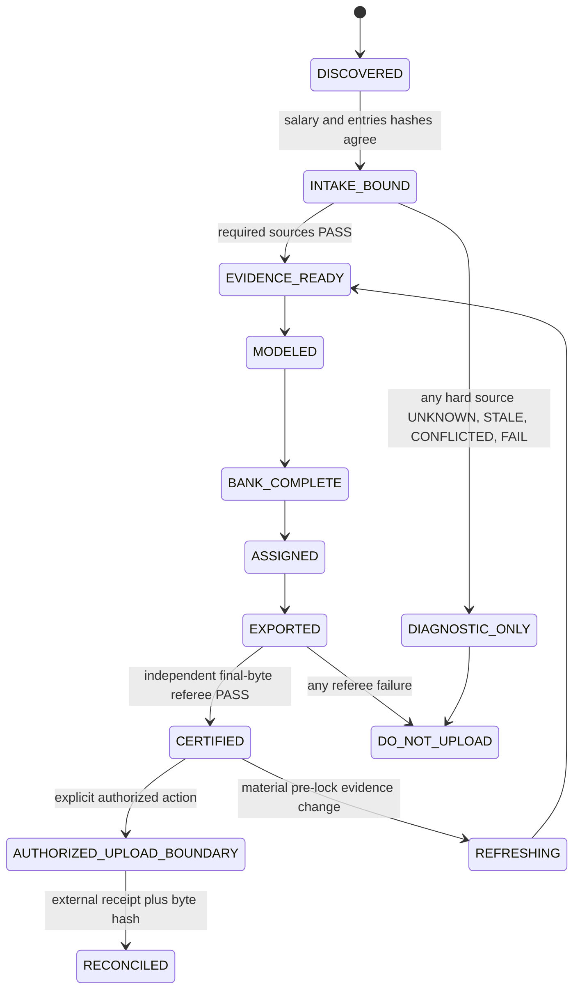

# DraftKings MLB DFS Greenfield System Specification and Static Code Audit

**Review date:** 2026-08-17  
**Repository:** `C:\Users\benja\Documents\MLB_DFS_Workbench`  
**Reviewed Git base:** `main` at `28aeaa85f9d68b754571dd22f543ffce91be3692`  
**Review scope:** the working tree as found, including its uncommitted Showdown rules, adapter, tests, documentation, generated preflight files, and tracked bytecode changes. No existing workspace file was changed by this review.  
**Disposition:** **DO NOT PROMOTE THE CURRENT ENGINES.** The repository can generate structurally plausible lineups, but it does not currently calculate, calibrate, or optimize contest expected value. Its production claims outrun its implementation and its tests.

## Executive verdict

The codebase has three different systems superimposed on one another:

1. a 3,874-line legacy Classic optimizer and related monoliths that generate legal-ish lineups using hand-built contest-fit proxies;
2. an experimental metric projection and waterfall layer that is correctly labeled shadow-only but is not a calibrated probability model;
3. a small Showdown adapter described as certified even though it never reads the rules it allegedly certifies, never implements the required lineup thesis, optimizes only mean points, and hard-codes `OPTIMAL` into its manifest.

The resulting system is evidence-conscious in prose but not evidence-bound in code. Many gates are dictionaries of booleans, manifests are declarations rather than cryptographic attestations, and validators frequently validate the same derived objects produced by the optimizer rather than independently reconstructing legality from immutable DraftKings inputs. The optimizer may continue diagnostically after missing data, but **promotion must fail closed**: any `UNKNOWN`, `STALE`, `CONFLICTED`, missing, or unbound hard fact means `DO_NOT_UPLOAD`.

There is no historical calibration dataset under `data/historical/` and no results history. The 12 slate folders contain 606 files (about 103.6 MB), but no saved standings, actuals, or results-history CSV/JSON. Therefore no code path can honestly be called maximum-EV, profitable, calibrated, or simulation-based today.

The target should not be another larger prompt or a rewrite of the existing monolith. It should be a small deterministic application with immutable inputs, typed contracts, event-level MLB simulations, contest-field simulations, joint assignment, a separately implemented referee, bounded execution, and a thin agent skill that only orchestrates the application. Zero-touch automation is appropriate from **authorized input arrival through a certified CSV package**. Automated DraftKings browsing or submission is not part of the target: DraftKings' current [Fair Play Commitment](https://help.draftkings.com/hc/en-us/articles/4405223983635-Fantasy-Sports-Fair-Play-Commitment-US) says browser scripts and bots are prohibited, while its supported mass-entry path is a user-initiated [desktop CSV upload](https://help.draftkings.com/hc/en-us/articles/4405223998867-How-do-I-upload-or-edit-multiple-lineups-at-once-US). Only a documented, authorized DraftKings API or written permission could change that boundary.

## Review method and observed test state

- Enumerated every first-party Python, PowerShell, JSON, YAML, CSV template, schema, instruction, prompt, and Markdown file outside generated slate/output trees and virtual environments.
- Read all active engine code and tests, all tool scripts, all configs/schemas/prompts/skill instructions, and every legacy module. Generated slate data was treated as evidence, not source; representative manifests and repository-wide outcome presence were inspected.
- Searched for error swallowing, unsafe writes, unbounded loops/solves, path mutation, weak parsing, global state, procedural DataFrame use, and configuration disconnects.
- Ran tests with bytecode disabled so verification did not mutate the repository:
  - legacy `.venv-legacy`: **44/44 tests passed**;
  - active metric tests: **5/5 passed** in the legacy environment;
  - active Showdown tests: **8 unit cases passed and 1 “real supplied templates” case errored** because it reads hard-coded `C:\Users\benja\Downloads\DKSalaries.csv`, which currently is not a CPT/UTIL template;
  - `.solver-venv` cannot import `pandas`, so it cannot run the metric suite.
- Did not run `project_audit.py` because it calls `py_compile.compile()` into tracked `__pycache__` locations; that helper is not read-only.
- Benchmarked target mechanics using current first-party product descriptions. SaberSim describes play-by-play game scripts, range-of-outcome correlation, contest-specific ownership, contest sims, live refresh, and entry assignment ([MLB optimizer](https://www.sabersim.com/mlb/optimizer), [MLB projections](https://www.sabersim.com/mlb/projections)). Stokastic describes field-mirroring pools and contest payout simulations rather than points-only ranking ([MLB contest simulator](https://www.stokastic.com/articles/dfs-strategy/mlb-dfs-contest-simulator)). FantasyLabs exposes real-time inputs, ownership, stacks, historical research, custom/blended projections, and simulation-backed controls ([MLB tools](https://www.fantasylabs.com/daily-fantasy-sports/mlb/), [MLB models](https://support.fantasylabs.com/hc/en-us/articles/219617488-MLB-Models-Overview)). These are product claims, not independently verified algorithms, but they establish the minimum competitive feature set.

---

# Section 1: Greenfield System Audit & Legacy Deconstruction

## 1.1 First-principles answer: what must exist

Only eight capabilities are irreducible:

1. **Immutable intake:** obtain authorized DraftKings salary/entry files and current external evidence; hash raw bytes and never rewrite them.
2. **Canonical truth:** reconcile IDs, contest, slot, game, lineup, pitcher, weather/roof, odds, and lock facts into typed records with explicit evidence states.
3. **Outcome distributions:** estimate correlated MLB event outcomes, not just one mean/floor/ceiling row per player.
4. **Field model:** estimate what opponent lineups will be entered, including stacks, salary use, ownership, captain use, and duplication.
5. **Legal candidate generation:** produce many legal Classic/Showdown lineups under the exact versioned contest rules.
6. **Contest and portfolio evaluation:** settle simulated contests against the actual payout curve, split ties, subtract fees, and jointly choose/assign entries.
7. **Independent certification:** reconstruct legality and immutability from raw files with a separately implemented referee and bind the result to final bytes.
8. **Bounded orchestration:** respond to new evidence, run stages with deadlines, and leave a deterministic blocked state instead of hanging.

Everything else is optional. A prose prompt, a “contest-fit” score, manually declared gates, arbitrary stack directives, a workbook, and even a specific MILP library are replaceable interfaces. They are not the engine.

## 1.2 What to burn down, archive, keep, or rebuild

| Current component | Decision | First-principles reason |
|---|---|---|
| `legacy/v2_15_1/*.py` | Archive as a frozen comparison fixture; never import in production | Useful for regression examples, but monolithic, proxy-scored, permissive, and not EV-calibrated. |
| `engines/adapters/showdown_scipy_adapter.py` | Replace | Rules are hard-coded and disconnected from config; selection is points-only; manifest/certification is false. |
| `engines/metric_projection.py` and `policies/metric_projection_v1.json` | Retain only as a named baseline experiment | Hand weights can benchmark a learned model but cannot be promoted as an outcome distribution. |
| `engines/stack_adjacency.py` | Delete from production; re-express adjacency as a simulation-derived feature | Adjacency should emerge in correlated outcomes/field behavior, not be a brittle forced story. |
| `engines/portfolio_waterfall.py` | Replace with exact net-payout scenario settlement and joint portfolio evaluation | “Any gross payout” and an apex threshold are not a contest EV objective. |
| `engines/adapters/classic_metric_shadow_adapter.py` | Delete after extracting fixtures | Global import mutation and legacy coupling defeat modularity. |
| `legacy/*_manager.py` | Replace with typed packages | Responsibilities are mixed and several gates are optional or advisory in code. |
| five `prompts/*.md` files | Collapse into four thin skills and one CLI contract | The prompts mostly restate policy; deterministic stages should not be performed through prose. |
| `PROJECT_INSTRUCTIONS.txt` | Replace with a short `CLAUDE.md`/agent entrypoint plus progressive-disclosure references | Current file is reasonable policy prose, but it is not automatically loaded by Claude Code and duplicates skill references. |
| `skill_dev/run-mlb-dfs-slate` | Rewrite as an orchestration shell | The present skill describes capabilities the program does not supply and can still succeed with a non-passing preflight. |
| PowerShell wrappers | Replace with one versioned Python CLI; optionally retain tiny launch shims | Ambient interpreters, hard-coded Downloads paths, and mutating audit behavior are avoidable. |
| CSV/JSON schemas and configs | Rebuild as strict, versioned Pydantic/JSON Schema contracts | Current schemas are permissive and internally inconsistent. |
| workbooks/prose reports | Keep as derived review surfaces only | They must never be the authority for gates or assignments. |

## 1.3 Artificial bottlenecks and token waste

- The intended dataflow in `docs/ARCHITECTURE.md` is mostly aspirational. There is no active `gates/` package, no provider-adapter package, no canonical-domain package, and no production orchestrator.
- The active skill loads four broad policy documents and then four more references before work begins. That is acceptable for a human review but wasteful for a repeatable slate run. Anthropic's current context guidance recommends high-signal minimal context, just-in-time retrieval, progressive disclosure, and simple prompts at the right altitude ([official context-engineering guidance](https://www.anthropic.com/engineering/effective-context-engineering-for-ai-agents)). The deterministic CLI should carry policy; the agent should receive only state, blockers, and requested action.
- Live facts are currently gathered through prose and copied text. This spends model tokens on parsing tables, money, IDs, timestamps, and CSVs that local code handles exactly.
- Each Showdown bank candidate launches another full MILP and adds every previous lineup as another row. Classic generation similarly runs sequential solves and later creates quadratic pair constraints. Most work is repeated.
- The legacy runtime is copied into slate folders, including caches in some historical runs. This creates hundreds of redundant files and multiple ambiguous code authorities.
- The candidate bank is generated before the system has a contest field or payout model. It spends solver time exploring a proxy objective and then pretends candidate count/pair count is coverage.
- Review workbooks and audit prose are demanded on every run even when an early hard input is blocked. Produce machine artifacts first; render human surfaces asynchronously only when requested or when a package reaches review.

## 1.4 LLM versus deterministic boundary

| Work | Owner | Reason |
|---|---|---|
| CSV parsing, duplicate headers, slot positions, IDs, salaries, hashes, byte preservation | Deterministic code | Exact, cheap, testable. |
| Rule evaluation, eligibility, locks, freshness, schema validation, joins | Deterministic code | A model must never decide legality. |
| Feature transforms, projections, simulations, ownership, field generation, payouts, MILP/CP-SAT | Deterministic code | Numeric reproducibility and speed. |
| Provider requests/retries/caching | Deterministic adapters | Needs deadlines, terms controls, and observability. |
| Extracting a changed public page whose schema is not stable | LLM-assisted fallback, never sole authority | LLM can propose structured facts; a schema validator and corroboration must accept them. |
| Summarizing evidence conflicts, producing incident reports, explaining portfolio stories | LLM | Natural-language synthesis is useful and not safety-critical. |
| Editing projections, choosing players, filling CSV cells, setting gate booleans, or submitting entries | Never LLM | These are deterministic or prohibited account actions. |

The LLM must be off the critical path. A timed-out or unavailable model cannot stop the engine. Its structured output is advisory, stored with prompt/model/version/raw-source lineage, and never changes `PASS` or file-promotion state directly.

## 1.5 Mathematical deconstruction

The current objective is not EV. In both active Showdown and legacy Classic, the core optimization maximizes a weighted point projection or a hand-built score. Ownership, stack, salary, “right tail,” and duplication terms are heuristics. They do not model:

- a joint distribution of player scores;
- game-event correlation;
- the opponent lineup distribution;
- contest field size and payout ladder;
- ties and duplicate-lineup prize splitting;
- entry fees or ticket values;
- the user's other entries in the same contest;
- uncertainty/calibration error.

The correct quantity for candidate `l` in contest `c` over simulated worlds `s=1..S` is:

\[
\widehat{EV}_{l,c}=\frac{1}{S}\sum_{s=1}^{S}
\frac{P_c(\operatorname{rank}_{l,c,s})}{\operatorname{ties}_{l,c,s}}-\operatorname{fee}_c
\]

For a portfolio, ranks must be recomputed with all selected entries present; summing standalone lineup EVs can overstate value because the user's lineups compete with one another. Risk limits, exposures, and diversity are separate policy constraints or secondary objectives—not aliases for EV.

## 1.6 Robustness and non-blocking design principles

- “Never stall” means every network call, solver, LLM fallback, file lock, and render has a deadline. It does **not** mean missing facts become passes.
- A failed provider call produces `UNKNOWN` or `STALE`, a saved incident, and a scheduled bounded refresh. Candidate generation may proceed diagnostically, but promotion remains closed.
- No `while` loop is allowed without a monotone counter, deadline, and terminal status.
- Each run writes to a unique staging directory, then atomically promotes a content-addressed manifest. No shared fixed filenames.
- External updates invalidate only dependent DAG nodes. A lineup change rebuilds features, simulations, bank, allocation, export, and referee; it does not redownload immutable salary bytes.
- A process crash leaves either the previous certified package or an incomplete staging run, never a half-overwritten “current” package.

## 1.7 Browser and account automation boundary

Use an authorized headless browser only for public pages whose terms permit automation, and save the response/HTML/screenshot before parsing. Prefer official feeds, licensed APIs, connectors, or direct downloads. Do not use Claude in Chrome, Playwright, Selenium, or another browser bot to log into DraftKings, scrape its lobby, download account-specific templates, enter contests, or upload lineups. The current supported workflow is desktop CSV upload, and DraftKings explicitly prohibits browser scripts/bots. The greenfield system can be zero-touch after an authorized salary/entry pair lands in an inbox folder; it cannot honestly or safely promise zero-touch DraftKings account transactions under current rules.

---

# Section 2: Comprehensive Code Review & Defect Log

## Severity and certification conventions

- **Blocker:** can produce a false promotion/certification, illegal/incomplete portfolio, or materially invalid EV claim.
- **Bug:** wrong output or unsafe behavior for a supported input/edge case.
- **Performance:** unnecessary cost, unbounded runtime, or scale failure.
- **Technical Debt:** architecture/test/maintainability defect that makes correctness hard to establish.
- **Security:** destructive path behavior, credential/automation risk, or supply-chain/integrity weakness.

Code snippets below are replacement primitives, not patches to the legacy tree. They are intended for the greenfield `src/dfs/` packages specified in Section 3.

## 2.1 Active Showdown path

### F-001 — The adapter never loads the rules it claims to certify

**File & Line / Function:** `engines/adapters/showdown_scipy_adapter.py:27-41, 249-337, 622-686`; `config/showdown/rules.json`; `docs/SHOWDOWN_ENGINE.md:5-24`  
**Severity:** Blocker  
**Issue Description:** Salary cap, slots, team limits, exposures, overlap, and rules version are module constants. `run_adapter()` has no rules argument and never opens `rules.json`. The config requires a lineup thesis, hitter-breakout/pitcher-control construction, and batting-order adjacency, but `CandidateLineup` has no thesis field and neither solver nor validator enforces the policy. The test at `test_showdown_scipy_adapter.py:90-101` merely inspects config text. Editing the advertised source of truth therefore does not change the engine.

**Remediation / Corrected Code:** Parse one strict rules object and pass it through generation, validation, allocation, QA, and manifest creation.

```python
from pydantic import BaseModel, ConfigDict, Field

class ShowdownRules(BaseModel):
    model_config = ConfigDict(extra="forbid", frozen=True)
    version: str
    salary_cap: int = Field(gt=0)
    slots: tuple[str, ...]
    max_players_per_team: int = Field(ge=1)
    max_hitters_per_team: int | None = Field(default=None, ge=1)
    require_both_teams: bool
    thesis_policy: str

def load_rules(path: Path) -> tuple[ShowdownRules, str]:
    raw = path.read_bytes()
    rules = ShowdownRules.model_validate_json(raw)
    return rules, hashlib.sha256(raw).hexdigest()
```

### F-002 — The rules evidence is not current, authoritative, or complete enough for zero-base certification

**File & Line / Function:** `config/showdown/rules.json:1-58`; `config/showdown/SHOWDOWN_RULES_USER_INPUT.yaml:1-45`; `config/classic/rules.yaml:1-9`  
**Severity:** Blocker  
**Issue Description:** Showdown rules cite user-provided prose and two old template hashes, not an immutable current official rules snapshot, direct URL, jurisdiction, effective time, parser version, or signed approval. The config expresses maximum **players** from one team but has no maximum-hitter rule; official DraftKings educational guidance has historically described a separate MLB Showdown hitter limit, so the omission must be actively resolved rather than assumed. Classic `rules.yaml` delegates almost everything to legacy code and is not a machine rule set at all. A new slate cannot prove which rules it used.

**Remediation / Corrected Code:** Treat rules as an input artifact with source and applicability metadata; refuse certification when the current template/rules evidence does not match.

```python
class RulesEvidence(BaseModel):
    model_config = ConfigDict(extra="forbid", frozen=True)
    site: Literal["DraftKings"]
    sport: Literal["MLB"]
    contest_mode: Literal["classic", "showdown"]
    jurisdiction: str
    effective_at_utc: datetime
    retrieved_at_utc: datetime
    source_url: AnyHttpUrl
    raw_sha256: str = Field(pattern=r"^[0-9a-f]{64}$")
    template_sha256: str = Field(pattern=r"^[0-9a-f]{64}$")
    verification_status: Literal["PASS", "UNKNOWN", "STALE", "CONFLICTED"]
```

### F-003 — Player identity and projection joins can collide or silently overwrite

**File & Line / Function:** `engines/adapters/showdown_scipy_adapter.py:116-158`  
**Severity:** Bug  
**Issue Description:** Underlying identity is `name|team|game_info`; names and `Game Info` are presentation strings, not stable IDs. Projection lookup accepts name-only keys, and the dictionary comprehension silently keeps the last duplicate. CPT and UTIL IDs are slot-specific, so they cannot by themselves identify the underlying athlete, but the solution is an explicit crosswalk—not fuzzy/name fallback. Non-finite or negative projections are accepted.

**Remediation / Corrected Code:** Require a unique, salary-derived `underlying_player_id` crosswalk and a one-to-one projection join.

```python
def projection_map(rows: Iterable[Mapping[str, str]]) -> dict[str, float]:
    out: dict[str, float] = {}
    for row in rows:
        key = row["underlying_player_id"].strip()
        value = float(row["projection"])
        if not key or key in out:
            raise ContractError(f"missing/duplicate projection key: {key!r}")
        if not math.isfinite(value) or value < 0:
            raise ContractError(f"invalid projection for {key}: {value}")
        out[key] = value
    return out
```

### F-004 — CPT/UTIL pairing does not reconcile metadata, status, or numeric validity

**File & Line / Function:** `engines/adapters/showdown_scipy_adapter.py:161-218`  
**Severity:** Bug  
**Issue Description:** The parser checks that a name/team/game key has one CPT and one UTIL row and that salary is exactly 1.5x. It does not require distinct nonempty slot IDs, identical player metadata, matching status/game/type, positive salaries, or finite projections. It selects `util.status or cpt.status`, so a conflicting excluded status can be lost. `cpt_salary / util_salary` can divide by zero.

**Remediation / Corrected Code:** Validate the pair as one typed record before producing variants.

```python
def make_pair(cpt: SalaryRow, util: SalaryRow) -> ShowdownPlayer:
    if not cpt.dk_id or not util.dk_id or cpt.dk_id == util.dk_id:
        raise ContractError("CPT and UTIL need distinct nonempty DK IDs")
    for field in ("underlying_player_id", "name", "team", "game_id", "player_type"):
        if getattr(cpt, field) != getattr(util, field):
            raise ContractError(f"CPT/UTIL metadata conflict: {field}")
    if util.salary <= 0 or cpt.salary != round(Decimal("1.5") * util.salary):
        raise ContractError("invalid CPT salary multiplier")
    if cpt.status != util.status:
        raise ContractError("CPT/UTIL status conflict")
    return ShowdownPlayer(cpt=cpt, util=util)
```

### F-005 — DKEntries parsing truncates entries and does not establish authorization

**File & Line / Function:** `engines/adapters/showdown_scipy_adapter.py:221-246`  
**Severity:** Blocker  
**Issue Description:** Parsing stops at the first blank Entry ID instead of continuing to the embedded instructions/player-pool region. It does not reject duplicate entry IDs, partial rosters, malformed widths, blank contest IDs, or mismatched embedded pools. Every blank entry is treated as an authorized target; there is no explicit authorization/lock contract.

**Remediation / Corrected Code:** Parse all real rows, classify partial rosters as invalid, and intersect them with an explicit authorization list.

```python
def mutable_targets(entries: Sequence[Entry], authorized: set[str]) -> list[Entry]:
    ids = [e.entry_id for e in entries]
    if len(ids) != len(set(ids)):
        raise ContractError("duplicate Entry ID")
    partial = [e.entry_id for e in entries if 0 < e.filled_slots < len(e.slots)]
    if partial:
        raise ContractError(f"partial rosters: {partial}")
    unknown = authorized - set(ids)
    if unknown:
        raise ContractError(f"unknown authorized entries: {sorted(unknown)}")
    return [e for e in entries if e.entry_id in authorized and e.is_blank and not e.is_locked]
```

### F-006 — Lineup legality omits rule dimensions and excluded-player checks

**File & Line / Function:** `engines/adapters/showdown_scipy_adapter.py:249-337`  
**Severity:** Blocker  
**Issue Description:** `validate_lineup()` checks six slots, uniqueness, salary cap, two teams, and the cached salary sum. It does not validate IDs against the authoritative pool, excluded/status eligibility, a minimum spend if configured, the current game, maximum hitters from a team, lineup thesis, captain/core rules, or confirmed-order adjacency. The solver repeats the same incomplete logic, so the post-solve check is not independent.

**Remediation / Corrected Code:** Make the production validator reconstruct every fact from salary/rules/canonical inputs, never from cached candidate totals.

```python
def validate_showdown(ids: Sequence[str], pool: Pool, rules: ShowdownRules) -> None:
    rows = [pool.by_slot_id(i) for i in ids]
    require(len(rows) == len(rules.slots), "slot count")
    require(tuple(r.slot for r in rows) == rules.slots, "slot order")
    require(len({r.underlying_player_id for r in rows}) == len(rows), "duplicate player")
    require(all(r.eligible and r.evidence_state == "PASS" for r in rows), "ineligible player")
    require(sum(r.salary for r in rows) <= rules.salary_cap, "salary cap")
    require(len({r.team for r in rows}) == 2, "both teams")
    require(max(Counter(r.team for r in rows).values()) <= rules.max_players_per_team, "team max")
    validate_thesis(rows, rules)
```

### F-007 — Every SciPy solve is unbounded and solver evidence is discarded

**File & Line / Function:** `engines/adapters/showdown_scipy_adapter.py:267-337, 456-464`; `engines/portfolio_waterfall.py:34-97`  
**Severity:** Performance  
**Issue Description:** `milp()` receives only `presolve=True`. SciPy exposes `time_limit`, `node_limit`, `mip_rel_gap`, status, node count, dual bound, and MIP gap, but the code discards all except `success/message`. A hard Saturday lock can therefore hang indefinitely, and a useful feasible incumbent at a time limit is discarded. Current official SciPy documentation explicitly supports these limits and result fields ([`scipy.optimize.milp`](https://docs.scipy.org/doc/scipy/reference/generated/scipy.optimize.milp.html)).

**Remediation / Corrected Code:** Centralize bounded solves and distinguish `OPTIMAL`, `FEASIBLE_LIMIT`, and failure.

```python
def solve_milp(*, c, bounds, constraint, seconds: float, gap: float) -> SolveResult:
    raw = milp(c=c, integrality=np.ones(len(c)), bounds=bounds,
               constraints=constraint,
               options={"presolve": True, "time_limit": seconds, "mip_rel_gap": gap})
    status = {0: "OPTIMAL", 1: "FEASIBLE_LIMIT" if raw.x is not None else "LIMIT_NO_SOLUTION",
              2: "INFEASIBLE", 3: "UNBOUNDED"}.get(raw.status, "ERROR")
    return SolveResult(status=status, x=raw.x, gap=getattr(raw, "mip_gap", None),
                       nodes=getattr(raw, "mip_node_count", None), message=raw.message)
```

### F-008 — Candidate generation is repeated sequential MILP enumeration and can return an incomplete bank as success

**File & Line / Function:** `engines/adapters/showdown_scipy_adapter.py:340-408`  
**Severity:** Performance  
**Issue Description:** Up to `4 * bank_size` complete MILPs are solved sequentially. Every solve rebuilds the sparse matrix and adds one no-good row for each previous lineup. Random Gaussian objective noise is not a principled scenario distribution. If attempts expire, a short bank is returned without an error. This is slow, biased toward the same high-mean core, and incompatible with the “non-blocking high-throughput” requirement.

**Remediation / Corrected Code:** Generate candidates from simulated worlds in bounded parallel batches, hash-deduplicate, and fail the coverage stage when the requested bank is not achieved. OR-Tools documents time/solution limits for CP-SAT ([official guide](https://developers.google.com/optimization/cp/cp_tasks)).

```python
def generate_bank(world_scores: np.ndarray, builder: LegalLineupBuilder,
                  limit: int, deadline: float) -> list[Lineup]:
    bank: dict[str, Lineup] = {}
    for world_batch in np.array_split(world_scores, os.cpu_count() or 1):
        for scores in world_batch:
            if time.monotonic() >= deadline:
                return list(bank.values())
            lineup = builder.solve(scores=scores, time_limit_s=0.20)
            if lineup is not None:
                bank.setdefault(lineup.underlying_signature, lineup)
            if len(bank) >= limit:
                return list(bank.values())
    return list(bank.values())
```

### F-009 — Exposure rounding silently changes policy and is mathematically infeasible for small portfolios

**File & Line / Function:** `engines/adapters/showdown_scipy_adapter.py:434-439, 501-506`; `legacy/v2_15_1/contest_allocator.py:529-536`  
**Severity:** Bug  
**Issue Description:** `max(1, floor(cap*n))` silently allows a player/captain even when the configured cap yields zero; an explicit zero cap is impossible. Conversely, a 33.333% captain cap is intrinsically infeasible at `n < 3` if applied to every captain identity. The code hides that policy contradiction instead of surfacing it. Exposure limits are portfolio-risk policy, not contest legality.

**Remediation / Corrected Code:** Preserve exact rounding and perform a separate feasibility check; any minimum-one exception must be explicit in the versioned policy.

```python
def cap_count(pct: Decimal, n: int) -> int:
    if not Decimal("0") <= pct <= Decimal("1") or n < 0:
        raise ContractError("invalid exposure cap")
    return int((pct * n).to_integral_value(rounding=ROUND_FLOOR))

def assert_cap_feasible(cap: int, identities: int, required_slots: int) -> None:
    if cap * identities < required_slots:
        raise PolicyInfeasible("exposure policy cannot fill all required slots")
```

### F-010 — Portfolio selection is contest-blind, assignment-blind, and not EV

**File & Line / Function:** `engines/adapters/showdown_scipy_adapter.py:411-474`  
**Severity:** Blocker  
**Issue Description:** The MILP selects `N` lineups by summed point projection. Contest ID, field size, entry fee, payout curve, max-entry type, opponent field, ownership, duplication, and tie splitting are absent. After selection, sorted lineups are zipped to sorted entries, so an expensive large-field GPP and a small single-entry contest receive arbitrary lineups. No expected value is calculated.

**Remediation / Corrected Code:** Optimize entry-to-candidate assignment on simulated **net payout** and settle the final portfolio jointly.

```python
def assignment_value(entry: Entry, lineup: Lineup, sim: ContestSimulation) -> float:
    gross = sim.mean_split_payout(entry.contest_id, lineup.signature)
    return gross - entry.fee

# x[e,l] is binary; each entry gets one lineup and same-contest signatures are unique.
objective = {(e.id, l.id): assignment_value(e, l, simulations[e.contest_id])
             for e in entries for l in compatible[e.id]}
solution = solve_assignment_milp(entries, compatible, objective, policy, time_limit_s=8.0)
```

### F-011 — “Bank coverage” is only a count and pair count, not a feasibility proof

**File & Line / Function:** `engines/adapters/showdown_scipy_adapter.py:603-619`  
**Severity:** Blocker  
**Issue Description:** Coverage passes when candidates are at least blank entries. Counting compatible pairs does not prove the existence of an `N`-lineup set satisfying exposure, overlap, contest uniqueness, locks, and entry-specific rules. The manifest can show coverage pass while allocation is impossible.

**Remediation / Corrected Code:** Run a zero-objective joint feasibility oracle with the exact production constraints.

```python
def certify_bank_coverage(entries: Sequence[Entry], bank: Sequence[Lineup], policy: Policy) -> Coverage:
    result = solve_assignment_milp(entries, compatibility(entries, bank),
                                   objective=None, policy=policy, time_limit_s=5.0)
    return Coverage(status=result.status,
                    covered_entry_ids=result.assigned_entries,
                    blockers=result.infeasibility_explanation,
                    passed=result.status in {"OPTIMAL", "FEASIBLE_LIMIT"}
                           and len(result.assigned_entries) == len(entries))
```

### F-012 — Export can overwrite the source and is not atomic

**File & Line / Function:** `engines/adapters/showdown_scipy_adapter.py:527-545`; `skill_dev/run-mlb-dfs-slate/scripts/preflight.py:446-473`  
**Severity:** Security  
**Issue Description:** `export_dkentries()` permits `output_path == source_path`; it opens the target for writing after parsing the source, destroying the user's original. Preflight's optional output can likewise target either input or any governing file. Writes use fixed destinations with no same-directory temporary file, fsync, or atomic replace. Concurrent runs can interleave or leave truncated files.

**Remediation / Corrected Code:** Protect all immutable inputs and use a same-volume atomic writer.

```python
@contextmanager
def atomic_output(target: Path, protected: Collection[Path]):
    resolved = target.resolve()
    if resolved in {p.resolve() for p in protected}:
        raise PermissionError(f"refusing to overwrite protected input: {resolved}")
    resolved.parent.mkdir(parents=True, exist_ok=True)
    fd, name = tempfile.mkstemp(dir=resolved.parent, prefix=f".{resolved.name}.", suffix=".tmp")
    try:
        with os.fdopen(fd, "wb") as handle:
            yield handle
            handle.flush(); os.fsync(handle.fileno())
        os.replace(name, resolved)
    finally:
        if os.path.exists(name): os.unlink(name)
```

### F-013 — The manifest falsely says `OPTIMAL` and is not bound to the run

**File & Line / Function:** `engines/adapters/showdown_scipy_adapter.py:656-686`; `schemas/optimizer_contract.schema.json`  
**Severity:** Blocker  
**Issue Description:** `status` is hard-coded to `OPTIMAL`. Candidate and allocation solver statuses, gaps, bounds, and nodes are not retained. `input_manifest_sha256` hashes only the concatenated salary and entries digests; projection bytes, rules, code, dependency lock, authorization, evidence, seed policy, and outputs are excluded. The sampled July manifests used an older rules version and 50% captain cap while current docs/config claim 33.333%, demonstrating drift. The schema permits arbitrary additional properties and does not require the evidence needed to justify `OPTIMAL`.

**Remediation / Corrected Code:** Hash a canonical manifest whose leaves include every input/code/config/artifact digest, and derive status from solver/referee evidence.

```python
def digest_manifest(leaves: Mapping[str, str]) -> str:
    payload = json.dumps(dict(sorted(leaves.items())), separators=(",", ":"), ensure_ascii=False)
    return hashlib.sha256(payload.encode()).hexdigest()

status = "OPTIMAL" if all(s.status == "OPTIMAL" for s in solves) else "FEASIBLE"
if not referee.passed:
    status = "UNCERTIFIED"
manifest = RunManifest(status=status, input_root_sha256=digest_manifest(input_hashes),
                       solver_evidence=solves, artifact_hashes=artifact_hashes)
```

### F-014 — Fixed output names and second-resolution run IDs are collision-prone

**File & Line / Function:** `engines/adapters/showdown_scipy_adapter.py:640-657`; `engines/adapters/classic_metric_shadow_adapter.py:56-103`  
**Severity:** Bug  
**Issue Description:** Reusing an output directory overwrites candidate bank, assignment, coverage, export, and manifest. `int(time.time())` collides for concurrent runs in the same second. The shadow adapter has the same overwrite pattern. This breaks immutability and makes late refresh lineage ambiguous.

**Remediation / Corrected Code:** Use a caller-independent UUIDv7/ULID run directory and fail if it exists.

```python
def create_run(root: Path, slate_id: str) -> tuple[str, Path]:
    run_id = f"{datetime.now(UTC):%Y%m%dT%H%M%S.%fZ}_{uuid.uuid4().hex[:12]}"
    path = root / slate_id / "runs" / run_id
    path.mkdir(parents=True, exist_ok=False)
    return run_id, path
```

### F-015 — Showdown certification tests are non-hermetic and certify prose, not behavior

**File & Line / Function:** `engines/tests/test_showdown_scipy_adapter.py:90-101, 167-178`; `tools/Certify-Showdown.ps1:3-28`  
**Severity:** Technical Debt  
**Issue Description:** The “real template” test reads hard-coded files from one user's Downloads directory, so its outcome changes with unrelated files. It currently errors. The rules test only checks values/placeholders. The wrapper then runs the adapter using DK average points and prints “certification … PASS,” even though the adapter never loads the rule file and its output is explicitly diagnostic. The test suite has no property-based parsing, malformed CSV, source-equals-target, concurrency, rule mutation, thesis, current-rule fixture, or manifest-binding cases.

**Remediation / Corrected Code:** Put immutable sanitized fixtures under `tests/fixtures`, parameterize rules, and assert behavior changes when a rule changes.

```python
@pytest.mark.parametrize("cap,expected", [(50_000, True), (1, False)])
def test_salary_rule_is_consumed(tmp_path: Path, cap: int, expected: bool, fixture_pair):
    rules = fixture_pair.rules.model_copy(update={"salary_cap": cap})
    result = run_showdown(fixture_pair.salary, fixture_pair.entries, rules, tmp_path)
    assert result.referee_passed is expected

def test_export_rejects_source_target_identity(fixture_pair):
    with pytest.raises(PermissionError):
        export(fixture_pair.entries, fixture_pair.entries, {})
```

### F-016 — The metric projection is an undocumented hand-built score, not an EV projection

**File & Line / Function:** `engines/metric_projection.py:32-38, 107-194`  
**Severity:** Blocker  
**Issue Description:** Fixed coefficients mix recent rates, season rates, role signals, and park/environment fields without units, training data, an objective function, out-of-sample validation, or uncertainty. The resulting number is treated like fantasy points even though it is only a ranking heuristic. Optimizing it cannot establish maximum EV and can magnify coefficient error across an entire portfolio.

**Remediation / Corrected Code:** Train component distributions as-of each historical slate, retain calibration metadata, and expose samples plus moments—not a single uncalibrated score.

```python
@dataclass(frozen=True)
class PlayerDistribution:
    player_id: str
    samples: NDArray[np.float32]
    mean: float
    variance: float
    model_id: str
    trained_through_utc: datetime

def fit_hitter_distribution(rows: pd.DataFrame, labels: pd.Series) -> CalibratedModel:
    x = build_features(rows)                  # units documented in schema
    train, calibration = temporal_split(x, labels)
    base = HistGradientBoostingRegressor(loss="poisson").fit(train.x, train.y)
    return conformal_calibrate(base, calibration.x, calibration.y)
```

### F-017 — Numeric coercion hides bad units and admits non-finite values

**File & Line / Function:** `engines/metric_projection.py:41-60, 112-153, 166-191`  
**Severity:** Bug  
**Issue Description:** `_number` silently replaces missing or malformed evidence with neutral defaults. `_pct` interprets `1.0` as 100%, creating an ambiguous discontinuity between proportions and percentages. `NaN` and infinities are not rejected, and an environment value of zero is treated as missing. These paths transform evidence failures into plausible-looking projections.

**Remediation / Corrected Code:** Make units explicit at ingestion and fail closed for required features. Imputation must be model-owned and observable.

```python
class Rate(BaseModel):
    model_config = ConfigDict(strict=True)
    proportion: Annotated[float, Field(ge=0.0, le=1.0)]

def finite_float(value: object, field: str) -> float:
    if isinstance(value, bool):
        raise TypeError(f"{field}: boolean is not numeric")
    number = float(value)
    if not math.isfinite(number):
        raise ValueError(f"{field}: non-finite value")
    return number
```

### F-018 — Unknown roles and truthy strings corrupt eligibility and lock state

**File & Line / Function:** `engines/metric_projection.py:71-104, 205-229`  
**Severity:** Bug  
**Issue Description:** Any role other than the narrow pitcher set falls through to hitter scoring. `bool(np.nan)` and `bool("False")` are both true, so missing or string-valued `Eligible` and `Locked` fields can roster or lock the wrong player. Position legality is never represented in this layer.

**Remediation / Corrected Code:** Parse enums and booleans strictly; reject unknown roles before projection.

```python
class Role(StrEnum):
    HITTER = "HITTER"
    STARTING_PITCHER = "STARTING_PITCHER"
    RELIEF_PITCHER = "RELIEF_PITCHER"

TRUE, FALSE = {"true", "1"}, {"false", "0"}
def strict_bool(value: object) -> bool:
    if isinstance(value, bool): return value
    if isinstance(value, str) and value.casefold() in TRUE | FALSE:
        return value.casefold() in TRUE
    raise ValueError(f"invalid boolean: {value!r}")
```

### F-019 — Baseline and role joins have no evidence identity or freshness contract

**File & Line / Function:** `engines/lineup_role.py:15-53`; `engines/metric_projection.py:197-240`  
**Severity:** Blocker  
**Issue Description:** The role merge enforces one-to-one rows but not slate, source, acquisition time, game identity, status, hash, or effective time. A syntactically valid old lineup can be joined to today's salary pool. The projection builder then emits rosterable rows from partial evidence without a promotion gate.

**Remediation / Corrected Code:** Require bitemporal, hashed evidence records and bind joins to a canonical slate ID.

```python
def bind_roles(players: pd.DataFrame, roles: pd.DataFrame, ctx: RunContext) -> pd.DataFrame:
    require_columns(roles, {"slate_id", "player_id", "as_of_utc", "source_sha256", "status"})
    if set(roles.slate_id) != {ctx.slate_id}:
        raise EvidenceConflict("role slate mismatch")
    if roles.as_of_utc.min() < ctx.started_utc - ctx.role_ttl:
        raise StaleEvidence("roles")
    if roles.player_id.duplicated().any():
        raise IdentityConflict("duplicate role identity")
    return players.merge(roles, on=["slate_id", "player_id"], validate="one_to_one")
```

### F-020 — Stack adjacency labels incomplete and duplicate batting orders as valid

**File & Line / Function:** `engines/stack_adjacency.py:14-72`  
**Severity:** Bug  
**Issue Description:** Duplicate batting-order rows overwrite each other, missing slots are tolerated, and partial windows are emitted with the same semantics as complete batting-order adjacency. Iterative row traversal adds avoidable overhead. Downstream optimizers can reward an alleged 1-2-3-4 stack that is neither complete nor uniquely sourced.

**Remediation / Corrected Code:** Validate a unique 1–9 order per confirmed team and distinguish complete from provisional windows.

```python
def adjacency_windows(lineup: pd.DataFrame, size: int) -> list[tuple[str, ...]]:
    require_unique(lineup, ["slate_id", "team", "batting_order"])
    slots = lineup.set_index("batting_order")["player_id"]
    if set(slots.index) != set(range(1, 10)):
        raise IncompleteEvidence("confirmed batting order")
    ordered = slots.loc[range(1, 10)].to_numpy()
    return [tuple(np.roll(ordered, -start)[:size]) for start in range(9)]
```

### F-021 — Portfolio waterfall is neither expected profit nor a robust scenario optimizer

**File & Line / Function:** `engines/portfolio_waterfall.py:17-145`  
**Severity:** Blocker  
**Issue Description:** Scenarios have no validated probabilities, entry fees, payouts, opponent fields, tie splitting, settlement rules, or net-profit objective. Non-finite values and malformed pairs are accepted; solver tolerances, time limits, and incumbent quality are absent. A comment promises a tie-breaking reward that the objective does not implement.

**Remediation / Corrected Code:** Define scenario-weighted net utility and validate the probability simplex.

```python
def expected_net_profit(
    lineup_scores: NDArray[np.float64], field_scores: NDArray[np.float64],
    payouts: NDArray[np.float64], fees: NDArray[np.float64], weights: NDArray[np.float64],
) -> NDArray[np.float64]:
    if not np.isclose(weights.sum(), 1.0) or np.any(weights < 0):
        raise ValueError("scenario weights must form a probability simplex")
    ranks = tie_aware_ranks(lineup_scores, field_scores)
    gross = tie_split_payouts(ranks, payouts)
    return (gross * weights[:, None]).sum(axis=0) - fees
```

### F-022 — Classic shadow execution can leave a plausible but partial artifact set

**File & Line / Function:** `engines/adapters/classic_metric_shadow_adapter.py:1-128`  
**Severity:** Blocker  
**Issue Description:** The adapter mutates `sys.path`, imports a legacy optimizer with process-global state, and writes fixed-name outputs stage by stage. A later failure leaves earlier CSVs looking complete. It does not bind a complete bank, rule set, inputs, solver result, referee result, and export bytes into a single manifest.

**Remediation / Corrected Code:** Package imports normally and publish only after the run directory passes an independent referee.

```python
with tempfile.TemporaryDirectory(dir=run_parent) as scratch_name:
    scratch = Path(scratch_name)
    artifacts = execute_classic(request, scratch)
    verdict = referee.verify(request, artifacts)
    if not verdict.passed:
        raise CertificationError(verdict.failures)
    atomic_publish_directory(scratch, final_run_dir)  # same-volume rename
```

### F-023 — Preflight emits success for unresolved mode and has no overall pass contract

**File & Line / Function:** `skill_dev/run-mlb-dfs-slate/scripts/preflight.py:112-204, 231-353, 356-443, 446-483`  
**Severity:** Blocker  
**Issue Description:** Mode may be inferred from a single weak source; unresolved conflicts are reported but the process exits successfully. Salary checks omit strict numeric, duplicate identity, team/game, and full position-pair validation. Entries parsing stops at the first empty row and treats partial rosters as populated. Workspace checks omit active rule/policy/adapter bindings. The script claims read-only behavior while permitting its output to target an input path.

**Remediation / Corrected Code:** Return one typed gate verdict and a nonzero exit code for every unresolved hard gate.

```python
verdict = PreflightVerdict.combine(mode_gate, salary_gate, entries_gate, workspace_gate)
atomic_write_json(args.output, verdict.model_dump(mode="json"), forbidden={salary, entries})
if verdict.state is not GateState.PASS:
    raise SystemExit(2)
```

### F-024 — Configuration and schemas contradict one another and permit unknown fields

**File & Line / Function:** `schemas/source_ledger.schema.json`; `schemas/optimizer_contract.schema.json`; `schemas/lineup_role_baseline.schema.json`; repository schema set (missing strict build-manifest schema); `config/classic/rules.yaml`; `config/showdown/rules.json`; `config/showdown/SHOWDOWN_RULES_USER_INPUT.yaml`  
**Severity:** Blocker  
**Issue Description:** Evidence states differ between schema and instructions (`WARN/PENDING` versus `UNKNOWN/STALE/CONFLICTED`), optimizer configuration permits extra properties, and the manifest lacks a strict schema for artifacts, rules, solver proofs, and final bytes. Classic configuration delegates core rules to legacy code. Showdown duplicates rules across files, allowing drift.

**Remediation / Corrected Code:** Generate every runtime model and JSON Schema from one strict source.

```python
class EvidenceState(StrEnum):
    PASS = "PASS"
    UNKNOWN = "UNKNOWN"
    STALE = "STALE"
    CONFLICTED = "CONFLICTED"
    FAIL = "FAIL"

class Ruleset(BaseModel):
    model_config = ConfigDict(extra="forbid", strict=True, frozen=True)
    version: str
    effective_utc: datetime
    classic: ClassicRules
    showdown: ShowdownRules
```

### F-025 — Instructions describe capabilities and gates that the executable system does not implement

**File & Line / Function:** `PROJECT_INSTRUCTIONS.txt:1-end`; `skill_dev/run-mlb-dfs-slate/SKILL.md:1-end`; `prompts/01_CLASSIC_COMPATIBILITY.md` through `prompts/05_AUTOMATION_PROMPTS.md`; repository root (missing `CLAUDE.md`)  
**Severity:** Technical Debt  
**Issue Description:** The instruction layer promises source-ledger gates, complete banks, certification, current evidence, and independent QA, but executable paths do not consume or prove many of them. The project-specific instructions are not in the requested `CLAUDE.md` convention, while prompts restate process policy and encourage token-heavy manual orchestration. This is specification drift, not an automation system.

**Remediation / Corrected Code:** Reduce the always-loaded instruction to invariants and move detailed workflows behind deterministic commands or progressively disclosed skills.

```markdown
# CLAUDE.md
- Never mutate source CSVs.
- Generation may continue diagnostically; promotion is fail-closed.
- Only `dfs referee` may set `file_promotion_authorized=true`.
- UNKNOWN, STALE, CONFLICTED, or FAIL evidence forbids promotion.
- Execute workflows through `dfs run`; do not reproduce them in chat.
```

### F-026 — Certification and audit scripts are machine-specific, mutating, and shallow

**File & Line / Function:** `tools/Certify-Showdown.ps1:1-28`; `tools/Run-LegacyAudit.ps1:1-end`; `tools/Test-Workspace.ps1:1-end`; `tools/Initialize-Workspace.ps1:1-end`; `tools/New-Slate.ps1:1-end`; `legacy/v2_15_1/project_audit.py:1-end`  
**Severity:** Technical Debt  
**Issue Description:** Scripts hard-code a user's Downloads path or rely on ambient Python, check file existence and a handful of literal values instead of schemas, and create slate templates without immutable intake hashes. `project_audit.py` compiles into tracked `__pycache__`, checks only a capped inventory sample, and counts tests rather than measuring behavior or coverage. A green audit can coexist with a broken real-template test.

**Remediation / Corrected Code:** Use one pinned entry point, isolated caches, schema validation, and immutable fixtures.

```powershell
$env:PYTHONDONTWRITEBYTECODE = "1"
$env:PYTHONPYCACHEPREFIX = Join-Path $env:TEMP "dfs-pycache"
& $PinnedPython -m dfs.cli verify-workspace --strict --json $ReportPath
if ($LASTEXITCODE -ne 0) { exit $LASTEXITCODE }
```

### F-027 — Dependency and package provenance are not reproducible

**File & Line / Function:** `requirements.txt`; `PACKAGE_SHA256.csv`; tracked `__pycache__` files; repository root (missing lockfile and CI definition)  
**Severity:** Security  
**Issue Description:** Broad version ranges, multiple local environments, no hash-locked transitive graph, no CI, and a stale checksum catalog make builds irreproducible. The checksum file includes generated bytecode while omitting newer active files. Different environments already produce different results: the solver environment cannot import the metric path because it lacks pandas.

**Remediation / Corrected Code:** Lock hashes, reject untracked runtime imports, and attest source plus environment.

```toml
[project]
requires-python = "==3.12.*"
dependencies = ["numpy==2.1.3", "pandas==2.2.3", "scipy==1.14.1", "pydantic==2.9.2"]

[tool.pytest.ini_options]
addopts = "--strict-config --strict-markers --cov=dfs --cov-fail-under=90"
```

Generate a locked, hash-verified environment in CI; exclude caches and run artifacts from source attestations.

### F-028 — Documentation is an aspirational architecture, not a traceable implementation map

**File & Line / Function:** `docs/SHOWDOWN_ENGINE.md`; `docs/CLASSIC_V3_2_*`; repository tree (missing documented production `gates`, provider, canonical-model, and referee packages)  
**Severity:** Technical Debt  
**Issue Description:** Design documents use production terminology and certification language for paths that are diagnostic, absent, or only implemented in a legacy monolith. There is no machine-readable requirement-to-test traceability, so prose can advance independently of code.

**Remediation / Corrected Code:** Give every normative requirement an executable identifier.

```yaml
requirements:
  DK-SD-ROSTER-001:
    implementation: dfs.rules.showdown:validate_roster
    tests:
      - tests/rules/test_showdown_properties.py::test_all_generated_rosters_are_legal
    referee_check: roster_legality
```

### F-029 — Legacy projection validation permits invalid and ambiguous player universes

**File & Line / Function:** `legacy/v2_15_1/optimizer_v3.py:279-291, 316-321, 391-455`  
**Severity:** Blocker  
**Issue Description:** Validation checks a short column list and salary floor/ceiling relationship, but not an empty pool, duplicate `Player_ID`, finite projections/salaries, strict booleans, roles, teams, games, or complete position coverage. Stack feasibility ignores excluded players and available roster slots and is bypassed when locks exist. A malformed pool can therefore enter the solver or pass a misleading precheck.

**Remediation / Corrected Code:** Make canonical validation the sole optimizer entry point.

```python
def validate_pool(df: pd.DataFrame, rules: ClassicRules) -> CanonicalPool:
    model = TypeAdapter(list[CanonicalPlayer]).validate_python(df.to_dict("records"), strict=True)
    ids = [p.player_id for p in model]
    if not ids or len(ids) != len(set(ids)):
        raise PoolValidationError("empty or duplicate player IDs")
    assert_roster_position_feasibility(model, rules)
    assert_stack_feasibility(model, rules, locked_ids={p.player_id for p in model if p.locked})
    return CanonicalPool(players=tuple(model))
```

### F-030 — The Classic MILP can ignore requested identities and lacks an independent legality proof

**File & Line / Function:** `legacy/v2_15_1/optimizer_v3.py:457-741` (`_prepare_single_lineup_df`, `_build_single_lineup_scipy`)  
**Severity:** Blocker  
**Issue Description:** Duplicate IDs corrupt index dictionaries. Required locks and forbidden IDs that are missing from the pool are silently ignored. Missing `Game_ID` values can satisfy or evade game-diversity logic. Global mutable state makes concurrent calls unsafe. The fixed 30-second solve records neither bound nor MIP gap, and selected rows are trusted without a separate rules implementation.

**Remediation / Corrected Code:** Resolve every requested identity before model creation, make the model pure, and referee the incumbent.

```python
missing_locks = requested_locks - pool.ids
missing_excludes = requested_excludes - pool.ids
if missing_locks or missing_excludes:
    raise IdentityConflict({"locks": sorted(missing_locks), "excludes": sorted(missing_excludes)})
result = solve_classic_milp(pool, rules, deadline=deadline, seed=seed)
if not result.has_incumbent:
    raise SolverFailure(result.status)
referee.assert_legal(result.lineup, source_pool=pool, rules=rules)
```

### F-031 — Diversity controls are disabled by default, silently relaxed, then represented as certified

**File & Line / Function:** `legacy/v2_15_1/optimizer_v3.py:1621-1769, 1781-2286, 3686-3842`  
**Severity:** Blocker  
**Issue Description:** `du_threshold_row=None` disables the very DU behavior the documentation describes as automatic. Retry logic relaxes thresholds—including lineups differing by only one player—and can return/certify the relaxed portfolio under the original policy name. Empty or undersized results can pass downstream validators because requested cardinality is not consistently a hard invariant.

**Remediation / Corrected Code:** Treat policy relaxation as a new, explicitly non-promotable configuration.

```python
resolved = rules.diversity.resolve(requested_count)
result = generate_bank(pool, resolved)
if result.count != requested_count:
    return DiagnosticResult(reason="INCOMPLETE_BANK", promotable=False)
if result.applied_policy != resolved:
    return DiagnosticResult(reason="POLICY_RELAXED", promotable=False)
referee.assert_pairwise_distance(result.lineups, resolved)
```

### F-032 — Candidate-bank bounds and seed insertion violate completeness assumptions

**File & Line / Function:** `legacy/v2_15_1/optimizer_v3.py:2288-2314, 2676-2847, 3235-3398, 3409-3505`  
**Severity:** Bug  
**Issue Description:** The bank-size resolver can cap below the requested lineup count. Stack-window seeds are appended after the normal bank path and can exceed caps or evade the same exposure/diversity controls. Generation exceptions are swallowed as ordinary misses. Coverage diagnostics measure labels and counts rather than proving that each required construction was feasible and searched.

**Remediation / Corrected Code:** Allocate the bank budget before generation and account for every requested stratum.

```python
plan = stratified_bank_plan(requested_final=n, multiplier=rules.bank_multiplier)
outcomes = [generate_stratum(spec) for spec in plan.strata]
failures = [o for o in outcomes if not o.complete]
if failures:
    raise IncompleteBank({o.stratum_id: o.reason for o in failures})
bank = deduplicate_and_referee(chain.from_iterable(o.lineups for o in outcomes))
if len(bank) < plan.minimum_unique:
    raise IncompleteBank("unique legal bank below required size")
```

### F-033 — Candidate scoring is a heuristic proxy and subset selection scales quadratically

**File & Line / Function:** `legacy/v2_15_1/optimizer_v3.py:2961-3133, 3507-3684`  
**Severity:** Performance  
**Issue Description:** “Field pressure,” correlation bonuses, ownership sums, and right-tail tags are added to projected points without an empirically estimated utility. Pairwise incompatibility introduces O(K²) variables/constraints, which becomes the dominant memory and solve cost. The selected subset is then labeled portfolio-EV despite no contest payout or opponent simulation.

**Remediation / Corrected Code:** Estimate candidate–contest expected profit in batched simulation and use sparse conflicts or decomposition.

```python
utility = simulate_candidate_contest_utility(bank, contests, worlds, field_lineups)
conflicts = sparse_overlap_edges(bank.signatures, max_overlap=rules.max_overlap)
selected = solve_sparse_assignment(
    utility=utility, conflicts=conflicts, exposure=rules.exposure, deadline=deadline
)
```

### F-034 — Contest cards and allocation recommendations manufacture missing economics

**File & Line / Function:** `legacy/v2_15_1/contest_allocator.py:48-367, 1156-1429`  
**Severity:** Blocker  
**Issue Description:** Weakly validated contest cards feed hand-tuned attractiveness and budget heuristics. Reserved-grid conversion substitutes the user's reserved entry count for contest field size and zero for prize pool. Missing payout data is therefore converted into apparently precise allocation advice instead of an evidence failure.

**Remediation / Corrected Code:** Require authoritative contest economics for profit optimization; otherwise classify only.

```python
class Contest(BaseModel):
    model_config = ConfigDict(strict=True, extra="forbid")
    contest_id: str
    field_size: Annotated[int, Field(gt=1)]
    entry_fee_cents: Annotated[int, Field(ge=0)]
    payouts_cents: tuple[Annotated[int, Field(ge=0)], ...]
    max_entries_per_user: Annotated[int, Field(gt=0)]

    @model_validator(mode="after")
    def full_schedule(self):
        if len(self.payouts_cents) != self.field_size: raise ValueError("incomplete payouts")
        return self
```

### F-035 — Assignment validation omits cardinality, uniqueness, and cross-contest constraints

**File & Line / Function:** `legacy/v2_15_1/contest_allocator.py:453-863`  
**Severity:** Blocker  
**Issue Description:** The validator does not prove requested assignment count, entry-row uniqueness, candidate reuse policy, all contest capacities/quotas, or all cross-contest exposure limits. Cap rounding can make small portfolios violate the intended percentage. A timed-out MILP result is discarded in favor of a greedy diagnostic fallback, and warnings do not reliably prevent “selection certified” state.

**Remediation / Corrected Code:** Validate assignment as a total bijection from reserved rows to selected candidate uses.

```python
def assert_assignment(assignments, reserved_rows, policy):
    assert set(a.entry_id for a in assignments) == set(reserved_rows)
    assert len(assignments) == len(reserved_rows)
    require_unique(assignments, key=lambda a: a.entry_id)
    assert_all_contest_caps(assignments, policy)
    assert_all_player_and_structure_exposures(assignments, policy)
    if any(a.diagnostic for a in assignments): raise CertificationError("fallback assignment")
```

### F-036 — DK Entries population can overwrite already populated rows and validation is not roster validation

**File & Line / Function:** `legacy/v2_15_1/dk_entries_manager.py:285-343, 493-690`  
**Severity:** Blocker  
**Issue Description:** Parsing hard-codes Classic assumptions, lacks strict header/entry duplicate checks, and loses repeated slot identity. Population refuses source=target but does not require explicit authorization to replace a populated row; repeated-position dictionaries can map slots incorrectly. Final validation checks counts, uniqueness, and player-pool membership but not position eligibility, salary, team/game rules, starters, locks, or exact preservation of unreserved bytes. Blank-row warnings can still coexist with a nominal pass.

**Remediation / Corrected Code:** Fill only explicitly reserved blank rows and round-trip every roster through the independent referee.

```python
for entry in template.entries:
    if entry.entry_id not in authorized_reserved_ids: continue
    if not entry.roster.is_blank:
        raise PermissionError(f"refusing populated entry {entry.entry_id}")
    lineup = assignment_by_entry[entry.entry_id]
    referee.assert_legal(lineup, mode=template.mode, pool=salary_pool, rules=rules)
    entry.fill_by_ordered_slots(lineup.slots)
assert_preserved_non_target_cells(source_bytes, rendered_bytes, authorized_reserved_ids)
```

### F-037 — Upload gates trust caller booleans instead of authenticated artifact evidence

**File & Line / Function:** `legacy/v2_15_1/dk_entries_manager.py:73-178`  
**Severity:** Security  
**Issue Description:** Gate validation accepts truthy values supplied by a caller, does not cryptographically bind them to inputs or outputs, and treats allocation evidence as optional. Stale-output removal can delete a caller-provided path based on weak protection. A forged JSON object can therefore promote bytes never checked by the purported gates.

**Remediation / Corrected Code:** Derive gates inside the referee and sign an immutable manifest.

```python
manifest = referee.build_manifest(run_dir)
if manifest.evidence_state is not EvidenceState.PASS:
    raise PromotionDenied(manifest.failures)
if sha256_file(export_path) != manifest.artifacts["dk_upload_csv"].sha256:
    raise PromotionDenied("final-byte hash mismatch")
signature = signer.sign(canonical_json(manifest))
```

### F-038 — Late-swap planning confuses individual pivots with feasible roster repair

**File & Line / Function:** `legacy/v2_15_1/late_swap_manager.py:97-176, 178-322, 324-464`  
**Severity:** Blocker  
**Issue Description:** Status matching is case-sensitive, timestamps may be naive, and team/player movement can invalidate the assumed lock cohort. Candidate sorting does not match its annotation. Individual salary/position pivots do not prove a simultaneous legal full-lineup rebuild; `salary_remaining` subtracts the whole current lineup rather than only locked salary. The contingency object reports passed status for an advisory plan.

**Remediation / Corrected Code:** Re-solve every affected entry with immutable locked slots and the current post-lock pool.

```python
def rebuild_after_lock(entry: Entry, snapshot: SlateSnapshot, now: datetime) -> Lineup:
    locked = tuple(slot for slot in entry.slots if snapshot.game(slot.player_id).lock_utc <= now)
    budget = snapshot.rules.salary_cap - sum(s.salary for s in locked)
    model = build_partial_roster_model(snapshot, fixed_slots=locked, remaining_budget=budget)
    incumbent = solve(model, deadline=now + timedelta(seconds=2))
    referee.assert_legal_at_time(incumbent, snapshot, now, locked)
    return incumbent
```

### F-039 — Build-state updates race and future timestamps can be declared fresh

**File & Line / Function:** `legacy/v2_15_1/build_state_manager.py:18-126, 129-169`  
**Severity:** Bug  
**Issue Description:** Files are stat'ed and hashed without a stable-read check, state writes are non-atomic and unlocked, and concurrent refreshes can overwrite one another. Age calculation clamps future timestamps into freshness. Fixed TTLs are embedded in code instead of source-specific policy.

**Remediation / Corrected Code:** Use stable snapshots, UTC validation, atomic compare-and-swap, and per-source TTLs.

```python
def stable_digest(path: Path) -> ArtifactDigest:
    before = path.stat()
    digest = sha256_file(path)
    after = path.stat()
    if (before.st_size, before.st_mtime_ns) != (after.st_size, after.st_mtime_ns):
        raise ConcurrentMutation(path)
    return ArtifactDigest(size=after.st_size, sha256=digest)
```

### F-040 — Environment, lineup, and odds canonicalization silently neutralize missing evidence

**File & Line / Function:** `legacy/v2_15_1/edge_data_manager.py:34-322, 324-491`  
**Severity:** Bug  
**Issue Description:** Venue normalization is defined but not consistently applied at lookup. Missing weather adjustments default to neutral; numeric inputs are not uniformly finite/bounded. Lineup feeds lack complete-order, team-count, status, and as-of checks. Duplicate odds records overwrite earlier values without conflict detection, bounds, or freshness. These transformations erase evidence uncertainty.

**Remediation / Corrected Code:** Return value plus evidence state for every derived signal and reject conflicting keys.

```python
def canonical_map(records, key_fn, parse_fn):
    out = {}
    for raw in records:
        key, value = key_fn(raw), parse_fn(raw)
        if key in out and out[key] != value:
            raise EvidenceConflict(key)
        out[key] = value
    return out
```

### F-041 — Slate intake skips malformed salary rows and weakens preflight on import failure

**File & Line / Function:** `legacy/v2_15_1/slate_intake_manager.py:193-329, 463-533, 699-1238, 2089-2138`  
**Severity:** Blocker  
**Issue Description:** Salary parsing can skip or deduplicate malformed rows rather than rejecting the entire immutable source. Numeric, team, game, and identity rules are incomplete. Venue/context inputs may be optional when mapping is absent. The optimizer shell preflight can be counted as acceptable when the optimizer import fails, so an unusable runtime can advance.

**Remediation / Corrected Code:** Quarantine any source file with a rejected row and require executable solver health.

```python
parsed, errors = parse_all_rows_strictly(path)
if errors:
    raise SourceRejected({"sha256": sha256_file(path), "row_errors": errors})
health = subprocess.run(
    [pinned_python, "-m", "dfs.cli", "solver-health", "--json"],
    check=False, timeout=10, capture_output=True, text=True,
)
if health.returncode: raise RuntimeUnavailable(health.stderr)
```

### F-042 — Text scraping and enrichment reconciliation are collision-prone and stale-tolerant

**File & Line / Function:** `legacy/v2_15_1/slate_intake_manager.py:1240-2087`  
**Severity:** Bug  
**Issue Description:** Declared-pitcher and confirmed-lineup text parsers depend on brittle formatting. Expected-stat and FanGraphs reconciliation uses normalized names with ambiguous collision behavior; duplicate records can resolve by last write. Cached or fallback evidence can generate only a warning. Player-status construction broadly marks pitchers as projected starters rather than consuming an authoritative role record.

**Remediation / Corrected Code:** Prefer structured providers; unresolved name joins must remain non-rosterable.

```python
matches = identity_service.match(provider_rows, salary_pool)
if matches.conflicts or matches.unmatched_required:
    return EvidencePacket(state=EvidenceState.CONFLICTED, details=matches.audit)
roles = role_provider.fetch_structured(slate_id, deadline=deadline)
require_fresh(roles, ttl=policy.role_ttl)
```

### F-043 — Post-slate evaluation can learn from incomplete or financially wrong outcomes

**File & Line / Function:** `legacy/v2_15_1/post_slate_evaluator.py:27-343, 345-460`  
**Severity:** Blocker  
**Issue Description:** Candidate completeness is inferred from scored-row counts without requiring a legal, unique full roster. Standings merges do not fully prove entry/contest identity, exact tie settlement, or net profit after fees. Bundle writes are staged non-atomically and unbound to the build manifest. Feeding these labels back into model selection creates silent leakage and bad calibration.

**Remediation / Corrected Code:** Accept outcomes only through a reconciled settlement contract.

```python
settlement = reconcile_settlement(
    certified_manifest=manifest,
    official_standings=standings,
    official_scoring=player_results,
)
referee.assert_complete_settlement(settlement)
labels = settlement.to_training_rows(net_of_fees=True, tie_split=True)
atomic_write_dataset(labels, partition_by=["slate_date", "contest_id"])
```

### F-044 — Results history is non-idempotent, race-prone, and lacks canonical lineage

**File & Line / Function:** `legacy/v2_15_1/results_history_manager.py:33-241, 244-349`  
**Severity:** Bug  
**Issue Description:** Candidate/assignment artifacts and history appends are non-atomic. Concurrent appends lose updates; reruns duplicate observations. Lineup signatures are weakly normalized strings, field size can be recomputed after invalid rows are dropped, and profitability is gross unless callers compensate. No model/run/source hashes make observations reproducible.

**Remediation / Corrected Code:** Store keyed, immutable facts with idempotent upsert semantics.

```sql
CREATE TABLE settlement_fact (
  contest_id TEXT NOT NULL,
  entry_id TEXT NOT NULL,
  manifest_sha256 TEXT NOT NULL,
  lineup_signature TEXT NOT NULL,
  net_profit_cents INTEGER NOT NULL,
  PRIMARY KEY (contest_id, entry_id, manifest_sha256)
);
```

### F-045 — The project audit can report health without testing production semantics

**File & Line / Function:** `legacy/v2_15_1/project_audit.py:104-408`; `legacy/v2_15_1/test_core.py:112-680`  
**Severity:** Technical Debt  
**Issue Description:** The audit checks a capped inventory sample, manifest test counts, import/compile success, and shallow canaries. Compilation mutates tracked caches. The 44 passing legacy unit tests do not cover the active adapters, actual DraftKings fixtures, concurrency, crash consistency, current rule evidence, solver gap/status, final-byte preservation, or prohibited promotion states.

**Remediation / Corrected Code:** Replace self-reported test counts with CI evidence and behavioral gates.

```yaml
quality_gates:
  - ruff check .
  - mypy --strict src tests
  - pytest --cov=dfs --cov-fail-under=90
  - hypothesis roster legality and parser round-trip properties
  - mutation score >= 80
  - crash-consistency and concurrent-run integration tests
  - golden DK fixtures for Classic and Showdown
```

### F-046 — There is no outcome corpus capable of calibrating “maximum EV” claims

**File & Line / Function:** `data/historical/README.md`; `data/historical/**`; `results_history/**`; reviewed slate directories  
**Severity:** Blocker  
**Issue Description:** The historical directory contains instructions and placeholders but no versioned outcome corpus; results history is empty. Reviewed slates hold inputs and generated artifacts, not a reconciled as-of feature store with official scoring, field lineups, payouts, fees, ties, and ownership outcomes. Consequently, no projection, ownership, duplication, simulation, or portfolio parameter has time-split calibration evidence. “EV” and “maximum EV” are presently untestable labels.

**Remediation / Corrected Code:** Establish an append-only backtest dataset and refuse the EV label until minimum calibration gates pass.

```python
class ModelCard(BaseModel):
    model_id: str
    training_manifest_sha256: str
    temporal_folds: tuple[FoldMetric, ...]
    point_mae: float
    quantile_coverage: dict[str, float]
    ownership_log_loss: float
    contest_profit_bootstrap_ci: tuple[float, float]
    promotable: bool
```

### F-047 — Copies, mutable run folders, and stale checksums create multiple artifact authorities

**File & Line / Function:** slate directories under `slates/**`; root/generated CSV and JSON artifacts; `PACKAGE_SHA256.csv`; tracked bytecode  
**Severity:** Technical Debt  
**Issue Description:** The repository mixes source, fixtures, mutable run output, audit output, and generated bytecode. Similar files recur across slate and root locations without a canonical manifest pointer. Operators can select the newest-looking file rather than the certified byte object. Repository size is dominated by artifacts, but provenance is not content-addressed.

**Remediation / Corrected Code:** Separate source control from an immutable artifact store and resolve every object through its manifest digest.

```text
artifacts/<slate_id>/<run_id>/
  input/sha256_<digest>_<original-name>
  evidence/<provider>/<acquired-utc>.json
  model/<model-id>/samples.parquet
  candidates/bank.parquet
  export/DKEntries.csv
  manifest.json
  manifest.sig
```

### F-048 — Fully automated DraftKings browser upload is a compliance and credential risk

**File & Line / Function:** proposed browser/Chrome workflow; no current implementation  
**Severity:** Security  
**Issue Description:** DraftKings' current Fair Play Commitment prohibits bots/scripts that automatically enter contests or automatically edit lineups, and its CSV help describes a user upload workflow. Building an unattended browser bot would risk account action, fragile UI automation, credential exposure, duplicate submissions, and irrecoverable external changes. “Zero-touch” cannot lawfully or safely include submission under those terms.

**Remediation / Corrected Code:** Stop at a certified, immutable upload package. Use a human-confirmed DraftKings flow unless DraftKings supplies written authorization and an official API. Even then, require idempotency and reconciliation.

```python
if destination == "draftkings" and not policy.has_official_write_api_authorization:
    return PromotionResult(
        state="CERTIFIED_FILE_READY_FOR_AUTHORIZED_UPLOAD",
        external_write_performed=False,
    )
```

Sources: [DraftKings Fair Play Commitment](https://help.draftkings.com/hc/en-us/articles/4405223983635-Fantasy-Sports-Fair-Play-Commitment-US), [DraftKings CSV upload/edit instructions](https://help.draftkings.com/hc/en-us/articles/4405223998867-How-do-I-upload-or-edit-multiple-lineups-at-once-US).

### F-049 — There is no bounded orchestrator, lease, cancellation, or observability plane

**File & Line / Function:** repository-wide; scripts and prompt chain are the current orchestration layer  
**Severity:** Blocker  
**Issue Description:** Stages are launched manually or in-process without a durable run state machine, lease, deadline propagation, structured logs, metrics, cancellation, bounded retries, or resumable checkpoints. A hung provider or solver can stall the workflow; concurrent refreshes can collide; a restart cannot distinguish incomplete scratch files from a completed run.

**Remediation / Corrected Code:** Execute an idempotent DAG whose state transitions are transactional and whose attempts inherit one hard deadline.

```python
for stage in dag.ready(completed):
    with leases.acquire(run_id, stage.name, ttl=stage.timeout):
        result = stage.run(ctx.with_deadline(stage.deadline(ctx.deadline)))
        state_store.compare_and_set(stage.name, "RUNNING", result.terminal_state)
        metrics.observe(stage.name, result.duration, result.terminal_state)
```

### F-050 — Operational errors can leak sensitive artifacts and cannot be reconstructed reliably

**File & Line / Function:** repository-wide logging/output behavior; entries and manifest artifacts  
**Severity:** Security  
**Issue Description:** Entry IDs, contest identifiers, player exposures, and local paths are copied through CSV/JSON artifacts without a classification, redaction, retention, or access policy. There is no structured audit log tying an operator authorization to a final-byte digest. Plain exception traces may expose local paths and row contents, yet still lack the causal run context needed for incident response.

**Remediation / Corrected Code:** Use classified structured events, redaction, least-privilege artifact permissions, and retention by artifact class.

```python
audit.emit("export.certified", {
    "run_id": run_id,
    "artifact_sha256": export_digest,
    "entry_count": len(assignments),
    "authorization_id": authorization.id,
})  # never log raw entry IDs, cookies, tokens, or full CSV rows
```

### Review coverage disposition

Every executable/configuration family in the reviewed working tree is covered above. The disposition below prevents an implementation agent from confusing “not individually rewritten” with “approved.”

| Family | Reviewed components | Disposition |
|---|---|---|
| Active projection | `metric_projection.py`, `lineup_role.py`, `stack_adjacency.py` | Replace with typed, calibrated distribution pipeline (F-016–F-020). |
| Active portfolio | `portfolio_waterfall.py` | Replace objective and scenario contract (F-021). |
| Active adapters | Classic and Showdown adapters | Rebuild behind one orchestrator and referee (F-001–F-015, F-022). |
| Active tests | metric and Showdown test modules | Keep useful cases; make fixtures hermetic and expand properties (F-015, F-045). |
| Skill/preflight | `skill_dev/run-mlb-dfs-slate/**` | Retain only as thin command interface; replace policy prose/preflight behavior (F-023, F-025). |
| Config/schema | all JSON/YAML schemas and Classic/Showdown rule inputs | Consolidate into strict generated models (F-002, F-024). |
| Prompts/instructions | `PROJECT_INSTRUCTIONS.txt`, prompts 01–04, skill guidance | Reduce to invariants and progressive disclosure (F-025). |
| PowerShell/tools | `Certify-Showdown`, `Run-LegacyAudit`, `Test-Workspace`, `New-Slate`, audit tools | Replace with pinned CLI wrappers or retire (F-026). |
| Legacy optimizer | `optimizer_v3.py` | Mine tests/fixtures, then retire monolith (F-029–F-033). |
| Legacy contest/export | allocator and DK entries manager | Replace with contest simulation, exact assignment, independent export/referee (F-034–F-037). |
| Legacy refresh/data | state, late swap, edge, slate intake | Replace with provider contracts and bitemporal evidence store (F-038–F-042). |
| Legacy feedback | post-slate and results-history managers | Replace with idempotent reconciled settlement store (F-043–F-044). |
| Legacy tests/audit/data CSVs | test core, project audit, static factor/maps/archetypes | Treat as candidate fixtures only; verify licensing, provenance, units, and effective dates before reuse (F-040, F-045). |
| Slate/generated artifacts | `slates/**`, reports, CSV/JSON/XLSX outputs, caches | Preserve as evidence; migrate only through hashed manifests (F-047). |

---

# Section 3: Target Greenfield Architecture & Implementation Specs

## 3.1 Objective, claims, and non-goals

The target is a **zero-touch internal build after authorized source files arrive**, producing a certified DraftKings file with deterministic failure states. It is not an automatic contest-entry bot. Its optimization claim is narrowly defined:

> Among a documented candidate universe, calibrated simulation model, contest set, constraints, and compute budget, select the portfolio with the best estimated out-of-sample net utility, and report uncertainty and solver quality.

Do not call a build “maximum EV” unless all of these are true:

1. projection, ownership, field, correlation, and duplication models have leakage-free temporal validation;
2. contest fees, payouts, field sizes, max-entry rules, and tie mechanics are complete;
3. the candidate-bank coverage target is met;
4. the assignment solve has a recorded bound/gap or a documented approximation bound;
5. the independent referee validates every lineup and the exact final bytes;
6. the model/run manifests make the result reproducible.

Otherwise use `DIAGNOSTIC`, `PROJECTED_POINTS_OPTIMIZED`, or `SIMULATED_UTILITY_ESTIMATE`, never `EV_CERTIFIED`.

## 3.2 Modular package and ownership boundaries

```text
src/dfs/
  contracts/       # strict Pydantic/domain types and JSON Schemas
  rules/           # versioned DK Classic/Showdown rules; pure validators
  providers/       # salary, entries, lineup, weather, odds, stats adapters
  identity/        # provider IDs -> canonical player/game/slate identities
  evidence/        # bitemporal ledger, TTL/conflict policy, immutable blobs
  features/        # point-in-time-safe feature transforms
  models/          # outcome, ownership, field, correlation, duplication models
  simulation/      # vectorized/compiled game and contest worlds
  candidates/      # legal Classic/Showdown candidate generation
  portfolio/       # contest-aware joint lineup-to-entry assignment
  late_swap/       # lock-cohort partial re-optimization
  export/          # DK byte-preserving renderer
  referee/         # independent legality, lineage, and final-byte checks
  orchestration/   # durable DAG, leases, deadlines, retries, state machine
  settlement/      # official result reconciliation and training labels
  observability/   # structured logs, metrics, traces, run summaries
  cli.py            # thin, non-interactive entry point
tests/
  unit/ property/ integration/ golden/ fault_injection/
```

Dependencies point inward: providers and solvers depend on contracts; orchestration composes services; export never imports optimizer internals; referee shares only contracts and rules data, not generation code.

## 3.3 End-to-end state machine



Every transition is compare-and-set, append-audited, and idempotent. `DO_NOT_UPLOAD` is terminal for a run; refresh creates a new child run rather than mutating the parent.

## 3.4 Canonical contracts

Use strict types at every boundary; never pass free-form dictionaries between stages.

```python
class EvidenceState(StrEnum):
    PASS = "PASS"
    UNKNOWN = "UNKNOWN"
    STALE = "STALE"
    CONFLICTED = "CONFLICTED"
    FAIL = "FAIL"

class SourceRecord(BaseModel):
    model_config = ConfigDict(extra="forbid", strict=True, frozen=True)
    source_id: str
    provider: str
    acquired_utc: AwareDatetime
    effective_utc: AwareDatetime
    expires_utc: AwareDatetime
    sha256: Annotated[str, Field(pattern=r"^[0-9a-f]{64}$")]
    state: EvidenceState
    schema_version: str

class CanonicalPlayer(BaseModel):
    model_config = ConfigDict(extra="forbid", strict=True, frozen=True)
    slate_id: str
    player_id: str
    name: str
    team_id: str
    opponent_id: str
    game_id: str
    salary: Annotated[int, Field(ge=0)]
    positions: frozenset[str]
    roster_status: Literal["CONFIRMED", "EXPECTED", "OUT", "UNKNOWN"]
    batting_order: Annotated[int | None, Field(ge=1, le=9)]
    game_lock_utc: AwareDatetime

class ArtifactRef(BaseModel):
    relative_path: str
    sha256: Annotated[str, Field(pattern=r"^[0-9a-f]{64}$")]
    bytes: Annotated[int, Field(ge=0)]
    media_type: str

class RunManifest(BaseModel):
    model_config = ConfigDict(extra="forbid", strict=True, frozen=True)
    run_id: str
    parent_run_id: str | None
    slate_id: str
    mode: Literal["CLASSIC", "SHOWDOWN"]
    code_commit: str
    environment_lock_sha256: str
    rules_sha256: str
    model_ids: tuple[str, ...]
    inputs: dict[str, ArtifactRef]
    evidence: tuple[SourceRecord, ...]
    solver: dict[str, SolverProof]
    outputs: dict[str, ArtifactRef]
    referee: RefereeVerdict
    file_promotion_authorized: bool
```

Schema migrations are explicit, one-way transformations with golden fixtures. Extra fields, naive datetimes, booleans-as-numbers, non-finite floats, missing identities, and duplicate composite keys are hard errors.

## 3.5 Immutable storage and atomic publishing

At intake, copy each user-supplied file once into content-addressed storage, record size/hash before parsing, and never edit it. Scratch output lives under a same-volume temporary directory. Only a complete referee-passed directory is renamed to its final run ID. `latest.json` is an atomic pointer containing a manifest hash—not an artifact copy.

```python
def publish_run(scratch: Path, destination: Path, manifest: RunManifest) -> None:
    if destination.exists(): raise FileExistsError(destination)
    verify_manifest_files(scratch, manifest)
    atomic_write_json(scratch / "manifest.json", manifest.model_dump(mode="json"))
    fsync_tree(scratch)
    os.replace(scratch, destination)
    fsync_directory(destination.parent)
```

Retention preserves inputs, manifests, final bytes, and settlements indefinitely (or per legal policy); bulky simulation matrices can be regenerated and expire by policy.

## 3.6 Evidence acquisition and identity reconciliation

Each provider implements the same deadline-aware contract:

```python
class Provider(Protocol[T]):
    name: str
    def fetch(self, request: ProviderRequest, *, deadline: datetime) -> EvidencePacket[T]: ...

async def bounded_fetch(provider, request, deadline):
    for attempt in range(provider.max_attempts):
        try:
            return await asyncio.wait_for(provider.fetch(request, deadline=deadline), timeout=seconds_left(deadline))
        except provider.retryable as exc:
            if attempt + 1 == provider.max_attempts: return EvidencePacket.failed(exc)
            await asyncio.sleep(full_jitter(attempt, cap=min(2.0, seconds_left(deadline))))
```

Rules:

- all HTTP/browser reads have connect/read/total timeouts, a maximum response size, schema/version checks, and circuit breakers;
- cache entries are keyed by request plus provider version and retain acquisition/effective time;
- name-only joins may suggest matches but never authorize them; stable provider IDs plus team/game context are required;
- two authoritative sources that disagree produce `CONFLICTED`, not last-write-wins;
- pre-lock live roles, weather, postponements, and odds have source-specific TTLs;
- a failed weather request is `UNKNOWN`, never “neutral weather.”

Browser automation is a last-resort **read-only** provider for public, structured page state where terms permit it. Prefer licensed APIs and downloadable structured files. Screenshots are audit attachments, not canonical data.

## 3.7 Modeling and simulation

### Player and game outcomes

Model components, not one fantasy-point scalar: plate appearances, batting-order turns, event probabilities, stolen-base opportunities, pitcher innings/batters faced, strikeouts, runs, earned runs, hits/walks, win/quality-start opportunities, bullpen transition, park, weather, umpire if licensed, and opponent quality. Sample team/game latent variables so correlated players move together.

For world \(s\):

\[
Y_{p,s} = f_{DK}(\text{events}_{p,s}), \qquad
\mathbf{Y}_s \sim P(\mathbf{Y}\mid X_{\le t},\,\theta)
\]

The simulator must reproduce DraftKings scoring from versioned rules and publish marginal/conditional calibration: mean error, CRPS or quantile loss, interval coverage, tail coverage, and correlation calibration by player relationship.

### Ownership, field, and duplication

Estimate marginal ownership with contest/slate/time features, then construct legal opponent lineups under joint roster tendencies. Calibrate ownership with time-split log loss/Brier score and reliability plots. Deduplicate identical field lineups and retain multiplicity. Estimate duplicate count inside each simulated field rather than applying a salary heuristic.

### Contest settlement

For candidate lineup \(l\), contest \(c\), and world \(s\):

\[
\pi_{l,c,s}=\frac{\sum_{r=a}^{b}Payout_{c,r}}{b-a+1}-Fee_c
\]

where \([a,b]\) is the exact rank interval tied by the lineup. Estimated EV is \(\hat{EV}_{l,c}=\sum_s w_s\pi_{l,c,s}\). Report standard error and bootstrap interval; never report it as win probability unless the event being estimated is explicitly first place.

Commercial tools publicly emphasize correlated simulation, ownership/field modeling, contest simulation, and multi-lineup optimization; those are useful design patterns, not evidence that their proprietary implementations are known. See [SaberSim MLB optimizer](https://www.sabersim.com/mlb/optimizer), [SaberSim MLB projections](https://www.sabersim.com/mlb/projections), [Stokastic MLB contest simulator](https://www.stokastic.com/articles/dfs-strategy/mlb-dfs-contest-simulator), and [FantasyLabs MLB tools](https://www.fantasylabs.com/daily-fantasy-sports/mlb/).

Vectorize scenario generation in NumPy, compile only measured hotspots (Numba/Rust), store simulation matrices as `float32`, batch candidates to cap memory, and seed every random stream from `(run_id, model_id, scenario_batch)`.

## 3.8 Rule engine and mathematical formulations

The rules package is data-driven and effective-dated. It must be refreshed and reviewed against [DraftKings Classic rules](https://help.draftkings.com/hc/en-us/articles/24807418578707-Game-Style-Classic-Overview-US), the general [Fantasy Sports Contest Rules and Scoring overview](https://help.draftkings.com/hc/en-us/articles/4405229758867-Fantasy-Sports-Contest-Rules-Scoring-Overview-US), and mode-specific contest pages before use. Relief-pitcher eligibility must follow the current platform rule, not a historical assumption; DraftKings documents MLB Showdown RP behavior [here](https://help.draftkings.com/hc/en-us/articles/17834347389587-How-can-I-add-Relief-Pitchers-RPs-in-a-contest-US).

### Classic legality MILP

Let \(x_{p,r}\in\{0,1\}\) assign player \(p\) to roster slot \(r\), and \(y_g\in\{0,1\}\) indicate use of game \(g\). Parameters come only from the effective ruleset.

\[
\begin{aligned}
&\sum_p x_{p,r}=1 &&\forall r \\
&\sum_r x_{p,r}\le1 &&\forall p \\
&x_{p,r}\le Eligible_{p,r} &&\forall p,r \\
&\sum_{p,r} Salary_p x_{p,r}\le SalaryCap \\
&x_{p,r}\le y_{game(p)} &&\forall p,r \\
&y_g\le\sum_{p:game(p)=g}\sum_r x_{p,r} &&\forall g \\
&\sum_g y_g\ge MinGames \\
&\sum_{p:team(p)=t,\ role(p)=H}\sum_r x_{p,r}\le MaxHittersPerTeam &&\forall t
\end{aligned}
\]

Exact slot counts (including two pitcher slots and repeated outfield slots) are encoded in the ruleset, not duplicated in code. Confirmed locks are equalities; exclusions are zero upper bounds. Strategic restrictions—pitcher versus opposing hitter, stacks, adjacency, ownership, and uniqueness—are labeled policy constraints, not DraftKings legality.

### Showdown legality MILP

Use slot assignments \(z_{p,r}\) for the one multiplier slot and the configured number of utility slots. Let \(m_r^{salary}\) and \(m_r^{score}\) be effective-dated slot multipliers.

\[
\begin{aligned}
&\sum_p z_{p,r}=1 &&\forall r \\
&\sum_r z_{p,r}\le1 &&\forall p \\
&z_{p,r}\le Eligible_{p,r} &&\forall p,r \\
&\sum_{p,r} Salary_p m_r^{salary} z_{p,r}\le SalaryCap \\
&\sum_{p:team(p)=t}\sum_r z_{p,r}\le MaxPlayersPerTeam &&\forall t
\end{aligned}
\]

The objective in simulated world \(s\) is \(\sum_{p,r}Y_{p,s}m_r^{score}z_{p,r}\), but candidate generation should sweep worlds/quantiles rather than solve only the mean. CPT and UTIL variants share one canonical player ID; pair-row salary parsing is only an input representation.

### Solver contract

Every solve records backend/version, formulation hash, random seed, wall/CPU limit, thread count, status, incumbent, bound, absolute/relative gap, node/iteration count where available, and termination reason. `TIME_LIMIT_WITH_INCUMBENT` may produce a diagnostic lineup but promotion policy decides whether its gap is acceptable. `INFEASIBLE`, `UNBOUNDED`, `NUMERICAL_FAILURE`, and no-incumbent timeouts never become empty successes.

OR-Tools CP-SAT is the default for integer roster/assignment models because it provides deterministic integer modeling and explicit solution/time controls; SciPy/HiGHS remains a supported audited backend. See [OR-Tools solution limits](https://developers.google.com/optimization/cp/cp_tasks) and [SciPy `milp`](https://docs.scipy.org/doc/scipy/reference/generated/scipy.optimize.milp.html).

```python
solver.parameters.max_time_in_seconds = min(stage_budget_s, seconds_left(deadline))
solver.parameters.num_search_workers = configured_workers
solver.parameters.random_seed = seed
status = solver.Solve(model)
proof = SolverProof.from_cp_sat(solver, status)
if status not in {cp_model.OPTIMAL, cp_model.FEASIBLE}:
    raise SolverFailure(proof)
```

## 3.9 Candidate generation

Candidate generation is stratified and embarrassingly parallel across **local worker processes**, not conversational agents. A deterministic planner divides the compute budget among:

- posterior game worlds and projection quantiles;
- stack/team/game archetypes that are feasible in the current pool;
- ownership/duplication penalty bands;
- contest shapes and payout-tail objectives;
- late-swap flexibility bands;
- forced-in/forced-out perturbations for sensitivity coverage.

Each worker receives an immutable snapshot and deadline, solves one specification, validates locally, and returns a compact canonical lineup. The coordinator deduplicates, independently referees, and measures coverage against the predeclared plan. It never retries an infeasible stratum indefinitely.

```python
def generate_bank(plan: BankPlan, snapshot: Snapshot, deadline: datetime) -> BankResult:
    with ProcessPoolExecutor(max_workers=plan.workers) as pool:
        futures = {pool.submit(solve_stratum, s, snapshot, deadline): s.id for s in plan.strata}
        outcomes = collect_until(futures, deadline=deadline, cancel_pending=True)
    ledger = CoverageLedger.from_outcomes(outcomes)
    legal = referee_many(deduplicate(o.lineups for o in outcomes if o.has_incumbent))
    return BankResult(lineups=legal, coverage=ledger, complete=ledger.meets(plan.requirements))
```

Use no-good cuts to enumerate alternatives without rebuilding the whole model:

\[
\sum_{p\in L_k}\sum_r x_{p,r}\le RosterSize-1
\]

For slot-sensitive Showdown duplicates, cut the full `(player, slot)` assignment when the Captain identity must differ; separately enforce player-set overlap. Candidate storage is columnar: IDs, ordered slots, salary, scenario-score vector reference, construction stratum, solver proof, and rules/referee hashes.

## 3.10 Joint contest-aware portfolio optimization

Never optimize a generic lineup list and assign it to contests afterward. Let \(a_{l,e}\in\{0,1\}\) assign candidate \(l\) to reserved entry \(e\), whose contest is \(c(e)\). Precompute net profit \(\pi_{l,c,s}\) for each candidate, contest, and representative scenario.

\[
\begin{aligned}
q_s &= \sum_{e,l} a_{l,e}\pi_{l,c(e),s} \\
\max &\quad \sum_s w_s q_s - \lambda\,CVaR_\alpha(-q) - \gamma\,Churn(a) \\
\text{s.t. }&\quad \sum_l a_{l,e}=1 &&\forall e \\
&\quad \sum_{e,l:p\in l}a_{l,e}\le U_p &&\forall p \\
&\quad \sum_{e,l:p\in l}a_{l,e}\ge L_p &&\forall p\text{ with mandated floor} \\
&\quad \sum_{e,l:k\in l}a_{l,e}\le U_k &&\forall\text{ stacks/pairs/structures }k
\end{aligned}
\]

Cap percentages are converted with explicitly documented floor/ceiling semantics. If a nonzero maximum percentage implies zero allowed uses in a small portfolio, configuration validation forces the operator/model author to choose; it is never silently raised. Candidate reuse policy is contest-aware and entry IDs form an exact assignment set.

For large problems, use a two-stage method:

1. prune only dominated candidates per contest using scenario utility vectors and legality-preserving diversity coverage;
2. solve a sample-average integer program, then improve with deterministic large-neighborhood search and evaluate the incumbent on untouched referee scenarios.

Keep three immutable scenario banks: `DESIGN` for model/parameter development, `SELECT` for portfolio choice, and untouched `REFEREE` for promotion diagnostics. Reusing selection scenarios for claimed out-of-sample EV is prohibited.

## 3.11 Independent referee and promotion semantics

The referee is a separate process/package with no import from `candidates`, `portfolio`, or optimizer adapters. It reparses original salary and entries bytes and the final export bytes, reconstructs canonical rosters, and checks:

1. source hashes, slate/mode/contest identity, rules/model/environment hashes;
2. exact targeted entry-ID set and no duplicated/missing assignment;
3. ordered slot eligibility, roster size, salary, unique identity, team/game rules;
4. locks, status, start-time, and approved late-swap immutability;
5. portfolio player/Captain/pitcher/stack/game exposures and overlap policy;
6. candidate/assignment cardinality and bank coverage;
7. solver proof/status/gap policy;
8. final-byte round trip and preservation of every non-authorized cell;
9. evidence TTL/conflict state at certification time;
10. manifest closure: every referenced artifact exists and hashes exactly.

```python
class RefereeVerdict(BaseModel):
    state: Literal["PASS", "FAIL"]
    checked_at_utc: AwareDatetime
    checks: tuple[CheckResult, ...]
    final_byte_sha256: str | None

    @computed_field
    def promotable(self) -> bool:
        return self.state == "PASS" and all(c.state == "PASS" for c in self.checks)
```

Promotion is fail-closed:

| Condition | Generation | Promotion |
|---|---:|---:|
| Evidence `PASS`, complete bank, acceptable proof, referee `PASS` | Yes | `CERTIFIED_FILE_READY_FOR_AUTHORIZED_UPLOAD` |
| Evidence `UNKNOWN`, `STALE`, `CONFLICTED`, or `FAIL` | Diagnostic allowed | `DO_NOT_UPLOAD` |
| Solver timeout with unacceptable/unknown gap | Diagnostic allowed | `DO_NOT_UPLOAD` |
| Incomplete bank/allocation or relaxed policy | Diagnostic allowed | `DO_NOT_UPLOAD` |
| Any final-byte or source mismatch | Stop | `DO_NOT_UPLOAD` |

## 3.12 Byte-safe DraftKings exporter

The exporter has no authority to choose lineups. It receives a signed assignment map, original entries bytes, exact authorized blank entry IDs, and mode schema. It writes a new file, never the source, and never infers permission from blank-looking cells alone.

```python
def render_dk_export(request: ExportRequest) -> ArtifactRef:
    if same_file(request.source, request.target): raise PermissionError("source is immutable")
    template = parse_entries_strict(request.source.read_bytes(), request.mode)
    assert set(request.assignments) == set(request.authorized_entry_ids)
    output = template.with_assignments(request.assignments).to_csv_bytes()
    assert_untouched_cells_equal(template.raw_table, parse_csv(output), request.authorized_entry_ids)
    atomic_write_bytes(request.target, output, create_new=True)
    return digest_artifact(request.target, media_type="text/csv")
```

The certified package contains the upload CSV, a human-readable review workbook/report, manifest, manifest signature, source hashes, and `DO_NOT_UPLOAD.txt` instead of an upload file whenever promotion fails. Never name a diagnostic file `upload_ready`.

## 3.13 Durable orchestration, deadlines, and recovery

One non-interactive command creates a run. The orchestrator persists stage state in SQLite/PostgreSQL with a single-writer transaction or advisory lease; filesystem JSON is an artifact, not the coordination database.

```python
STAGES = Dag(
    discover=Stage(timeout=5, attempts=1),
    intake=Stage(after="discover", timeout=10, attempts=1),
    evidence=Stage(after="intake", timeout=45, attempts=3, retry="network_only"),
    model=Stage(after="evidence", timeout=30, attempts=1),
    simulate=Stage(after="model", timeout=90, attempts=1),
    candidates=Stage(after="simulate", timeout=120, attempts=1),
    assign=Stage(after="candidates", timeout=45, attempts=1),
    export=Stage(after="assign", timeout=10, attempts=1),
    referee=Stage(after="export", timeout=30, attempts=1),
)

def run(request: RunRequest) -> RunSummary:
    ctx = create_or_resume_by_idempotency_key(request)
    for stage in STAGES.topological():
        if ctx.stage_complete(stage): continue
        if ctx.deadline_expired(): return ctx.fail_closed("RUN_DEADLINE")
        ctx.execute_transactional(stage)
    return ctx.summary()
```

Properties:

- one global deadline propagates to every provider, process, and solver;
- retry only errors classified as transient; validation, conflicts, and infeasibility are never retried;
- exponential backoff has full jitter, a low cap, and cannot exceed the deadline;
- child processes are terminated on cancellation; pending futures are cancelled;
- a lease heartbeat detects dead workers and makes stages safely resumable;
- a stage writes to attempt-scoped scratch and commits one content digest;
- concurrent refreshes get distinct run IDs; only a compare-and-set pointer can become current;
- diagnostic generation can continue with degraded optional inputs, but promotion gates retain the degraded states.

Exit codes are stable: `0=certified`, `2=diagnostic/do-not-upload`, `3=input-invalid`, `4=evidence-unavailable`, `5=solver-failure`, `6=internal-error`. No command waits for interactive input.

## 3.14 Live refresh and late swap

The monitor is event-driven where licensed sources support it and bounded polling otherwise. It wakes at planned checkpoints relative to each game lock and only creates a child run if a material evidence digest changes.

Material changes include lineup confirmation/scratch, starting pitcher/role, postponement/start time, material weather/roof, material odds/team-total move, salary/entry identity, or policy/model version. Cosmetic HTML changes do not trigger builds.

```python
if new_packet.material_digest != current.material_digest:
    child = orchestrator.create_child(parent=current.run_id, reason=new_packet.diff)
    child.run(deadline=min(next_lock - safety_margin, utcnow() + refresh_budget))
```

At or after a game lock, freeze exact `(entry_id, slot, player_id)` assignments for that cohort and re-solve every affected roster as a whole. The late-swap objective includes updated expected utility, feasibility, exposure drift, and a small churn cost. If no certified repair completes before the safety margin, retain the last certified file and emit an alert; never publish a partial repair.

External DraftKings edits remain at the authorized upload boundary described in F-048.

## 3.15 Post-slate settlement and learning loop

Official scoring and standings are ingested as immutable source artifacts and reconciled to the exact certified manifest and external receipt. Training rows are produced only when entry, contest, lineup, scoring, payout, fee, field size, tie split, and timestamps all reconcile.

The feedback loop computes:

- event-component and fantasy-point calibration by role and horizon;
- ownership reliability and field-lineup feature calibration;
- correlation and upper-tail dependence errors;
- candidate-bank oracle regret on an untouched hindsight diagnostic (never a selection input);
- contest-level gross winnings, fees, net profit, ROI, drawdown, and bootstrap intervals;
- parameter/model comparisons through rolling-origin backtests.

No model promotes from one slate. Promotion requires a predeclared temporal evaluation window, minimum sample sizes, non-inferiority on primary calibration metrics, risk limits, and signed model-card approval. All backtests reconstruct only evidence available before the historical lock.

## 3.16 LLM, local code, and agent boundaries

The LLM is a control-plane assistant, never a numeric or promotion authority.

| Work | Owner | Reason |
|---|---|---|
| CSV parsing, validation, identity, hashing, rules | Deterministic code | Exact, fast, testable. |
| Feature math, simulation, ownership, solver, exposure, export | Local compiled/vectorized code | Reproducible and inexpensive. |
| Provider schema normalization | Deterministic adapter; LLM only suggests a quarantined mapping | Unknown mappings must be reviewed/tested before production. |
| Public-page interpretation when no structured source exists | Bounded read-only browser adapter, optionally LLM-assisted | Preserve raw evidence; never silently promote extracted claims. |
| Incident summary and explanation | LLM over structured run report | Natural-language strength without execution authority. |
| Strategy hypothesis generation | LLM into an experiment registry | Hypotheses require time-split tests before use. |
| Final gates and upload authority | Independent deterministic referee + authorized user/API | No conversational judgment. |

Do not use multi-agent debate in the critical path. Parallelism belongs in provider I/O and local simulation/solver workers. An LLM may explain a failed run after completion, but the run does not wait for it.

Keep the always-loaded project context below roughly one page: invariants, CLI entry points, artifact locations, and status semantics. Skills disclose mode/provider/referee details only when invoked. This follows the progressive-disclosure and tool-design principles in Anthropic's [effective context engineering guidance](https://www.anthropic.com/engineering/effective-context-engineering-for-ai-agents).

## 3.17 Cowork-native Skill definitions

Skills are deliberately thin wrappers over the deterministic CLI. They do not contain roster math, repeat rule prose, browse opportunistically, edit source CSVs, or manufacture missing evidence.

### `skills/dfs-build/SKILL.md`

```markdown
---
name: dfs-build
description: Build or refresh a DraftKings MLB Classic or Showdown slate from authorized salary and entries CSVs, producing diagnostic artifacts or a certified upload package.
---

# DFS Build

## Use when
The user asks to build, refresh, generate, validate, or finalize an MLB DraftKings slate.

## Required inputs
- Absolute salary CSV path.
- Absolute DK Entries CSV path.
- Optional contest/evidence bundle paths.
- Optional run deadline. Default comes from configuration.

## Procedure
1. Invoke `dfs run --salary <path> --entries <path> --json` exactly once.
2. Do not edit either input or substitute a newer-looking file.
3. Read the returned `run_summary.json` and `manifest.json` only.
4. If status is `CERTIFIED_FILE_READY_FOR_AUTHORIZED_UPLOAD`, report the exact export path and SHA-256.
5. For every other status, say `DO_NOT_UPLOAD`, list hard-gate failures, and link the review artifact. A diagnostic lineup is never described as upload-ready.
6. Never automate DraftKings entry/upload unless an official authorized write API and explicit user authorization are present.

## Failure handling
Do not retry validation, conflict, infeasibility, or referee failures. The CLI owns bounded transient retries. Never start a manual correction loop inside chat.

## Output
Return run ID, mode, state, entry count, evidence state, bank coverage, solver proof summary, referee state, export hash/path if certified, and next material refresh checkpoint.
```

### `skills/dfs-monitor/SKILL.md`

```markdown
---
name: dfs-monitor
description: Monitor a previously created MLB DFS run for material pre-lock evidence changes and create bounded child refreshes.
---

# DFS Monitor

## Required input
Certified or diagnostic run ID.

## Procedure
1. Invoke `dfs monitor --run-id <id> --until-lock --json`.
2. The command owns source TTLs, polling/event cadence, deadlines, and child runs.
3. Report only material digest changes, child run states, and the currently certified manifest hash.
4. Do not keep conversational polling alive; use the durable monitor job.

## Safety
No browser writes, lineup submission, or source mutation. If the last certified package expires or evidence becomes stale, report `DO_NOT_UPLOAD` until a new child certifies.
```

### `skills/dfs-referee/SKILL.md`

```markdown
---
name: dfs-referee
description: Independently verify a DFS run or exact DraftKings export against immutable inputs, rules, evidence, assignments, and final-byte hashes.
---

# DFS Referee

## Procedure
1. Invoke `dfs referee --run-id <id> --independent-process --json`.
2. Do not call generation or repair code.
3. Check the signed verdict and manifest closure.
4. Report PASS only when every hard check is PASS and the returned export hash matches the manifest.

## Output
State, checked manifest SHA-256, final-byte SHA-256, failed check IDs, and `CERTIFIED_FILE_READY_FOR_AUTHORIZED_UPLOAD` or `DO_NOT_UPLOAD`.
```

### `skills/dfs-settle/SKILL.md`

```markdown
---
name: dfs-settle
description: Reconcile official DraftKings MLB results and standings to a certified run and write idempotent post-slate evaluation facts.
---

# DFS Settle

## Required inputs
Run ID plus official scoring and standings artifacts or authorized provider identifiers.

## Procedure
1. Invoke `dfs settle --run-id <id> --scoring <path> --standings <path> --json`.
2. Do not infer missing contest economics or repair unmatched identities.
3. If reconciliation is incomplete, quarantine the settlement and list exact conflicts.
4. If complete, report net-of-fee results and model-monitoring artifact paths. Never retrain or promote a model in this skill.
```

The CLI JSON is the skill interface contract. Human-readable prose is generated from that JSON, so a model change cannot change execution semantics.

## 3.18 CLI and custom-tool surface

```text
dfs intake      --salary PATH --entries PATH --json
dfs run         --salary PATH --entries PATH [--deadline UTC] --json
dfs refresh     --parent-run-id ID --reason REASON --json
dfs monitor     --run-id ID --until-lock --json
dfs referee     --run-id ID --independent-process --json
dfs package     --run-id ID --json
dfs settle      --run-id ID --scoring PATH --standings PATH --json
dfs backtest    --spec PATH --cutoff-policy as-of-lock --json
dfs solver-health --json
dfs verify-workspace --strict --json
```

If exposed as custom tools, use the same schemas and make tools asynchronous jobs returning `{job_id, run_id, state}` plus a read-only `get_run` method. Mutation methods require an idempotency key. No generic shell or arbitrary-path write tool belongs in the skill.

## 3.19 Detailed operational flow

1. **Authorized input landing.** A user or authorized official integration places salary and DK Entries exports in an inbox. File creation must be complete and stable; the system never scrapes credentials or submits entries.
2. **Discovery.** A watcher records file hashes and pairs inputs by DraftKings slate/contest evidence. Classic versus Showdown must agree across salary position pairs, entry headers, and optional explicit mode. Any conflict stops promotion.
3. **Immutable intake.** Copy bytes into content-addressed storage; record origin, acquisition time, size, SHA-256, encoding/dialect, and authorization scope. Reject source/target aliases.
4. **Strict parsing.** Parse all rows. One malformed required row rejects the source rather than shrinking the slate. Reconcile salary pool and embedded entry pool by canonical IDs and preserve ordered slots and entry IDs.
5. **Rules binding.** Load one signed, effective-dated ruleset for mode and contest date. Include its digest in every downstream cache key.
6. **Parallel evidence fetch.** Fetch projections/features, starting pitchers, confirmed/expected lineups, statuses, game times, weather/roof/postponement, odds/totals, and contest economics through bounded providers. Preserve raw response bytes and per-source state.
7. **Identity reconciliation.** Join only on stable IDs plus slate/team/game context. Quarantine collisions and moved/doubleheader ambiguity. Produce a canonical player/game table and an identity audit.
8. **Promotion preflight.** Evaluate hard TTL/completeness/conflict policy. Continue optional diagnostic generation if requested, but latch `DO_NOT_UPLOAD` for the run if any hard evidence is not `PASS`.
9. **Point-in-time features.** Build features using data effective at or before the run cutoff. Emit schema, feature code, and source-lineage hashes.
10. **Outcome worlds.** Generate deterministic-seeded correlated player/game samples. Cache by canonical slate, evidence, model, rules, and seed-set hashes.
11. **Contest/field worlds.** Validate fees, payouts, field size, entry limits, and tie rules; generate calibrated legal field lineups and duplicate multiplicities.
12. **Candidate planning.** Construct a feasibility-aware stratified plan sized above the requested entries; allocate fixed deadlines and workers.
13. **Candidate solve.** Generate Classic or Showdown candidates with exact integer rules, no-good cuts, perturbations, and recorded solver proof. Cancel unfinished work at deadline.
14. **Bank referee/coverage.** Independently revalidate, deduplicate, and compare completed strata with the declared coverage plan. Incomplete coverage is diagnostic-only.
15. **Joint assignment.** Optimize candidates directly against each reserved contest/entry on simulated net profit and risk, subject to exact exposures, reuse, overlap, and contest policies.
16. **Independent assignment referee.** Prove the entry set is an exact bijection, all portfolio caps hold in integer counts, and every chosen candidate exists in the certified bank.
17. **Export.** Fill only explicitly authorized blank roster cells in a new DK file. Preserve all other cells and metadata; write atomically.
18. **Final-byte referee.** Reparse the exact output bytes against original salary/entries bytes, current evidence, rules, assignment, locks, and artifact hashes in an independent process.
19. **Package.** If and only if every hard check passes, publish the immutable package and state `CERTIFIED_FILE_READY_FOR_AUTHORIZED_UPLOAD`. Otherwise publish diagnostics plus `DO_NOT_UPLOAD.txt` and no upload-named CSV.
20. **Authorized upload boundary.** The user uploads the certified bytes using DraftKings' supported flow. If a future official, written-authorized API exists, bind its idempotency key, requested byte hash, response receipt, and reconciliation; do not automate the website.
21. **Refresh.** Until lock, a durable monitor creates a child run only for a material evidence digest change. The prior certified run remains immutable.
22. **Late swap.** Freeze locked slots and fully re-optimize affected entries before the next cohort deadline. Produce a new certified package; external edits remain authorized actions.
23. **Settlement.** Ingest official scoring/standings, reconcile to the uploaded manifest/receipt, compute exact net results, and write idempotent evaluation facts.
24. **Model monitoring.** Update dashboards and experiment evidence. Retraining and promotion occur in a separate, temporally valid pipeline—not automatically because one slate ended.

## 3.20 Performance, cost, and reliability budgets

Initial service-level objectives for a typical 15-game Classic slate and up to 150 reserved entries on an 8-core workstation:

| Stage | Hard budget | Target implementation |
|---|---:|---|
| Intake + strict parse + hashes | 5 s | streaming CSV, one hash pass, Arrow/Pandas only after validation |
| Parallel live evidence | 45 s | async bounded I/O, cache, provider circuit breakers |
| Feature/model inference | 15 s | columnar/vectorized batch inference |
| 20k–50k correlated worlds | 30–60 s | NumPy/Numba, batched `float32`, deterministic seeds |
| Candidate bank | 60–120 s | bounded local process pool, CP-SAT/HiGHS, incremental cuts |
| Contest simulation + assignment | 30–60 s | batched rank/tie kernels, scenario reduction, sparse conflicts |
| Export + independent referee | 10 s | streaming/columnar checks, second process |
| Material refresh after cache hit | <=90 s p95 | recompute only invalidated DAG nodes |

The orchestrator's hard deadline overrides every stage budget. At expiry it cancels work and returns a useful diagnostic state within five seconds—never an unbounded wait.

Cost controls:

- zero LLM tokens in routine intake, generation, refresh, export, and certification;
- cache raw evidence and model matrices by content hashes, not filenames;
- recompute only nodes whose dependency digest changed;
- use process pools only for CPU work and async tasks only for I/O;
- sample sizes and candidate counts come from measured convergence/error targets, not a round-number ritual;
- collect CPU time, wall time, peak resident memory, provider calls/bytes, solver gap, candidate yield, and cache-hit ratio per run;
- reject quadratic overlap formulations above their planned sparsity threshold.

Reliability SLOs: no input mutation; no duplicated run ID; no promoted partial artifact; 100% manifest closure; deterministic rerun equivalence for the same hashes/config/seeds; bounded shutdown; and zero unclassified exceptions in production summaries.

## 3.21 Test and verification specification

### Required suites

| Suite | Required coverage |
|---|---|
| Unit | strict parsers, IDs, units, TTLs, rule functions, tie settlement, cap rounding, hashes |
| Property | every generated roster legal; parse/render/parse invariant; no duplicate identity; portfolio caps; source bytes unchanged |
| Golden | sanitized real Classic and Showdown salary/entries files, including CRLF/UTF-8 BOM and embedded pools |
| Differential | generator versus independent referee; CP-SAT versus SciPy on small enumerated pools; vectorized settlement versus brute force |
| Integration | full DAG to certified and each `DO_NOT_UPLOAD` state; restart/resume; parent-child refresh |
| Fault injection | truncated CSV/JSON, schema drift, 429/500/timeouts, partial writes, disk full, killed worker, lease loss, solver timeout |
| Concurrency | two runs same slate, two refreshes, same proposed target, concurrent settlement upsert |
| Temporal | daylight-saving boundaries, naive timestamps rejected, future timestamps, stale evidence, games moved across cohorts |
| MLB edge | doubleheaders, postponements, suspended games, rain delay, roof change, openers/bulk relievers, RP eligibility, traded players, duplicate names |
| Statistical | rolling-origin calibration, quantile/tail coverage, ownership reliability, correlation error, bootstrap EV uncertainty |
| Performance | stage budgets and memory caps on standard fixtures; candidate yield and sparse-conflict thresholds |
| Security | path traversal, CSV formula injection in review outputs, zip/decompression bombs, oversized responses, secret/log redaction, manifest tampering |

### Example property test

```python
@given(valid_classic_pools(), classic_policies())
def test_generator_and_referee_agree(case, policy):
    result = generator.solve(case.pool, case.rules, policy, deadline=future_deadline())
    assume(result.has_incumbent)
    assert referee.check_lineup(result.lineup, case.pool, case.rules).state == "PASS"
```

CI runs on pinned Python and dependency hashes, Windows and Linux, and both solver backends for small differential fixtures. Enforce formatting, lint, strict typing, schema generation diff, >=90% line/branch coverage on critical packages, and mutation score >=80% for rules/referee/export. Never count test functions as coverage.

Release requires:

- all current-rule golden fixtures refreshed with cited source date;
- a clean reproducible build from the lockfile;
- signed software bill of materials and vulnerability scan;
- model cards and temporal validation for every promoted model;
- load/fault test artifacts;
- a migration rehearsal on copies of historical artifacts;
- an operator runbook proving `DO_NOT_UPLOAD` paths.

## 3.22 Implementation sequence and deletion plan

### Phase 0 — Freeze and characterize (2–3 days)

- Freeze the legacy tree read-only; do not add features.
- Extract sanitized Classic/Showdown golden fixtures and current generated outputs.
- Record current behavioral snapshots, including failing/non-hermetic cases.
- Create the pinned package, CI, lockfile, artifact exclusions, and requirement-to-test register.
- Define signed rules v1 and canonical contracts.

**Exit gate:** reproducible CI; strict input parsers reject all known malformed cases; no source mutation.

### Phase 1 — Rules, contracts, exporter, and independent referee (1 week)

- Implement `contracts`, `rules`, `evidence`, `export`, and independent `referee` first.
- Exhaustively enumerate small pools to prove Classic/Showdown rule checks.
- Implement final-byte preservation and manifest closure.

**Exit gate:** legacy and new candidate outputs can be judged independently; no code path can authorize file promotion except the referee.

### Phase 2 — Evidence and orchestration plane (1–2 weeks)

- Build provider contracts, immutable evidence store, identity service, TTL/conflict policy.
- Add durable DAG, leases, deadlines, retries, cancellation, structured metrics, and child refreshes.
- Add `dfs intake/run/referee/package` CLI and Cowork skills.

**Exit gate:** complete diagnostic run resumes after injected crashes and deterministically reaches a terminal state.

### Phase 3 — Legal candidate engine (1–2 weeks)

- Implement Classic and Showdown CP-SAT formulations from the same rules data.
- Add stratified planning, no-good cuts, parallel workers, coverage ledger, and SciPy differential backend.
- Run old and new engines in shadow; new referee judges both.

**Exit gate:** 100% generator/referee agreement across golden/property suites; deadlines and bank completeness enforced.

### Phase 4 — Calibrated models and contest simulation (multi-week, data-dependent)

- Build the point-in-time feature/outcome/ownership/field/duplication dataset.
- Implement correlated component simulator and exact contest settlement.
- Establish rolling-origin baselines and model cards before any EV claim.

**Exit gate:** predeclared calibration thresholds met on untouched temporal folds; missing economics fail closed.

### Phase 5 — Joint portfolio, monitor, late swap, and settlement (1–2 weeks)

- Implement scenario-aware joint assignment, sparse conflicts, risk objective, and untouched referee scenarios.
- Add material-change monitor, cohort-safe full-roster late swap, external upload boundary, receipt reconciliation, and idempotent settlement.

**Exit gate:** full fault-injected lifecycle passes from intake to settlement without manual prompt repair.

### Phase 6 — Cutover and burn-down

After at least 20 representative shadow slates and all exit gates:

1. archive `legacy/v2_15_1/` and retain only approved golden fixtures/migration readers;
2. delete active Classic/Showdown adapters, metric heuristic, waterfall, and duplicated rules after their callers are zero;
3. replace PowerShell certification/audit scripts with thin pinned-CLI wrappers;
4. remove prompt-chain orchestration and keep the concise project invariants plus skills;
5. remove tracked caches, generated output copies, stale checksum catalogs, and local environments from source control;
6. migrate prior artifacts into immutable manifests without retroactively calling them certified.

Deletion is gated by call-graph zero usage, fixture extraction, migration verification, and a reversible release tag. Do not delete historical source inputs or settlement evidence.

## 3.23 Definition of done

The redesign is complete only when all statements below are demonstrably true:

- A single non-interactive command reaches a bounded terminal state from immutable authorized inputs.
- Classic and Showdown mode, rules, salary, entries, and contest identities are mutually bound.
- Every input/output/evidence/model/rules/environment object is hashed in a closed manifest.
- Every live source has an explicit state and TTL; `UNKNOWN`, `STALE`, `CONFLICTED`, and `FAIL` cannot promote.
- Player outcomes and ownership are temporally calibrated; contest EV is net of fee and tie-aware with uncertainty.
- Candidate generation meets a predeclared feasibility/coverage plan within a hard deadline.
- Joint assignment uses actual contest economics and passes exact integer exposure/cardinality constraints.
- Independent generation and referee implementations agree on every final roster.
- Only authorized blank entries are filled; the exact final bytes pass a second-process round trip.
- A solver timeout, crash, partial write, schema change, or network failure cannot yield an upload-ready label.
- Concurrent runs and refreshes cannot collide or corrupt state.
- Late swap preserves locked slots and proves whole-roster legality.
- Settlement is idempotent and lineage-bound; training data is as-of-lock and leakage-free.
- Routine operation consumes no LLM tokens and requires no prompt edits.
- DraftKings submission remains an authorized user/official-API boundary consistent with current platform rules.

## Final architectural decision

Do not incrementally “harden” the current monolith into the target. Preserve its inputs and useful tests, put the independent referee in front of it immediately, and build the new system alongside it. The current system has useful diagnostic pieces, but its configuration, evidence, optimization, export, and certification claims are not coherently bound. The shortest path to faster, cheaper, zero-touch internal operation is a typed deterministic pipeline with calibrated simulation, exact contest-aware assignment, immutable artifacts, and a fail-closed independent referee—not more prompt orchestration.
